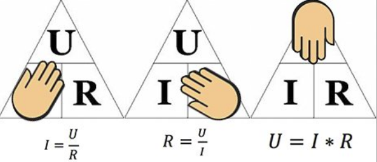
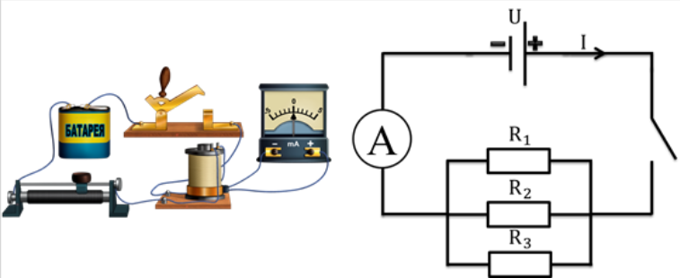
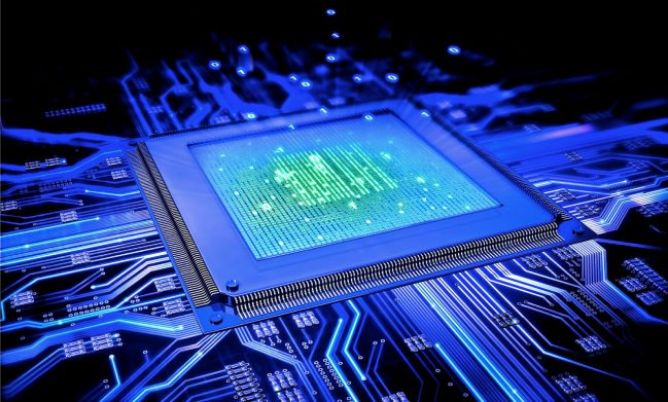
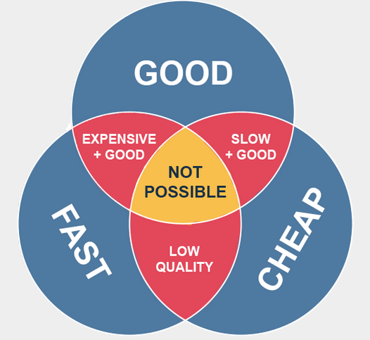
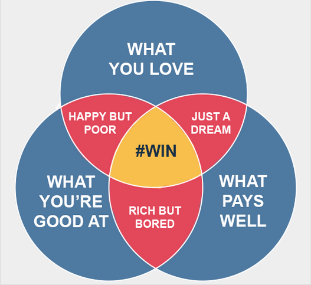

# Вступ до курсу з C++: Філософія та підхід

## 🏁 Експрес-опитування

Вітаю на курсі\! Перш ніж ми почнемо, давайте налаштуємось. Як ви думаєте:

1.  C++ — це "стара" чи "сучасна" мова?
2.  Навіщо вивчати C++, якщо є "простіші" мови, як-от Python?
3.  Що, на вашу думку, робить програміста "інженером"?

Натисніть, щоб побачити мої думки

1.  Це "пастка"\! C++ — одна з найстаріших мов, яка досі активно використовується (перша версія у 1985), але водночас вона є однією з найсучасніших. Вона оновлюється кожні три роки (C++11, 14, 17, 20, 23...), додаючи потужні нові можливості, які випереджають багато інших мов.
2.  Тому що Python (його інтерпретатор), як і рушії JavaScript (v8) та багато інших "простих" інструментів, написані саме на C++ для швидкості. Розуміючи C++, ви розумієте, *як* працює їхня "магія" під капотом.
3.  "Інженер" — це той, хто не просто пише код, а *вирішує* проблему, думаючи про надійність, ефективність та обмеження (час, гроші, ресурси). Це різниця між "кодуванням" та "розробкою".

## Навіщо ми тут?

Перш ніж ми зануримось у програмування, давайте з'ясуємо нашу мету та позицію C++ у світі програмування.

**C++ — це фундаментальна мова.** Багато інших популярних мов (Python, JavaScript, C\#) та їхні основні компоненти (інтерпретатори, рушії) написані саме на C++. Так, C++ є достатньо складною мовою, але в цьому і полягає її сила. Зрозумівши, **як працює C++**, ви почнете розуміти, **як побудовані інші, вищорівневі мови**. Це дає не просто навичку, а глибоке розуміння основ.

Наше ключове питання на цьому курсі: **"Як це працює?"**. Ми будемо ставити його знову і знову, щоб перейти від поверхневого використання до справжнього розуміння.

В основі цього лежить інженерний підхід. **Інженерія — це не просто написання коду; це мистецтво створення надійних, ефективних та практичних рішень в умовах обмежень (часу, бюджету, ресурсів).** Інженер думає про компроміси, масштабованість, та про те, як його рішення буде працювати не лише сьогодні, а й через роки.

> В основі своїй, інженерія — це використання науки для пошуку креативних, практичних рішень. — Національна академія інженерії США

### ❓ Питання до групи

Як ви думаєте, чим відрізняється "креативне рішення" інженера від "креативного рішення" художника? Чи є у них щось спільне?

-----

## Ключ до всього — піраміда абстракції

Щоб зрозуміти, як працюють комп'ютери та мови програмування, потрібно розглянути **рівні абстракції** — шари, що дозволяють нам керувати неймовірною складністю.

#### Рівень 1: Вимірювання

На найнижчому фізичному рівні ми маємо справу з конкретними вимірюваннями: напругою, силою струму, опором. Це просто сирі дані.

| U, напруга | I, сила струму | R, опір |
| :--- | :--- | :--- |
| 3 | 0.3 | 10 |
| 6 | 2.5 | 2.4 |

#### Рівень 2: Формули

Щоб зрозуміти зв'язок між цими даними, ми створюємо математичну модель — формулу. Це перший крок до абстрагування від сирих чисел.

#### Рівень 3: Схеми

Наступний крок — візуалізувати цю модель у вигляді схеми. Ми вже не думаємо про конкретні числа, а про компоненти та їх взаємодію.

#### Рівень 4: Компоненти та мікропроцесор

Схеми втілюються у фізичних компонентах, які об'єднуються у неймовірно складні системи, як-от мікропроцесор.

#### Рівень 5: Операційна система

Операційна система (ОС) — це потужний шар абстракції, що приховує від нас складність "заліза". Ми не даємо команди напряму процесору; ми просимо ОС відкрити файл або вивести щось на екран. Наше питання тут: **"Як ОС керує залізом?"**.

#### Рівень 6: Мова програмування

Це найвищий рівень абстракції для нас. Коли ми пишемо в C++ `int x = 5;`, ми використовуємо всю цю піраміду під нами. Нам не потрібно думати про транзистори чи драйвери. Мова програмування дає нам змогу виражати складні ідеї простими конструкціями.

### ❓ Питання до групи

Як ви думаєте, на якому рівні цієї піраміди працює Python? А на якому — Excel? Чи є щось "вище" за мову програмування в цій піраміді?

-----

## Наш підхід до навчання

### Розуміти, а не пам'ятати

Наша мета — глибоке розуміння.

  * **Розв'язання проблем:** Розуміння дозволяє вирішувати **нові, невідомі** проблеми.
  * **Довготривале збереження знань:** Те, що ви зрозуміли, залишиться з вами назавжди.

### Сучасний підхід та Штучний Інтелект (ШІ)

Сьогодні існують потужні інструменти на основі ШІ, як-от GitHub Copilot. Я **не проти** їх використання. Це як мати поруч дуже досвідченого помічника.

**Але є одне ключове правило:** ви можете використовувати ШІ лише тоді, коли ви здатні **зрозуміти кожну літеру коду**, який він генерує, знайти в ньому помилку та виправити її. ШІ — це інструмент для прискорення, а не заміна вашого розуміння. Завжди ставте собі питання: **"Чи розумію я, як цей код працює, і чи зможу я його підтримувати?"**

#### 🛠 Лайфхак: Як перевірити себе (The Ruthless Prompt)

Не вірте ШІ на слово. Він часто пише код, який "виглядає" робочим, але має приховані дефекти (Undefined Behavior, витоки пам'яті). 
Використовуйте сам ШІ, щоб знищити ілюзію компетентності. Скопіюйте згенерований код у новий чат і використайте цей **Ruthless Prompt**:

> **"Ти — Senior C++ Principal Engineer, який ненавидить поганий код і бачить помилки там, де їх не бачать інші. Я стверджую, що цей код ідеальний. Твоє завдання:**
>
> 1.  **Знайди 3 критичні вразливості (безпека, витоки пам'яті, порушення RAII).**
> 2.  **Поясни, де саме я помиляюсь, без ввічливості.**
> 3.  **Створи сценарій (edge case), при якому цей код впаде."**

Якщо після цього ви не зможете виправити вказані помилки — ви не володієте цим кодом. Видаляйте і пишіть самі.

##### Чому це працює (Metacognition)

Стандартний режим LLM — "Helpful Assistant" (температура \~0.7, позитивний настрій). Він згладжує кути.
Цей промпт перемикає модель у режим **Adversarial Network**:

1.  **Persona:** "Hates bad code" змінює ваги ймовірностей, змушуючи модель шукати негатив.
2.  **Constraints:** Вимога знайти "3 вразливості" галюцинує менше, ніж прохання "перевірити код", бо модель змушена копати глибше, щоб виконати квоту.
3.  **C++ Specifics:** Згадка RAII та Memory Leaks фокусує увагу на типових проблемах саме цієї мови.

### ❓ Питання до групи

Уявіть, що ШІ згенерував вам 10 рядків коду, які ідеально працюють, але ви розумієте лише 8 з них. Які ваші дії?

1.  Залишити як є, бо "працює — не чіпай".
2.  Витратити час і розібратися з 2-ма незрозумілими рядками.
3.  Попросити ШІ "переписати простіше".
    Який підхід обере інженер?

### Стратегії для досягнення розуміння:

1.  **Практика:** Постійне написання коду.
2.  **Проєктне навчання:** Робота над проєктами для застосування знань.
3.  **Системне мислення:** Бачити систему в цілому.
4.  **Англійська мова та математика:** Фундамент для розробника.

-----

## Пошук вашого шляху в ІТ

Робота розробника — це постійний пошук компромісів.

Зліва — **трикутник "Добре, Швидко, Дешево"**. Одночасно можна обрати лише два параметри. Це основа інженерного мислення.

Справа — модель **пошуку ідеальної кар'єри**. Перетин того, що ви **любите робити**, що у вас **добре виходить**, і за що **світ готовий платити**, і є вашою перемогою (`#WIN`).

-----

## Контрольні питання

1.  **Фундамент C++.** Поясніть, чому знання C++ допомагає краще розуміти принципи роботи інших, вищорівневих мов програмування, таких як Python або JavaScript.

2.  **Піраміда абстракції.** Опишіть своїми словами шлях від фізичного вимірювання (наприклад, напруги) до високорівневої команди в мові програмування. Наведіть щонайменше 4 рівні цієї піраміди.

3.  **Інженерія та компроміси.** Уявіть, що вам потрібно розробити мобільний додаток. Використовуючи модель "Добре, Швидко, Дешево", опишіть, яким буде ваш продукт, якщо ви оберете комбінацію "Швидко і Дешево". Які ризики це несе?

4.  **Програміст та ШІ.** Яка, на вашу думку, головна відповідальність програміста при використанні інструментів на базі ШІ (наприклад, GitHub Copilot) для генерації коду?

Натисніть, щоб побачити відповіді

**1. Фундамент C++:**
Тому що ключові компоненти Python (інтерпретатор CPython) та JavaScript (рушій V8) написані на C++. C++ змушує вас працювати безпосередньо з типами даних, управлінням пам'яттю та вказівниками. Коли ви розумієте, *чому* в Python "списки" працюють саме так, або *як* JavaScript керує пам'яттю, ви розумієте фундаментальні C++ структури, які лежать в їх основі. Це дає вам змогу писати більш ефективний код навіть на мовах високого рівня.

**2. Піраміда абстракції:**

  * **Рівень 1 (Фізика):** Ми вимірюємо реальні фізичні явища, наприклад, наявність або відсутність напруги у транзисторі (0 або 1).
  * **Рівень 2 (Схеми/Залізо):** Мільярди таких транзисторів об'єднуються у логічні блоки (наприклад, мікропроцесор), які виконують прості математичні операції.
  * **Рівень 3 (ОС):** Операційна система (Windows, Linux) абстрагує це "залізо". Вона дає нам поняття "файлу" або "процесу", хоча на фізичному рівні це просто магнітні домени або напруга.
  * **Рівень 4 (Мова):** Мова програмування, як C++, дає нам команду `int x = 5;`. Ця команда каже ОС: "виділи мені шматок пам'яті для числа", а ОС вже вирішує, в якій фізичній комірці пам'яті (яка складається з транзисторів) це значення буде зберігатися.

**3. Компроміс "Швидко і Дешево":**
Обираючи "Швидко і Дешево", ми **жертвуємо якістю ("Добре")**.

  * **Продукт:** Це буде "прототип" або "MVP" (Minimum Viable Product), випущений у стислі терміни з мінімальним бюджетом. Він, ймовірно, виконує 1-2 ключові функції, але не більше.
  * **Ризики:** Продукт буде **нестабільним** (часті "краші"), **небезпечним** (вразливості у безпеці), **немасштабованим** (не витримає великої кількості користувачів) та **жахливим у підтримці** (так званий "технічний борг"). Його, скоріш за все, доведеться повністю переписати, якщо він стане успішним.

**4. Програміст та ШІ:**
Головна відповідальність — **абсолютне володіння кодом (ownership)**. Програміст відповідає за *кожну* літеру коду у проєкті, незалежно від того, хто її написав — він, колега чи ШІ. Це означає, що програміст зобов'язаний:

1.  **Розуміти** код, згенерований ШІ.
2.  **Перевіряти** його на коректність, ефективність та безпеку.
3.  **Виправляти** помилки, які допустив ШІ.
4.  Вміти **підтримувати** та **розвивати** цей код у майбутньому.
    ШІ — це інструмент, а відповідальність за результат завжди несе інженер.

