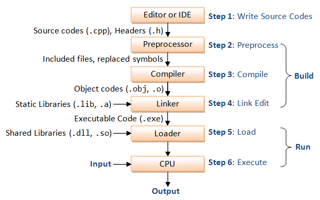

# Лекція 1: Вступ до C++: Типи та перша програма

Вітаю\! Це наша перша лекція з C++. Ми розглянемо базові концепції, створимо нашу першу програму та навчимося працювати з основними типами даних.

## 🏁 Експрес-опитування

Перш ніж почнемо, давайте швидко перевіримо, що ви, можливо, вже знаєте або про що здогадуєтесь. Спробуйте відповісти, а потім перевірте себе.

1.  Що, на вашу думку, робить програма "компiлятор"?
2.  Навіщо, на вашу думку, програмам потрібні різні "типи" даних? Чому не може бути один "універсальний" тип?
3.  Що таке `cout` та `cin`?

<details markdown="1">
<summary>Натисніть, щоб побачити варіанти відповідей від авторів</summary>

1.  **Компiлятор** — це програма-перекладач. Він бере написаний вами "людський" код (наприклад, C++) і перетворює його на машинний код (набір інструкцій для процесора), який комп'ютер може виконати. 
2.  **Типи даних** (як `int` для чисел або `string` для тексту) повідомляють компілятору, скільки пам'яті виділити і які операції можна виконувати. `2 + 2` — це зрозуміла операція, а `"Привіт" + 5` — ні. Типізація допомагає уникнути таких помилок ще на етапі компіляції. 
3.  **`cout`** (Console Out) — це стандартний потік для **виводу** даних (зазвичай, на ваш екран).  **`cin`** (Console In) — це стандартний потік для **вводу** даних (зазвичай, з вашої клавіатури). 

</details>

-----

## 1\. Наша перша програма: "Hello, World\!"

Це традиційний перший крок. Ми створимо програму, яка просто виводить текст "hello, world" на екран.

### Крок 1: Написання вихідного коду

Файл слід зберегти з розширенням `.cpp`, наприклад, `hello.cpp`.

```cpp
/*
 * Перша програма на C++, яка виводить "hello, world" (hello.cpp)
 */
#include <iostream> // Потрібно для операцій вводу/виводу (cout, cin) 

// using namespace std; дозволяє писати cout замість std::cout 
using namespace std; 

// main() — це точка входу в програму. Виконання коду починається звідси. 
int main() { 
    // cout — це стандартний потік виводу (зазвичай, ваш екран) 
    // << — це оператор "вставки в потік", він направляє дані в cout 
    // "hello, world" — це рядок, який ми хочемо вивести 
    // endl — це спеціальний маніпулятор, який переводить курсор на новий рядок 
    cout << "hello, world" << endl; // Виводимо привітання

    // return 0; повідомляє операційній системі, що програма завершилася успішно 
    return 0; 
} // Кінець функції main() 
```

### ❓ Питання до групи

1.  `using namespace std;` — це зручно, але у великих комерційних проєктах це вважається поганою практикою, і програмісти пишуть повний варіант `std::cout`. Як ви думаєте, чому? (Підказка: що, як у двох різних бібліотеках будуть функції з однаковим ім'ям?)
2.  Що станеться, якщо ми напишемо `return 1;` замість `return 0;`? Програма не запуститься? Чи це щось означає?

### Крок 2: Компіляція та запуск

Написаний нами код — це просто текст. Щоб комп'ютер міг його виконати, його потрібно **скомпілювати** — перетворити на машинний код.  Для цього використовується компілятор (наприклад, `g++`).

1.  **Компіляція (Build)**: Створює з файлу `hello.cpp` виконуваний файл. 

    ```bash
    # Для Windows
    > g++ -o hello.exe hello.cpp 

    # Для Linux / macOS
    $ g++ -o hello hello.cpp 
    ```

2.  **Запуск (Run)**: Виконуємо створений файл. 

    ```bash
    # Для Windows
    > hello 

    # Для Linux / macOS (./ означає "в поточній директорії")
    $ ./hello 
    ```

Результатом виконання буде текст `hello, world` на екрані. 

### Повний процес: Від коду до програми

Щоб краще зрозуміти, як текст перетворюється на програму, розглянемо повний шлях: 

1.  **Написання коду (Editor/IDE)**: Ви пишете код у файлах `.cpp` та `.h`. 
2.  **Препроцесор (Preprocessor)**: Обробляє директиви, що починаються з `#` (наприклад, `#include <iostream>`). Він буквально вставляє вміст інших файлів у ваш код. 
3.  **Компілятор (Compiler)**: Перетворює оброблений код на об'єктні файли (`.obj` або `.o`). Це проміжний машинний код. 
4.  **Лінкер (Linker)**: Лінкер (компонувальник) збирає ваш об'єктний код, код зі стандартних бібліотек (як `iostream`) та інше, щоб створити єдиний виконуваний файл (`.exe`). 
5.  **Завантажувач (Loader)**: Коли ви запускаєте програму, ОС копіює її в оперативну пам'ять. 
6.  **Виконання (CPU)**: Центральний процесор (CPU) починає виконувати інструкції. 



### ❓ Питання до групи

Ми пишемо код для *комп'ютера*, але на етапі 4 (Лінкер) наш код об'єднується з кодом з *бібліотек*. Хто, на вашу думку, написав ці бібліотеки (як `iostream`), і навіщо вони потрібні?

-----

## 2\. Основи синтаксису C++

  * **Інструкція (Statement)**: Це окрема дія, наприклад, `cout << "hello";`. Кожна інструкція в C++ має закінчуватися крапкою з комою (`;`). 
  * **Директива препроцесора**: Команди для препроцесора, що починаються з `#` (наприклад, `#include`). Вони **не** закінчуються крапкою з комою. 
  * **Блок коду**: Група інструкцій, взята у фігурні дужки `{ }`. Наприклад, тіло функції `main`. 
  * **Коментарі**: Текст, який компілятор ігнорує. Потрібен для пояснень. 
      * `// Однорядковий коментар` 
      * `/* Багаторядковий коментар */` 
  * **Чутливість до регістру**: C++ розрізняє великі та малі літери. `main`, `Main` та `MAIN` — це три різні ідентифікатори. 

### ❓ Питання до групи

Давайте поміркуємо: навіщо мови програмування роблять чутливими до регістру? Це ж створює плутанину. Чи є в цьому якась інженерна перевага?

-----

## 3\. Робота з даними: Змінні та фундаментальні типи

C++ — це **статично типізована** мова.  Це означає, що для кожної змінної (іменованої комірки пам'яті) ми повинні заздалегідь вказати, який тип даних вона буде зберігати. 

### Фундаментальні типи даних

Це базові "цеглинки" для даних.

| Тип | Опис | Розмір у байтах (типовий) | Приклад коду (з актуальним контекстом) |
| :--- | :--- | :--- | :--- |
| `int` | **Ціле число**  | 4 | `int drones_count = 15;` |
| `float` | **Дійсне число** (одинарної точності)  | 4 | `float core_temp = 80.5f;` |
| `double` | **Дійсне число** (подвійної точності)  | 8 | `double donation_amount = 250.75;` |
| `char` | **Один символ**  | 1 | `char map_sector = 'B';` |
| `bool` | **Логічний тип** (`true` або `false`)  | 1 | `bool is_target_locked = true;` |
| `std::string`| **Рядок тексту**  | Залежить | `std::string model = "Mavic 3T";` |

### Числа з плаваючою комою: `float` vs. `double`

Основна відмінність — у **точності** та **діапазоні** значень. 

  * **`float` (Одинарна точність):** Розмір 4 байти. Точність \~7 десяткових знаків. 
  * **`double` (Подвійна точність):** Розмір 8 байт. Точність \~15-17 десяткових знаків. 

> **Аналогія:** 💡 Уявіть, що `float` — це звичайна лінійка, яка дозволяє виміряти довжину з точністю до міліметра. `double` — це лазерний вимірювач, що дає значно точніший результат.

**Завжди надавайте перевагу `double`**, якщо у вас немає вагомих причин економити пам'ять (наприклад, у комп'ютерній графіці).

### ❓ Питання до групи

Уявіть, що ми пишемо програму для балістичного калькулятора. Який тип ви оберете для розрахунку траєкторії, `float` чи `double`, і чому?

-----

## 4\. Ввід та вивід даних (I/O)

### Вивід даних з `cout`

Ми вже використовували `cout` для виводу.  Оператор `<<` можна поєднувати в ланцюжок. 

```cpp
string drone_model = "Mavic 3T";
int quantity = 5;
cout << "Model: " << drone_model << ", Quantity: " << quantity << endl;
cout << "First line." << endl << "Second line." << endl; 
```

### `endl` чи `'\n'`: У чому насправді різниця?

Обидва символи починають новий рядок. 

  * **`'\n'`** — це просто символ нового рядка. 
  * **`std::endl`** — це маніпулятор, який робить **дві речі**:
    1.  Вставляє символ нового рядка `'\n'`. 
    2.  **Очищує буфер (flushing)**, тобто гарантовано змушує програму негайно вивести всі дані на екран. 

Часте очищення буфера (flushing) може сповільнювати програму, особливо при записі у файл.

**Рекомендація:** Використовуйте `'\n'` для більшості випадків, особливо всередині довгих рядків. Використовуйте `std::endl` тільки тоді, коли вам потрібно *гарантовано* побачити вивід негайно (наприклад, перед `cin` або під час відладки).

### Ввід даних з `cin`

Для отримання даних від користувача використовується потік вводу `cin` та оператор `>>`. 

**Приклад: Міні-утиліта "Залишок збору"**

```cpp
#include <iostream>

using namespace std;

int main() {
    // 1. Оголошуємо змінні
    int drones_needed;
    int drones_purchased;
    int drones_remaining;

    // 2. Просимо користувача ввести дані
    cout << "Enter total drones needed: "; 
    
    // 3. Читаємо введене значення 
    cin >> drones_needed; 

    // 4. Робимо те ж саме для другого числа
    cout << "Enter drones already purchased: ";
    cin >> drones_purchased;

    // 5. Обчислюємо залишок
    drones_remaining = drones_needed - drones_purchased;

    // 6. Виводимо результат
    cout << "Remaining to collect: " << drones_remaining << " drones." << endl;

    return 0;
}
```

Можна зчитувати кілька значень одночасно. Користувач має вводити їх через пробіл. 

```cpp
cout << "Enter drones needed and purchased (separated by space): ";
cin >> drones_needed >> drones_purchased; 
```

-----

## 5\. Стандартна бібліотека шаблонів (STL)

**STL** (Standard Template Library) — це потужна частина C++, яка надає готові рішення. 

  * Вона містить готові класи, як `vector` (динамічний масив), `map` (словник) та багато інших. 
  * Усі елементи STL знаходяться у просторі імен `std`.  Саме тому ми пишемо `std::cout` або `std::string`.
  * Директива `using namespace std;` дозволяє не писати префікс `std::` щоразу. 

### ❓ Питання до групи

Ми кажемо, що STL "добре оптимізована".  Що це означає для нас, як для розробників, на практиці? Чому краще взяти готовий `std::vector`, ніж писати свій "велосипед"?

-----

## 6\. Завдання для самостійної роботи

1.  **Конвертер валют**: Напишіть програму, яка запитує у користувача суму в гривнях (UAH) та поточний курс долара (наприклад, 39.5). Програма має обчислити та вивести, скільки доларів (USD) можна купити за цю суму. Використовуйте тип `double`.
2.  **Розрахунок збору**: Напишіть програму, яка запитує ціну одного дрона (`double`) та їхню кількість (`int`). Програма має обчислити та вивести загальну суму збору.
3.  **Статистика волонтерів**: Напишіть програму, яка запитує, скільки волонтерів працювало вранці (`int morning_shift`) та скільки ввечері (`int evening_shift`). Програма має вивести загальну кількість волонтерів за день.

-----

## 7\. Ключові моменти та поради

  * **Завжди завершуйте інструкції крапкою з комою (`;`)**. 
  * **Використовуйте `'\n'` або `endl` для переходу на новий рядок**.
  * **Називайте змінні змістовно**: `drones_count` краще, ніж `dc`.
  * **Коментуйте свій код**: Пояснюйте, *навіщо* ви щось робите. 
  * **C++ чутливий до регістру**: `myVar` та `myvar` — це дві різні змінні. 
  * **Структура програми**: Завжди починайте з шаблону: `#include`, `using namespace std;`, `int main() { ... return 0; }`. 

-----

## 8\. Міні-опитування: Вгадайте тип

Спробуйте самостійно визначити, які типи даних пропущено в коді нижче. 

```cpp
#include <iostream>
#include <string>

// Впишіть правильні типи даних там, де стоїть '???'

??? a = "test"; 
??? b = 3.2 * 5 - 1; 
??? c = 5 / 2; 

??? d(int foo) { return foo / 2; } 
??? e(double foo) { return foo / 2; } 
??? f(double foo) { return int(foo / 2); } 
??? g(double c) { 
    std::cout << c << std::endl;
}
```

<details markdown="1">

<summary>Натисніть, щоб побачити відповіді</summary>

```cpp
#include <iostream>
#include <string>

// Правильні відповіді та пояснення
std::string a = "test"; // Рядок тексту завжди має тип std::string 
double      b = 3.2 * 5 - 1; // Через наявність '3.2', результат буде дійсним числом (15.0) 
int         c = 5 / 2; // Результатом цілочисельного ділення буде ціле число (2, залишок відкидається) 

float  d(int foo) { return foo / 2; } // Повертає дійсне число 
double e(double foo) { return foo / 2; } // Операція з double повертає double 
int    f(double foo) { return int(foo / 2); } // Тип повернення явно вказаний як int 
void   g(double c) { // Функція нічого не повертає, тому її тип 'void' 
    std::cout << c << std::endl;
}
```

</details>

-----

## 9\. Контрольні питання до модуля 1

Ці питання призначені для самоперевірки та підготовки.

### Частина 1: Теоретичні питання

1.  **Процес компіляції.** Опишіть роль **препроцесора**, **компілятора** та **лінкера (компонувальника)**. 
2.  **Точка входу.** Що таке функція `main()` і що означає `return 0;`? 
3.  **Типізація.** Що означає "C++ — це статично типізована мова"? 
4.  **Вивід даних.** Яка різниця між `std::endl` та `'\n'`? 

<details markdown="1">

<summary>Натисніть, щоб побачити відповіді (Частина 1)</summary>

1.  **Препроцесор** обробляє директиви `#include`, вставляючи код із заголовків. **Компiлятор** перетворює код C++ на об'єктні файли (машинний код). **Лінкер** збирає всі об'єктні файли та бібліотеки в один виконуваний файл (.exe). 
2.  `main()` — це функція, з якої **починається виконання** будь-якої програми C++. `return 0;` — це стандартний спосіб повідомити операційній системі, що програма **завершилася успішно**. 
3.  **Статична типізація** означає, що тип кожної змінної (наприклад, `int` або `std::string`) має бути відомий на етапі компіляції, ще до запуску програми. 
4.  `'\n'` — це просто символ нового рядка. `std::endl` — це маніпулятор, який не тільки вставляє `'\n'`, але й **примусово очищує буфер виводу (flush)**, що гарантує негайний вивід, але може бути повільнішим. 

</details>

### Частина 2: Аналіз коду

1.  **Що виведе цей код?** Поясніть, чому.

    ```cpp
    #include <iostream>
    int main() {
        int a = 15;
        int b = 4;
        double c = a / b;
        std::cout << c << std::endl;
        return 0;
    }
    ```

2.  **Знайдіть помилки.** У коді є **дві синтаксичні помилки**.

    ```cpp
    #include <iostream>
    int main() 
        std::cout << "C++ is powerful" << std:endl;
        return 0;
    }
    ```

3.  **Визначте типи.** Які типи найкраще підходять для змінних `droneModel`, `price` та `isAvailable`?

    ```cpp
    // ??? droneModel = "Autel EVO II";
    // ??? price = 1499.99;
    // ??? isAvailable = true;
    ```

<details markdown="1">

<summary>Натисніть, щоб побачити відповіді (Частина 2)</summary>

1.  Код виведе `3`. **Пояснення:** Операція `a / b` відбувається між двома `int`, тому виконується **цілочисельне ділення**. `15 / 4` дорівнює `3` (залишок відкидається). Лише після цього ціле число `3` присвоюється змінній `double` і стає `3.0`, але оскільки розрахунок вже втратив точність, на екран буде виведено `3`.
2.  **Помилка 1:** Пропущено відкриваючу фігурну дужку `{` після `int main()`. **Помилка 2:** `std:endl` написано з однією двокрапкою. Правильно: `std::endl`.
3.  `std::string droneModel`, `double price`, `bool isAvailable`.

</details>

### Частина 3: Практичне завдання (Продукт)

Напишіть повну програму **"Калькулятор донатів"**, яка виконує наступні дії:

1.  Запитує у користувача **назву збору** (одне слово, наприклад "Дрони"). Збережіть це у `std::string`.
2.  Запитує **загальну суму**, яку потрібно зібрати (наприклад, 100000.0). Використовуйте `double`.
3.  Запитує, **скільки вже зібрано** (наприклад, 45000.0). Використовуйте `double`.
4.  Обчислює, **скільки гривень залишилось** зібрати.
5.  Виводить на екран повідомлення у чіткому форматі, наприклад:
    `--- Збір [Назва] ---`
    `Залишилось зібрати: [Сума] грн.`

<details markdown="1">

<summary>Натисніть, щоб побачити приклад реалізації (Частина 3)</summary>

```cpp
#include <iostream>
#include <string>
#include <iomanip> // Для форматування виводу (setprecision)

int main() {
    // 1. Оголошуємо змінні
    std::string collection_name;
    double total_goal;
    double already_collected;
    double remaining;

    // 2. Зчитуємо дані
    std::cout << "Введіть назву збору (одне слово): ";
    std::cin >> collection_name;

    std::cout << "Введіть загальну суму збору (грн): ";
    std::cin >> total_goal;

    std::cout << "Введіть, скільки вже зібрано (грн): ";
    std::cin >> already_collected;

    // 3. Обчислюємо залишок
    remaining = total_goal - already_collected;

    // 4. Виводимо результат
    std::cout << std::endl; // Порожній рядок для краси
    std::cout << "--- Збір \"" << collection_name << "\" ---" << std::endl;
    
    // Встановлюємо вивід на 2 знаки після коми
    std::cout << std::fixed << std::setprecision(2); 
    
    std::cout << "Залишилось зібрати: " << remaining << " грн." << std::endl;

    return 0;
}
```

</details>