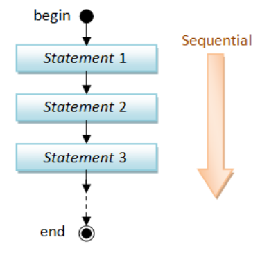
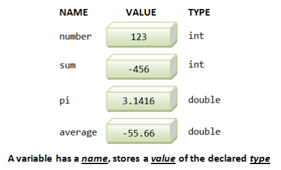
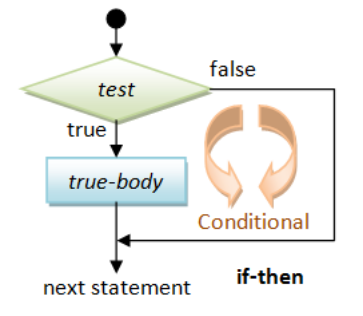
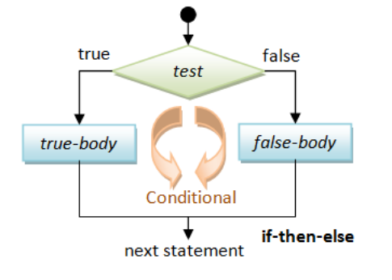
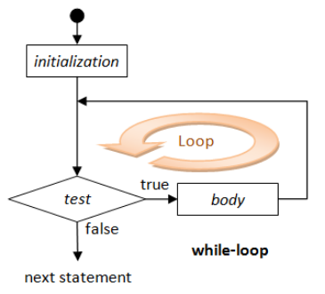
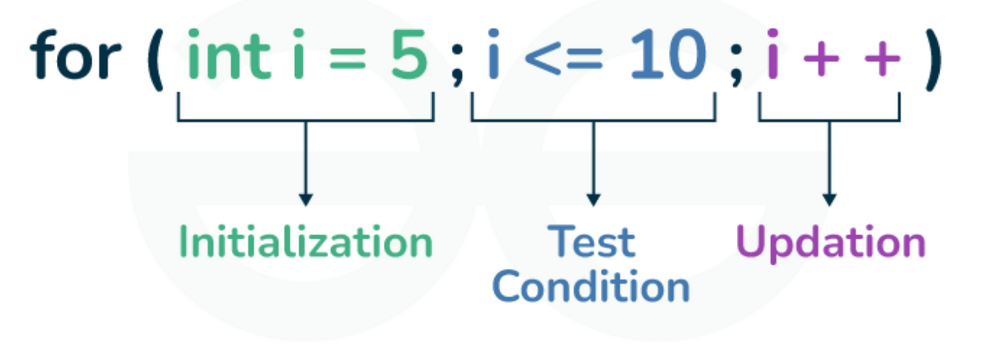
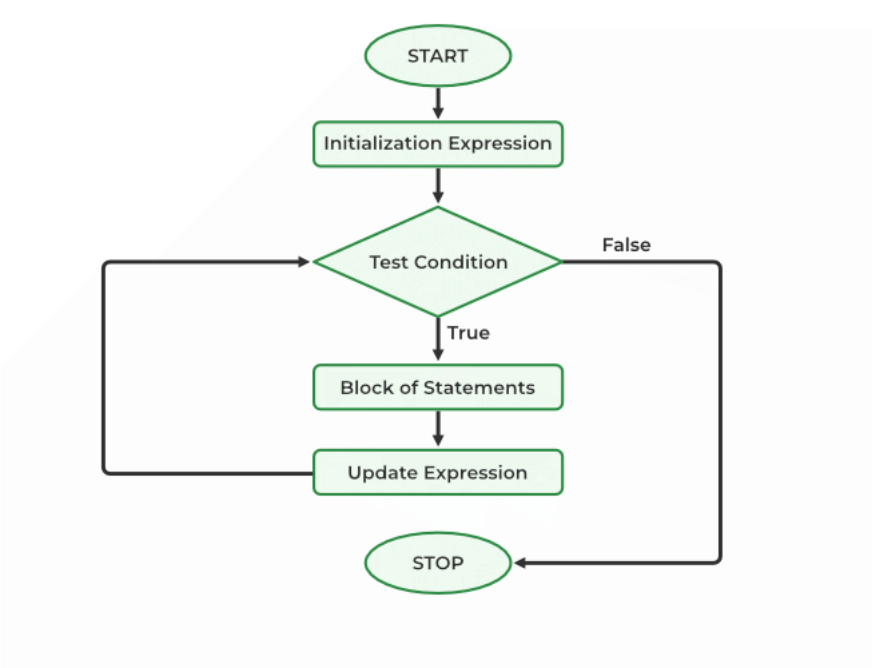

# Лекція 2: Що таке програма? Змінні та потік керування

## 🏁 Експрес-опитування

Давайте активуємо знання з минулої лекції. Не хвилюйтесь, якщо щось забули — ми якраз тут, щоб це виправити\!

1.  Як називається *функція*, з якої C++ завжди починає виконання програми?
2.  Який тип даних (`int`, `double` чи `std::string`) ви б обрали для зберігання суми донату, наприклад, "150.75 грн"?
3.  Чим команда `cin >> my_var;` відрізняється від `cout << my_var;`?

<details markdown="1">
<summary>Натисніть, щоб побачити відповіді</summary>

1.  Це функція `int main()`.
2.  `double`, оскільки він може зберігати дробову частину (копійки).
3.  `cin >> ...` (Console In) використовується для **вводу** (читання) даних з клавіатури, а `cout << ...` (Console Out) — для **виводу** (друку) даних на екран.

</details>

-----

## Програма як послідовність дій

У своїй основі, **програма** — це послідовність інструкцій (програмних операторів), які виконуються одна за одною, зазвичай у тому порядку, в якому вони написані. Це називається **послідовним виконанням**.



Кожна дія, від простого обчислення до виводу на екран, є окремим оператором у цій послідовності.

### ❓ Питання до групи

Якщо програма — це суто послідовне виконання, як, на вашу думку, працюють сучасні веб-сайти? Чому, наприклад, текст на сторінці може завантажитись раніше, ніж картинки? Чи це порушує "послідовність"?

-----

## Змінні — Пам'ять програми



Програми маніпулюють даними. **Змінна** — це іменована комірка в пам'яті, яка використовується для зберігання даних під час роботи програми.

Кожна змінна має три основні характеристики:

1.  **Ім'я (Name):** Унікальний ідентифікатор (наприклад, `droneCount`, `totalGoal`).
2.  **Тип (Type):** Визначає, які дані можуть зберігатися (наприклад, `int` чи `double`).
3.  **Значення (Value):** Конкретні дані, що зберігаються у змінній.


### Оголошення та ініціалізація змінних

Перед використанням змінну потрібно **оголосити**, вказавши її тип та ім'я.

```cpp
// Синтаксис: Оголошення однієї змінної
int droneCount;
double targetGoal;

// Синтаксис: Оголошення кількох змінних одного типу
int activeVolunteers, newRecruits, totalTeamSize;

// Синтаксис: Оголошення з одночасною ініціалізацією
double targetGoal = 500000.0;
int activeVolunteers = 5, newRecruits = 2; 
```

### Присвоєння та зміна значення

Використовується **оператор присвоєння (`=`)**.

```cpp
int currentDonations;      // Оголошення
currentDonations = 500;     // Перше присвоєння
currentDonations = 1200;    // Повторне присвоєння (старе значення 500 втрачається)

// А це — серце програмування. "Banka" дорівнює тому, що в ній
// вже було, плюс новий внесок.
currentDonations = currentDonations + 100; 
```

**Ключові правила:**

  * Змінна має бути оголошена **перед її першим використанням**.
  * Кожна змінна може бути оголошена лише **один раз** в одній області видимості.
  * Тип змінної **не можна змінити** після оголошення.
  * Кожен оператор (інструкція) в C++ має завершуватися **крапкою з комою (`;`)**.

### ❓ Питання до групи

Ми оголосили `int droneCount;`. Що станеться, якщо ми спробуємо присвоїти їй дробове значення: `droneCount = 5.8;`?

1.  Програма видасть помилку компіляції?
2.  Програма "заокруглить" значення до `6`?
3.  Програма "відкине" дробову частину і збереже `5`?
    (Спойлер: правильна відповідь — 3. Це називається неявним приведенням типів, і це може бути джерелом помилок).

-----

## Операції зі змінними

### Присвоєння (`=`) — це не рівність (`==`)

Вкрай важливо розрізняти оператор присвоєння та знак рівності в математиці.

  * В математиці `x = x + 1` — це хибне твердження.
  * В програмуванні `x = x + 1;` — це **команда**: "обчислити значення `x + 1` і записати новий результат назад у змінну `x`".

Уявіть, що змінна — це "Банка" в Monobank. Вираз `banka = banka + newDonation;` є абсолютно логічним: новий баланс дорівнює старому балансу плюс новий внесок.

Завжди спочатку обчислюється вираз **справа** від знака `=`, і лише потім результат записується у змінну **зліва**.

### Арифметичні операції

| Оператор | Значення | Приклад |
| :--- | :--- | :--- |
| `+` | Додавання | `x + y` |
| `-` | Віднімання | `x - y` |
| `*` | Множення | `x * y` |
| `/` | Ділення | `x / y` |
| `%` | **Остача від ділення** | `x % y` |
| `++` | Збільшити на 1 (Інкремент) | `++x` або `x++` |
| `--` | Зменшити на 1 (Декремент) | `--x` або `x--` |

### ❓ Питання до групи

Оператор `%` (остача від ділення або "modulus") здається дивним. Наведіть приклад, де б ми могли його використати в реальній задачі?
(Підказка: як перевірити, чи є число парним або непарним? `number % 2`)

-----

## Керування потоком виконання

Програми не завжди виконуються лінійно. Часто потрібно приймати рішення або повторювати дії.

### Умови (if-else)




Дозволяють виконувати різні блоки коду залежно від того, чи є умова істинною (`true`) чи хибною (`false`).

```cpp
// Проста умова if
int dronesInStock = 10;
if (dronesInStock > 0) {
    // цей код виконається, тільки якщо умова true
    std::cout << "Готово до відправки!";
}

// Умова з альтернативою if-else
if (dronesInStock % 2 == 0) {
    // цей блок, якщо кількість парна
    std::cout << "Кількість парна.";
} else {
    // цей блок, якщо кількість непарна
    std::cout << "Кількість непарна.";
}
```

Для побудови умов використовуються **оператори порівняння** (`>`, `<`, `>=`, `<=`, `==` (рівність), `!=` (нерівність)) та **логічні оператори** (`&&` (І), `||` (АБО), `!` (НЕ)).

### Цикли (Loops)

#### Приклад: Історія про Гаусса та сила алгоритмів

Існує відома історія про молодого Карла Гаусса, якому вчитель дав завдання додати всі числа від 1 до 100. Гаусс майже миттєво знайшов відповідь (5050), помітивши, що сума пар чисел (1+100, 2+99, ...) завжди дорівнює 101. Це ілюструє силу **алгоритмічного мислення** — замість тисячі операцій, можна знайти елегантніше рішення.

У програмуванні ми часто починаємо з рішення "в лоб" за допомогою циклів.

#### Цикл `while`



Цикл `while` ("поки") виконує тіло циклу доти, доки його умова є істинною. Перевірка умови відбувається **перед** кожною ітерацією.

**Коли використовувати:** Ідеально, коли ми не знаємо точну кількість повторень, але знаємо *умову зупинки*.

**Приклад (Симулятор збору коштів):**

```cpp
#include <iostream>

int main() {
    double totalGoal = 5000.0;
    double currentCollection = 0.0;
    
    std::cout << "Починаємо збір на " << totalGoal << " грн." << std::endl;

    // 2. Умова: цикл працює, поки зібрано менше, ніж потрібно
    while (currentCollection < totalGoal) {
        double newDonation;
        std::cout << "Отримано новий донат: ";
        std::cin >> newDonation;
        
        // 3. Оновлення: додаємо донат до загальної суми
        currentCollection += newDonation; 
        
        std::cout << "Зараз зібрано: " << currentCollection << std::endl;
    }

    std::cout << "Збір завершено! Дякуємо!" << std::endl;

    return 0;
}
```

#### Цикл `for`



Цикл `for` є більш структурованим і часто використовується, коли кількість повторень **відома заздалегідь**. Він поєднує ініціалізацію, умову та оновлення в одному рядку.

**Синтаксис:** `for (ініціалізація; умова; оновлення) { ... }`

1.  **Ініціалізація:** Виконується **один раз** на самому початку (напр., `int i = 0`).
2.  **Умова:** Перевіряється **перед кожною ітерацією** (напр., `i < 10`).
3.  **Оновлення:** Виконується **після кожної ітерації** (напр., `++i`).



**Приклад (Обробка 5 посилок):**

```cpp
#include <iostream>

int main() {
    int totalParcels = 5;
    std::cout << "Починаємо обробку посилок..." << std::endl;
    
    for (int i = 1; i <= totalParcels; ++i) {
        std::cout << "Обробка посилки номер " << i << "..." << std::endl;
        // Тут міг би бути складний код обробки
    }

    std::cout << "Всі посилки оброблено." << std::endl;

    return 0;
}
```

-----

### Керування ітераціями: `break` та `continue`

Іноді потрібно змінити стандартний потік виконання циклу.

  * **`break`**

      * **Що робить:** Негайно і повністю **виходить** з поточного (найглибшого) циклу.

  * **`continue`**

      * **Що робить:** Негайно **припиняє** поточну ітерацію і переходить до наступної. Код в тілі циклу після `continue` пропускається.

#### Приклад у вкладених циклах

**`break` та `continue` діють лише на той цикл, всередині якого вони знаходяться.**

```cpp
#include <iostream>

int main() {
    // Зовнішній цикл (напр., 3 коробки)
    for (int i = 1; i <= 3; ++i) {
        std::cout << "Відкриваємо коробку " << i << std::endl;

        // Внутрішній цикл (напр., 5 предметів у коробці)
        for (int j = 1; j <= 5; ++j) {
            
            // Демонстрація continue: ігноруємо "неважливі" предмети
            if (j == 2) {
                std::cout << "  j=" << j << ": (дрібничка, пропускаємо)\n";
                continue; 
            }

            // Демонстрація break: знайшли "ціль", шукати далі в ЦІЙ коробці немає сенсу
            if (i * j > 6) {
                std::cout << "  i*j > 6 (" << i << "*" << j << "): Знайшли те, що шукали! (break)\n";
                break; // Виходить ТІЛЬКИ з внутрішнього циклу
            }

            std::cout << "    Оглядаємо предмет j = " << j << std::endl;
        }
        std::cout << "  ---> Закінчили з коробкою " << i << "\n";
    }
    std::cout << "--> Огляд завершено.\n";
    return 0;
}
```

### ❓ Питання до групи

Уявіть, що ви пишете код для банкомату. Користувач вводить PIN-код. У вас є цикл `for`, який дає 3 спроби. Якщо користувач вводить правильний PIN на 2-й спробі, яку команду (`break` чи `continue`) ви використаєте, щоб зупинити цикл? Чому?

-----

### Три кити програмування: Повнота за Тьюрінгом

Тепер, коли ми знаємо про три основні структури керування:

1.  **Послідовне виконання** (одна команда за одною)
2.  **Розгалуження** (умови `if-else`)
3.  **Цикли** (`while`, `for`)

Варто знати, що цього набору **достатньо для реалізації будь-якого, наскільки завгодно складного, алгоритму**. Мова, що має ці три структури, називається **повною за Тьюрінгом**.

-----

## `++x` проти `x++`: У чому різниця?

Це класичне питання на співбесідах. Обидва оператори збільшують `x` на одиницю, але **повертають** різне значення.

### `++x` (Префіксний інкремент)

**Правило:** "Спочатку збільшити, потім повернути".
Оператор спочатку збільшує `x` на 1, а потім повертає **нове, вже збільшене** значення.

```cpp
int x = 5;
int y = ++x; // Спочатку x стає 6, потім це значення 6 присвоюється y
// Результат: x = 6, y = 6
```

### `x++` (Постфіксний інкремент)

**Правило:** "Спочатку повернути, потім збільшити".
Оператор спочатку повертає **оригінальне** значення `x`, і лише після цього збільшує `x` на 1.

```cpp
int x = 5;
int y = x++; // Спочатку y присвоюється оригінальне значення x (5),
             // і тільки після цього x стає 6
// Результат: x = 6, y = 5
```

### Використання в циклах `for`

У стандартному циклі `for (int i = 0; i < 5; ++i)` між `++i` та `i++` **немає жодної різниці у функціональності**. Значення, яке повертає операція, ніде не використовується, нас цікавить лише побічний ефект (збільшення `i`).

**💡 Рекомендація:** Гарною звичкою в C++ є використання **`++i`** у циклах `for`. Це ніколи не буде повільніше, а для складних типів (які ми вивчимо пізніше, наприклад, ітераторів) `++i` є більш ефективним, оскільки не потребує створення тимчасової копії.

-----

## Контрольні питання

1.  **Теорія.** У чому полягає фундаментальна різниця між оператором присвоєння (`=`) та оператором порівняння (`==`)? Наведіть приклад коду, де використання одного замість іншого призведе до логічної помилки.

2.  **Аналіз коду.** Що буде виведено на екран в результаті виконання наступного коду? Покроково поясніть, як змінюється значення змінної `result`.

    ```cpp
    #include <iostream>

    int main() {
        int result = 0;
        for (int i = 1; i <= 10; i++) {
            if (i % 3 == 0) {
                result = result + i;
            }
        }
        std::cout << result << std::endl;
        return 0;
    }
    ```

3.  **Практичне завдання.** Напишіть програму, яка знаходить суму всіх **непарних** чисел від 1 до 100 включно. Використайте для цього цикл `for` та умовний оператор `if`. Результат (суму) виведіть на екран.

-----

<details markdown="1">
<summary>Натисніть, щоб побачити відповіді на контрольні питання</summary>

**1. (Теорія) `=` проти `==`**

  * **`=` (Оператор присвоєння):** Це **команда**. Вона бере значення *справа* і *записує* його у змінну *зліва*. Наприклад, `x = 5;`
  * **`==` (Оператор порівняння):** Це **питання**. Він перевіряє, чи значення зліва *дорівнює* значенню справа, і повертає `true` (так) або `false` (ні). Наприклад, `if (x == 5) { ... }`

**Логічна помилка:**
Найчастіша помилка — використання `=` всередині `if`.

```cpp
int x = 0;
if (x = 5) { // ПОМИЛКА!
    // Цей код виконається ЗАВЖДИ.
    // Чому: (x = 5) - це присвоєння. Воно присвоює x=5,
    // і сама операція повертає значення 5.
    // В C++ будь-яке число, що не є 0, вважається 'true'.
    std::cout << "x is 5";
}
// Правильно було б:
if (x == 5) { 
    // ... 
}
```

**2. (Аналіз коду)**

Код виведе **18**.

  * **Покрокове виконання:**
      * `result` починається з `0`.
      * Цикл `for` перебирає числа `i` від 1 до 10.
      * Умова `if (i % 3 == 0)` перевіряє, чи ділиться `i` на 3 без остачі.
      * Це трапиться, коли `i` дорівнює 3, 6 та 9.
      * `i = 1`: `1 % 3 != 0`.
      * `i = 2`: `2 % 3 != 0`.
      * `i = 3`: `3 % 3 == 0`. `result = 0 + 3` (result стає 3).
      * `i = 4`: `4 % 3 != 0`.
      * `i = 5`: `5 % 3 != 0`.
      * `i = 6`: `6 % 3 == 0`. `result = 3 + 6` (result стає 9).
      * `i = 7`: `7 % 3 != 0`.
      * `i = 8`: `8 % 3 != 0`.
      * `i = 9`: `9 % 3 == 0`. `result = 9 + 9` (result стає 18).
      * `i = 10`: `10 % 3 != 0`.
      * Цикл завершується.
      * `cout` виводить `18`.

**3. (Практичне завдання)**

```cpp
#include <iostream>

int main() {
    int sum = 0;

    // Цикл від 1 до 100
    for (int i = 1; i <= 100; ++i) {
        
        // Перевіряємо, чи число непарне
        // (остача від ділення на 2 не дорівнює 0)
        if (i % 2 != 0) {
            sum += i; // Додаємо непарне число до суми
        }
    }

    std::cout << "Сума непарних чисел від 1 до 100: " << sum << std::endl;
    // P.S. Результат має бути 2500.

    return 0;
}
```

</details>