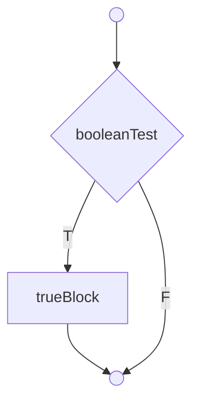
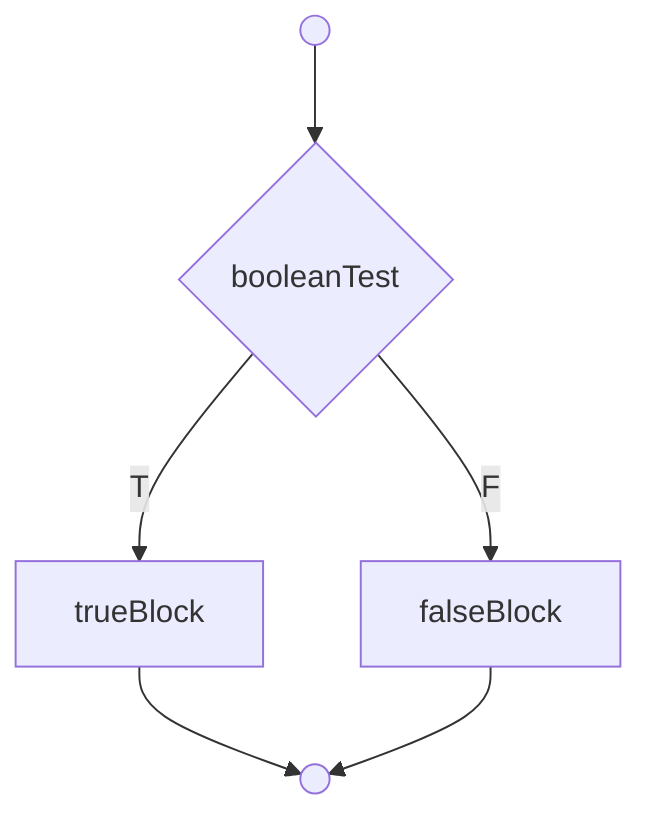
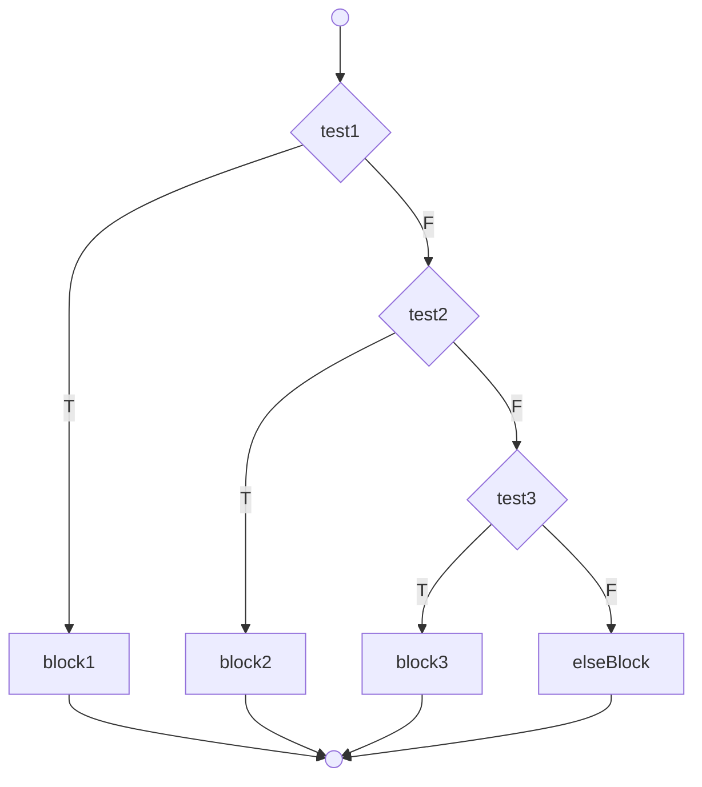
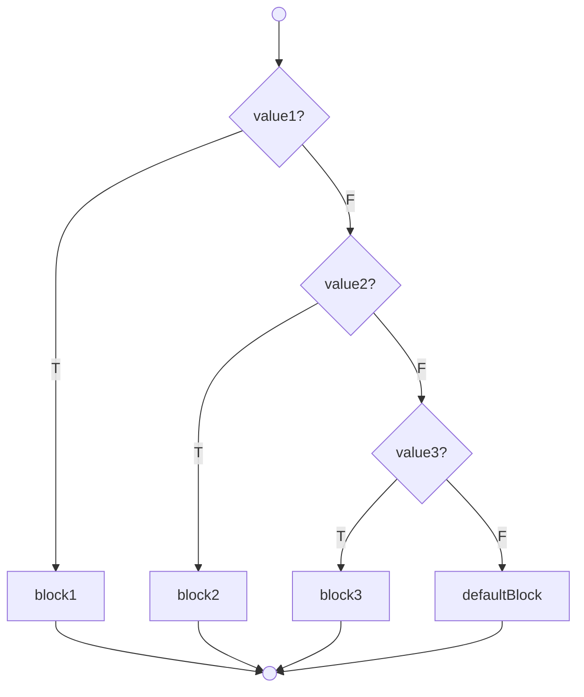
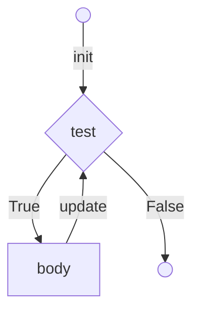
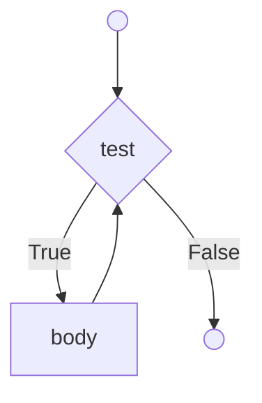
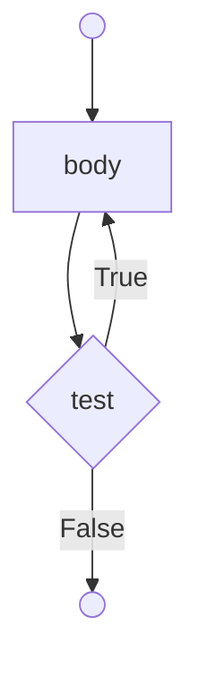

# Лекція 3: Керування потоком виконання

## 🏁 Експрес-опитування

Перед тим, як зануритись у нові конструкції, давайте пригадаємо матеріал з Лекції 2.

1.  Який оператор використовується для **присвоєння** значення, а який для **порівняння**?
2.  Яку команду ми використовуємо, щоб "прочитати" щось з клавіатури?
3.  Що робить оператор `%` (наприклад, `10 % 3`)?
4.  Яка ключова різниця між циклом `for` та циклом `while`?

<details markdown="1">
<summary>Натисніть, щоб побачити відповіді</summary>

1.  **Присвоєння**: `=` (один знак дорівнює). **Порівняння**: `==` (два знаки дорівнює).
2.  Ми використовуємо `std::cin >> my_variable;`.
3.  Оператор `%` (modulus) повертає **остачу від ділення**. `10 % 3` поверне `1`.
4.  **`for`** зазвичай використовується, коли ми *знаємо* точну кількість повторень (наприклад, 10 разів, або для кожного елемента). **`while`** використовується, коли ми знаємо лише *умову продовження* (наприклад, "поки збір не закритий" або "поки користувач не ввів 'exit'").

</details>

-----

## Як читати блок-схеми

У цій лекції ми будемо використовувати блок-схеми для візуалізації логіки. Ось що означають основні фігури:

  * **Овал або кружечок (`()`):** Початок або кінець процесу.
  * **Прямокутник (`[]`):** Операція, дія (наприклад, `battery_level = 100`).
  * **Ромб (`{}`):** Умова або прийняття рішення (наприклад, `if (battery_level > 20)`). З ромба завжди виходять дві стрілки: `True` (Так) та `False` (Ні).
  * **Стрілка (`-->`):** Напрямок виконання програми.

-----

## Умовні оператори (Conditional Statements)

### `if-then`

Конструкція `if-then` виконує блок коду тільки в тому випадку, якщо умова є істинною (`true`).



**Приклад:**

```cpp
int batteryLevel = 30;

if (batteryLevel >= 20) {
    // Цей код виконається
    cout << "Рівень заряду достатній для місії." << endl;
    cout << "Починаємо..." << endl;
}
```

### `if-then-else`

Ця конструкція виконує один блок коду (`true-block`), якщо умова істинна, і інший блок коду (`false-block`), якщо вона хибна.



**Приклад:**

```cpp
int ammo = 5;

if (ammo > 0) {
    cout << "Виконуємо дію." << endl;
} else {
    // Цей код виконається, якщо ammo буде 0
    cout << "Недостатньо ресурсів!" << endl;
}
```

### Ланцюжок `if-else if-else`

Використовується для перевірки послідовності умов. Як тільки одна з умов виявляється істинною, виконується її блок, а решта ланцюжка ігнорується.



**Приклад (Рівень пріоритету):**

```cpp
int powerLevel = 65;

if (powerLevel > 80) {
    cout << "Статус: Повний заряд" << endl;
} else if (powerLevel > 50) {
    // powerLevel не > 80, але > 50 (тобто 51-80)
    cout << "Статус: Робочий режим" << endl;
} else if (powerLevel > 20) {
    // powerLevel не > 50, але > 20 (тобто 21-50)
    cout << "Статус: Низький заряд" << endl;
} else {
    // Всі попередні умови хибні (тобто <= 20)
    cout << "Статус: Критично! Потрібна підзарядка!" << endl;
}
```

### ❓ Питання до групи

Що станеться у прикладі вище, якщо ми **помилково поміняємо місцями** перші дві перевірки? (Тобто, спочатку `if (powerLevel > 50)`, а потім `else if (powerLevel > 80)`). Який статус ми отримаємо для `powerLevel = 90`?

<details markdown="1">
<summary>Натисніть, щоб побачити відповідь</summary>
Ми отримаємо "Статус: Робочий режим". Чому? Тому що перша ж умова `(90 &gt; 50)` буде `true`, її блок виконається, а весь інший ланцюжок (включаючи перевірку `&gt; 80`) буде проігноровано. Ось чому **порядок перевірок** у `if-else if` є критично важливим\! Завжди перевіряйте від найбільш до найменш конкретного (або навпаки).
</details>

### `switch-case`

Оператор `switch-case` є альтернативою `if-else if`, коли потрібно перевірити **одну змінну** на відповідність кільком **фіксованим значенням** (цілі числа або символи).



**Приклад (Меню вибору):**

```cpp
char choice = 'B'; // Наприклад, користувач ввів 'B'

switch (choice) {
    case 'A':
        cout << "Ви обрали пункт А (Завантажити мапу)..." << endl;
        break; // break НЕГАЙНО виходить з switch
    case 'B':
        cout << "Ви обрали пункт B (Почати місію)..." << endl;
        break;
    case 'C':
        cout << "Ви обрали пункт C (Налаштування)..." << endl;
        break;
    default: // Виконується, якщо жоден case не збігся
        cout << "Помилка: Невідомий пункт меню." << endl;
}
```

### ❓ Питання до групи

Що, на вашу думку, станеться, якщо я забуду `break;` у `case 'A'`? Це помилка компіляції? Чи програма зробить щось... дивне?

<details markdown="1">
<summary>Натисніть, щоб побачити відповідь</summary>
Це не помилка компіляції, але це призведе до **"провалювання" (fall-through)**. Якщо `choice` буде 'A', програма виконає код для 'A', *а потім* продовжить виконувати код для `case &#39;B&#39;` (аж доки не зустріне `break` або кінець `switch`). Іноді це використовують свідомо, але зазвичай це серйозна логічна помилка.
</details>

### Тернарний оператор (`? :`)

Це скорочена форма запису `if-else`, яка повертає одне з двох значень.

**Синтаксис:** `умова ? вираз_якщо_true : вираз_якщо_false`

**Приклад:**

```cpp
int batteryLevel = 15;
string status;

// Замість:
// if (batteryLevel > 20) {
//     status = "OK";
// } else {
//     status = "LOW";
// }

// Можна написати в один рядок:
status = (batteryLevel > 20) ? "OK" : "LOW";

cout << "Status: " << status << endl; // Виведе "Status: LOW"
```

-----

## Цикли (Loops)

### `for`

Ідеально підходить, коли кількість повторень (ітерацій) **відома заздалегідь**.



**Приклад (Обробка партії з 5 дронів):**

```cpp
// `i = 1` - ініціалізація (1 раз на початку)
// `i <= 5` - умова (перевірка перед кожною ітерацією)
// `++i` - оновлення (після кожної ітерації)
for (int i = 1; i <= 5; ++i) {
    cout << "Підготовка дрона " << i << " до місії..." << endl;
}
```

### `while`

Виконує блок коду доти, доки умова є істинною. Умова перевіряється **перед** кожною ітерацією. Ідеально, коли кількість ітерацій **невідома**.



**Приклад (Очікування на сигнал GPS):**

```cpp
bool signalAcquired = false;
int attempt = 1;

while (signalAcquired == false) {
    cout << "Спроба " << attempt << ": Пошук сигналу GPS..." << endl;
    
    // ...тут був би код, що намагається отримати сигнал...
    
    // Імітуємо, що на 3-й спробі ми його знайшли
    if (attempt == 3) {
        signalAcquired = true;
    }
    
    attempt++; // Важливо не забути оновити умову!
}
cout << "Сигнал знайдено! Можна злітати." << endl;
```

### `do-while`

Схожий на `while`, але умова перевіряється **після** кожної ітерації. Це гарантує, що тіло циклу виконається **щонайменше один раз**.



**Приклад (Запит на повторення дії):**
Цикл `do-while` ідеальний для меню "спробувати ще раз?".

```cpp
char repeatChoice;

do {
    // Цей код виконається 100% хоча б один раз
    cout << "Виконуємо складну операцію..." << endl;
    cout << "Операція завершена." << endl;
    
    // А тепер питаємо користувача
    cout << "Бажаєте повторити? (Y/N): ";
    cin >> repeatChoice;

} while (repeatChoice == 'Y' || repeatChoice == 'y'); // Перевірка умови *після*

cout << "Завершення роботи." << endl;
```

-----

## Керування ітераціями циклу

  * **`break`**: Негайно перериває виконання і виходить з поточного (найглибшого) циклу.
  * **`continue`**: Перериває поточну ітерацію і переходить до наступної.

**Примітка:** Використання `break` та `continue` вважається поганою практикою, оскільки вони ускладнюють читання та відстеження логіки програми. Намагайтеся уникати їх використання, якщо це можливо.

-----

## Контрольні питання

1.  **Порівняння.** У чому полягає ключова різниця між циклами `while` та `do-while`? Наведіть приклад задачі, де використання `do-while` є більш доцільним.
2.  **Застосування.** Перепишіть наступний код з використанням тернарного оператора (`? :`), щоб досягти того ж результату в один рядок:
    ```cpp
    int x = 10;
    int y;
    if (x > 5) {
        y = 1;
    } else {
        y = 0;
    }
    ```
3.  **Аналіз коду.** Що виведе наступний код? Поясніть роль оператора `continue`.
    ```cpp
    int sum = 0;
    for (int i = 1; i <= 10; i++) {
        if (i % 2 != 0) { // Якщо i непарне
            continue;
        }
        sum += i;
    }
    cout << sum << endl;
    ```
4.  **Концепція.** У яких випадках оператор `switch-case` є кращим вибором, ніж довгий ланцюжок `if-else if`?

<details markdown="1">
<summary>Натисні "Enter" щоб відкрити відповіді ;-)</summary>

**1. `while` vs `do-while`**

  * **`while`** перевіряє умову **ДО** виконання тіла циклу. Якщо умова з самого початку хибна, тіло **не виконається жодного разу**.
  * **`do-while`** перевіряє умову **ПІСЛЯ** виконання тіла циклу. Це гарантує, що тіло **виконається щонайменше один раз**.
  * **Приклад для `do-while`:** Будь-яка ситуація, де потрібно спочатку щось зробити, а потім запитати, чи повторювати. Найкращий приклад — меню підтвердження ("Ви бажаєте вийти? (Y/N)") або запит "Спробувати ще раз?".

**2. Тернарний оператор**

```cpp
int x = 10;
int y = (x > 5) ? 1 : 0; // Ось цей рядок
```

**3. Аналіз коду `continue`**

  * Код виведе **30**.
  * **Пояснення:** Цикл `for` перебирає числа від 1 до 10. Умова `if (i % 2 != 0)` є істинною для **непарних** чисел (1, 3, 5, 7, 9).
  * Коли `i` непарне, спрацьовує `continue`. Це негайно **перериває поточну ітерацію** і переходить до наступного `i`. Рядок `sum += i;` у цьому випадку **пропускається**.
  * Таким чином, до суми додаються **лише парні** числа: `2 + 4 + 6 + 8 + 10 = 30`.

**4. `switch-case` vs `if-else if`**

  * **`switch-case`** є кращим (і більш чистим/читабельним) у конкретній ситуації: коли вам потрібно порівняти **одну і ту саму змінну** (типу `int` або `char`) з **набором фіксованих, сталих значень (констант)**. (Наприклад, `case 1:`, `case 'A':`).
  * **`if-else if`** є набагато гнучкішим і є *єдиним* вибором, якщо вам потрібно:
      * Перевіряти діапазони (`powerLevel > 80`).
      * Перевіряти різні змінні в одному ланцюжку (`if (ammo > 0 && health > 50)`).
      * Перевіряти `string` або `double` (хоча з `double` це пога\_на ідея).

</details>