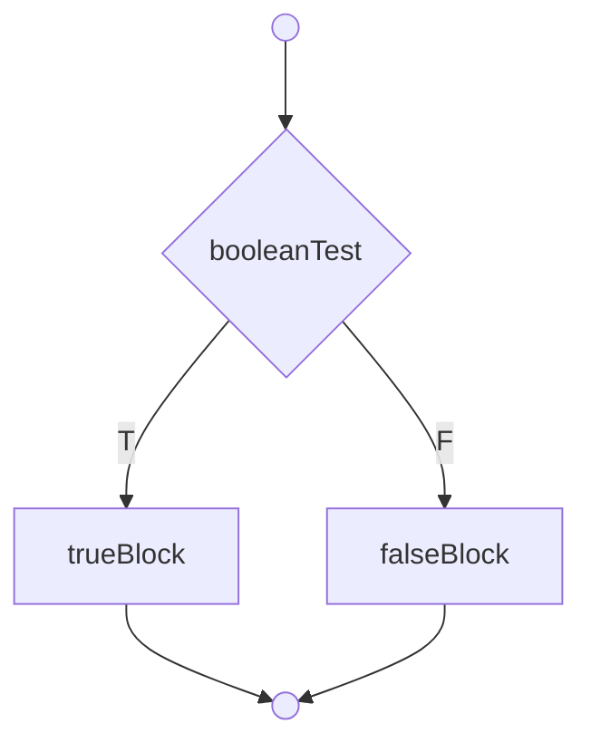
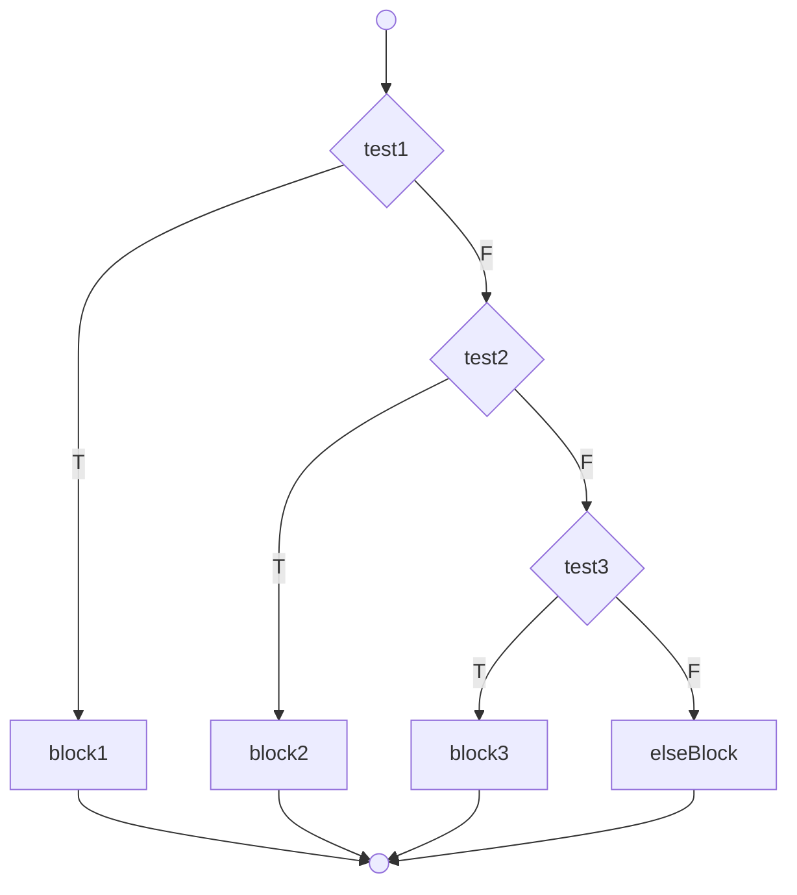
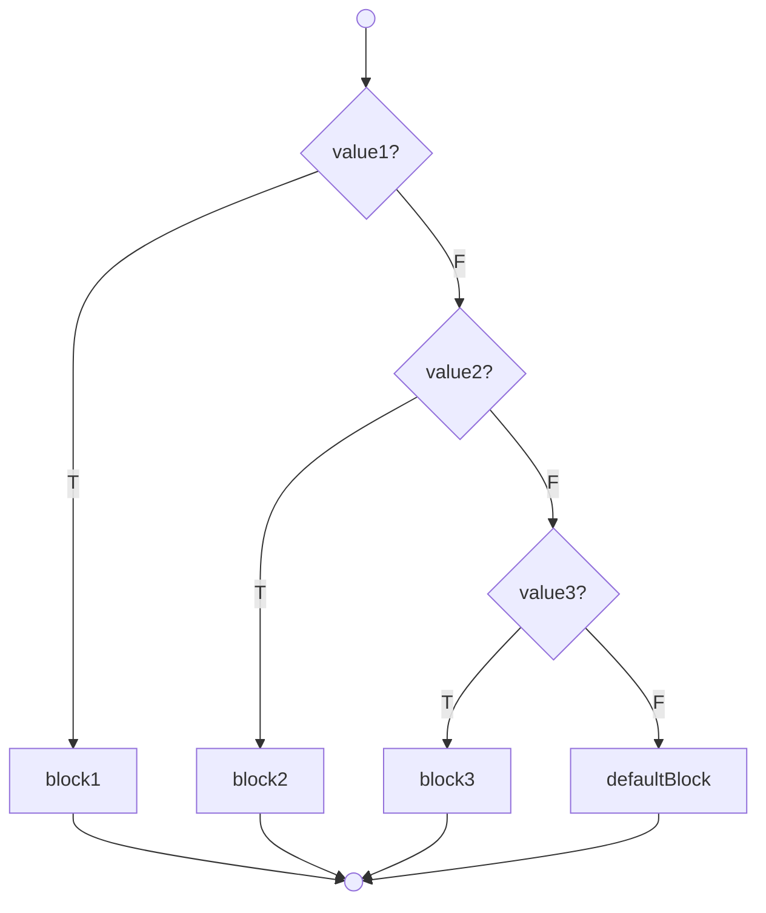
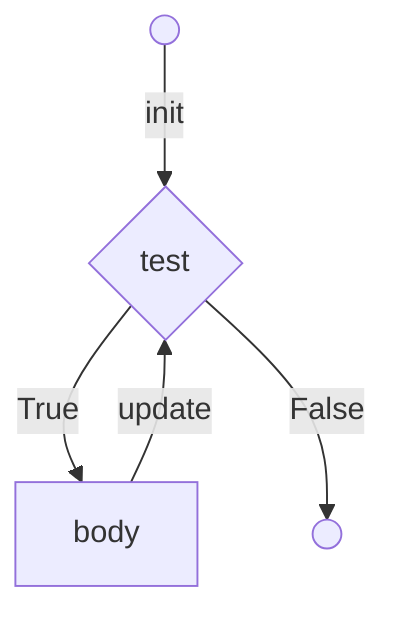
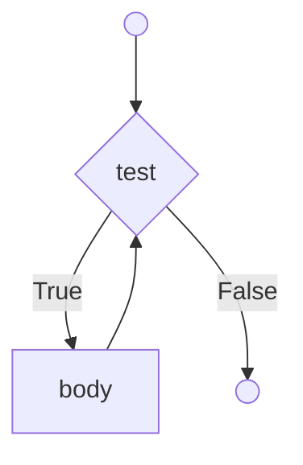
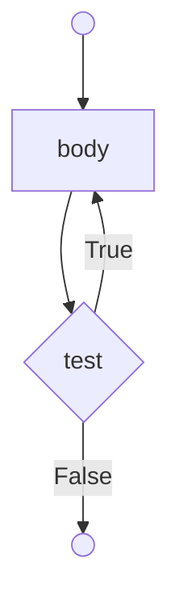

# Лекція 3: Керування потоком виконання

## Як читати блок-схеми

У цій лекції ми будемо використовувати блок-схеми для візуалізації логіки роботи керуючих конструкцій. Ось що означають основні фігури, які ми будемо використовувати в діаграмах Mermaid:

* **Овал або кружечок (`()`):** Початок або кінець процесу.
* **Прямокутник (`[]`):** Операція, дія або набір інструкцій (наприклад, `true-block`).
* **Ромб (`{}`):** Умова або прийняття рішення (наприклад, `if (mark >= 50)`). З ромба завжди виходять дві стрілки, що відповідають результатам `True` (Так) та `False` (Ні).
* **Стрілка (`-->`):** Напрямок виконання програми.

---

## Умовні оператори (Conditional Statements)

Умовні оператори дозволяють програмі виконувати різні блоки коду залежно від певних умов.

### `if-then`

Конструкція `if-then` виконує блок коду тільки в тому випадку, якщо умова є істинною (`true`). Якщо умова хибна (`false`), блок ігнорується, і програма продовжує виконання з наступного оператора.

```mermaid
graph TD;
    Start(( )) --> Condition{"booleanTest"};
    Condition -- "T" --> Process["trueBlock"];
    Process --> End(( ));
    Condition -- "F" --> End(( ));
````

**Синтаксис:**

```cpp
if (booleanExpression) {
    // true-block;
}
```

**Приклад:**

```cpp
if (mark >= 50) {
    cout << "Congratulation!" << endl;
    cout << "Keep it up!" << endl;
}
```

### `if-then-else`

Ця конструкція виконує один блок коду (`true-block`), якщо умова істинна, і інший блок коду (`false-block`), якщо вона хибна.



**Синтаксис:**

```cpp
if (booleanExpression) {
    // true-block;
} else {
    // false-block;
}
```

**Приклад:**

```cpp
if (mark >= 50) {
    cout << "Congratulation!" << endl;
} else {
    cout << "Try Harder!" << endl;
}
```

### Ланцюжок `if-else if-else` (nested-if)

Використовується для перевірки послідовності умов. Як тільки одна з умов виявляється істинною, виконується її блок, а решта ланцюжка ігнорується. Блок `else` в кінці виконується, якщо жодна з попередніх умов не була істинною.



**Приклад:**

```cpp
if (mark >= 80) {
    cout << "A" << endl;
} else if (mark >= 70) {
    cout << "B" << endl;
} else if (mark >= 60) {
    cout << "C" << endl;
} else {
    cout << "F" << endl;
}
```

### `switch-case`

Оператор `switch-case` є альтернативою довгому ланцюжку `if-else if`, коли потрібно перевірити одну змінну на відповідність кільком фіксованим значенням (`case`). Оператор `break` використовується для виходу з конструкції після виконання блоку. Блок `default` є необов'язковим і виконується, якщо жодне зі значень `case` не збіглося.



**Синтаксис:**

```cpp
switch (selector) {
    case value-1:
        // block-1;
        break;
    case value-2:
        // block-2;
        break;
    default:
        // default-block;
}
```

### Тернарний оператор (`? :`)

Це скорочена форма запису `if-else`, яка повертає одне з двох значень залежно від умови.

**Синтаксис:**
`booleanExpression ? trueExpression : falseExpression`

**Приклад:**

```cpp
// Замість:
// if (mark >= 50) {
//     cout << "PASS";
// } else {
//     cout << "FAIL";
// }

// Можна написати:
cout << (mark >= 50 ? "PASS" : "FAIL") << endl;

// Присвоєння максимального значення
max = (a > b) ? a : b;
```

-----

## Цикли (Loops)

Цикли дозволяють виконувати блок коду багаторазово.

### `for`

Цикл `for` ідеально підходить для ситуацій, коли кількість повторень (ітерацій) відома заздалегідь. Він складається з трьох частин: **ініціалізації** (виконується один раз на початку), **умови** (перевіряється перед кожною ітерацією) та **пост-обробки** (виконується після кожної ітерації, зазвичай для оновлення лічильника).



**Приклад (сума чисел від 1 до 1000):**

```cpp
int sum = 0;
for (int number = 1; number <= 1000; ++number) {
    sum += number;
}
```

### `while`

Цикл `while` виконує блок коду доти, доки умова є істинною. Умова перевіряється **перед** кожною ітерацією. Якщо умова з самого початку хибна, тіло циклу не виконається жодного разу.



**Приклад:**

```cpp
int sum = 0, number = 1;
while (number <= 1000) {
    sum += number;
    ++number;
}
```

### `do-while`

Цикл `do-while` схожий на `while`, але умова перевіряється **після** кожної ітерації. Це гарантує, що тіло циклу виконається **щонайменше один раз**.



**Приклад:**

```cpp
int sum = 0, number = 1;
do {
    sum += number;
    ++number;
} while (number <= 1000);
```

-----

## Керування ітераціями циклу

  * **`break`**: Негайно перериває виконання і виходить з поточного (найглибшого) циклу.
  * **`continue`**: Перериває поточну ітерацію і переходить до наступної.

**Примітка:** Використання `break` та `continue` вважається поганою практикою, оскільки вони ускладнюють читання та відстеження логіки програми. Намагайтеся уникати їх використання, якщо це можливо.

-----

## Практичні приклади

  * **Приклад коду:** `loops_samples.cpp` (посилання на ваш файл з прикладами)

-----

## Контрольні питання

1.  **Порівняння.** У чому полягає ключова різниця між циклами `while` та `do-while`? Наведіть приклад задачі, де використання `do-while` є більш доцільним.
2.  **Застосування.** Перепишіть наступний код з використанням тернарного оператора, щоб досягти того ж результату в один рядок:
    ```cpp
    int x = 10;
    int y;
    if (x > 5) {
        y = 1;
    } else {
        y = 0;
    }
    ```
3.  **Аналіз коду.** Що виведе наступний код? Поясніть роль оператора `continue`.
    ```cpp
    int sum = 0;
    for (int i = 1; i <= 10; i++) {
        if (i % 2 != 0) { // Якщо i непарне
            continue;
        }
        sum += i;
    }
    cout << sum << endl;
    ```
4.  **Концепція.** У яких випадках оператор `switch-case` є кращим вибором, ніж довгий ланцюжок `if-else if`?