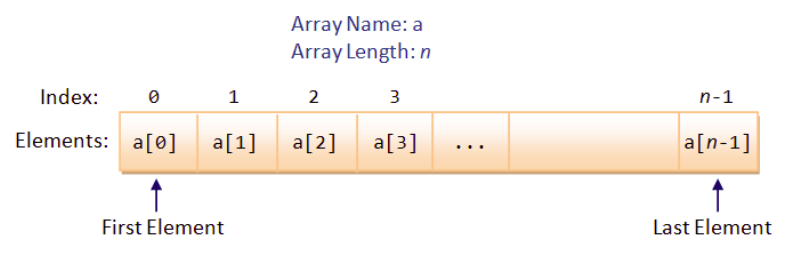

# Лекція 4: Розширені можливості типів: приведення, масиви та C-Strings

## 🏁 Експрес-опитування

Перед початком, давайте швидко пригадаємо ключові моменти з минулої лекції.

1.  У чому різниця між `while (condition)` та `do { ... } while (condition)`?
2.  Яку конструкцію краще обрати, якщо нам потрібно перевірити одну змінну на 5 різних *конкретних* значень (наприклад, `choice == 1`, `choice == 2` і т.д.)? `if-else if` чи `switch`?
3.  Що, на вашу думку, буде в змінній `x` після виконання `int x = 10 / 4;`?

<details markdown="1">
<summary>Натисніть, щоб побачити відповіді</summary>

1.  **`while`** перевіряє умову *ДО* виконання. Тіло циклу може не виконатись жодного разу. **`do-while`** перевіряє умову *ПІСЛЯ*. Тіло циклу гарантовано виконається хоча б один раз.
2.  **`switch`** є більш чистим та ефективним вибором для перевірки однієї змінної на набір фіксованих значень.
3.  В змінній `x` буде `2`. Оскільки обидва числа цілі (`int`), C++ виконає **цілочисельне ділення** і просто відкине залишок `0.5`. Саме про це ми сьогодні і поговоримо\!

</details>

-----

## 1\. "Пастка" ділення: Приведення типів (Type Casting)

Уявімо, що ми пишемо програму для дрона. Нам потрібно розрахувати точність влучань.

```cpp
#include <iostream>

int main() {
    int hits = 9;       // 9 влучань
    int totalShots = 10; // 10 пострілів
    
    // Ми очікуємо 0.9 (90%)
    double accuracy = hits / totalShots; 
    
    std::cout << "Точність: " << accuracy << std::endl;
    return 0;
}
```

**Результат виконання:**

```
Точність: 0
```

**Що сталося?**
Це одна з найпоширеніших "пасток" для новачків. C++ побачив, що `hits` і `totalShots` обидва є `int`.Він вирішив, що ви хочете виконати **цілочисельне ділення**.
Результатом `9 / 10` стало `0` (із залишком `9`, який було відкинуто).
І *тільки після цього* ціле число `0` було присвоєно змінній `accuracy` типу `double`, перетворившись на `0.0`.

### Як це виправити?

Ми маємо "повідомити" C++, що ми хочемо отримати дробовий (дійсний) результат.Для цього **хоча б один** з учасників операції має бути типу `double`.

**Спосіб 1: Явне приведення (Explicit Casting) - Найкращий спосіб**
Ми тимчасово "перетворюємо" одну зі змінних на `double` *тільки* для цієї операції.

```cpp
// static_cast<new_type>(variable) - це безпечний і чіткий спосіб
double accuracy = static_cast<double>(hits) / totalShots; // 9.0 / 10 = 0.9
```

**Спосіб 2: Неявне приведення (Implicit Casting)**
Якщо ми оголосимо змінні як `double` з самого початку, проблема зникне.

```cpp
double hits = 9.0;
double totalShots = 10.0;
double accuracy = hits / totalShots; // 9.0 / 10.0 = 0.9
```

### ❓ Питання до групи

А що буде, якщо написати так:
`double accuracy = static_cast<double>( hits / totalShots );`

Який буде результат? Чому?

<details markdown="1">
<summary>Натисніть, щоб побачити відповідь</summary>
Результат все одно буде `0.0`. Операція в дужках `(hits / totalShots)` виконується *першою* (цілочисельне ділення `9 / 10` дає `0`). І *тільки потім* цей результат `0` перетворюється на `double` (`0.0`). Тому важливо перетворювати на `double` **один з операндів**, а не результат операції.
</details>

### Звуження типів (Truncation)

Зворотний процес також існує, але він **небезпечний**.При присвоєнні `double` у `int`, дробова частина просто **відсікається (truncated)**, а не заокруглюється.

```cpp
double batteryVoltage = 14.8;
int approxVoltage;

approxVoltage = batteryVoltage; // Неявне "звуження"

// approxVoltage тепер дорівнює 14.
// Дробова частина .8 просто зникла.
```

-----

## 2\. Масиви (Arrays)

**Проблема:** У нас є 30 дронів. Нам потрібно зберігати рівень заряду батареї для кожного.Створювати 30 окремих змінних (`battery1`, `battery2`, `battery3`...) — це жахливо.

**Рішення:** **Масив** — це структура, яка зберігає *список* елементів **одного типу** (наприклад, 30 значень `int`) під одним ім'ям.

### Оголошення та індексація



```cpp
// Синтаксис: type arrayName[size]; 
int batteryLevels[30]; 
```

Це створює в пам'яті 30 "комірок" для `int`.


**Найважливіше правило C++:** Індексація (нумерація) масивів **завжди починається з 0**.

  * Для масиву `batteryLevels[30]`:
  *Перший елемент має індекс `0` (`batteryLevels[0]`).
  * Другий елемент має індекс `1` (`batteryLevels[1]`).
  * ...
  *Останній (30-й) елемент має індекс `29` (`batteryLevels[29]`).

### Ініціалізація (Надання значень)

Ви можете надати значення одразу при створенні:

```cpp
// Оголошуємо та ініціалізуємо масив з 5 рівнів заряду
int batteryLevels[5] = {100, 95, 80, 75, 90};

// Ми можемо звернутися до будь-якого елемента за його індексом
cout << "Заряд 3-го дрона: " << batteryLevels[2] << endl; // Виведе 80
```

Щоб ініціалізувати всі елементи нулями, використовуйте:

```cpp
int donationAmounts[100] = {0}; // Всі 100 елементів тепер дорівнюють 0
```

### Масиви та Цикли (Найкращі друзі)

Масиви та цикли `for` створені одне для одного. Цикл `for` дозволяє легко "пробігтися" по всіх елементах масиву.

```cpp
int batteryLevels[5] = {100, 95, 80, 75, 90};

// i = 0 (перший індекс)
// i < 5 (оскільки 5 не включається, останній індекс буде 4)
for (int i = 0; i < 5; ++i) {
    cout << "Дрон " << i+1 << " (індекс " << i << "): " 
         << batteryLevels[i] << "%" << endl;
}
```

**Результат:**

```
Дрон 1 (індекс 0): 100%
Дрон 2 (індекс 1): 95%
Дрон 3 (індекс 2): 80%
Дрон 4 (індекс 3): 75%
Дрон 5 (індекс 4): 90%
```

### Range-based for (C++11)

Існує простіший, сучасний синтаксис `for`, якщо вам потрібно просто перебрати *всі* елементи:

```cpp
// "Для кожного 'level' всередині 'batteryLevels'"
for (int level : batteryLevels) {
    cout << "Рівень: " << level << "%" << endl;
}
```

### 🚨 Критична небезпека: Вихід за межі масиву

Це найстрашніша "яма" в C++.**C++ не перевіряє, чи ви не вийшли за межі масиву**.

```cpp
int arr[5] = {1, 2, 3, 4, 5};

// Останній індекс - 4.
// Ми ПОМИЛКОВО пишемо в індекс 5 (або 10, або 88)
arr[5] = 99; // Помилка! 
arr[88] = 999; // Жахлива помилка!

cout << arr[77] << endl; // Спроба читання сміття 
```

**Результат:** Це не викличе помилку компіляції.Це викличе **Невизначену Поведінку (Undefined Behavior)**. Програма може "впасти", або (що гірше) мовчки записати ці дані поверх іншої важливої інформації у вашій програмі (наприклад, поверх іншої змінної), створюючи хаос.

**Завжди** слідкуйте за тим, що ваші індекси знаходяться в діапазоні `[0, size-1]`.

-----

## 3\. Багатовимірні масиви

**Проблема:** Як представити тактичну карту, сітку 3х3?
**Рішення:** Двовимірний масив (масив масивів).

```cpp
// Оголошуємо сітку 3x3
// Синтаксис: type name[rows][columns]
int mapGrid[3][3];

// Ініціалізація (рядками) 
int mapGrid[3][3] = {
    {1, 0, 0}, // Рядок 0
    {0, 2, 0}, // Рядок 1
    {0, 0, 1}  // Рядок 2
};

// Звертаємось до елемента [рядок][стовпець] 
// Знайдемо, що у нас в секторі [1][1] (центр)
int centerUnit = mapGrid[1][1]; // centerUnit = 2
```

-----

## 4\. C-Рядки (C-Strings)

**Проблема:** Як C++ працював з текстом до появи `std::string`?
**Рішення:** C-String — це просто **масив символів (`char`)**, який має спеціальний символ у кінці.

  ***Нуль-термінатор (`\0`)**: Це спеціальний символ (буквально нуль), який C++ ставить у кінець C-рядка, щоб позначити, де він закінчується.

<!-- end list -->

```cpp
// C++ автоматично додає \0 в кінець
char callsign_1[] = "Ghost"; // [G, h, o, s, t, \0] - Розмір 6
char callsign_2[] = {'S', 'o', 'a', 'p', '\0'}; // Ручний запис - Розмір 5

cout << callsign_1 << endl; // cout читає до \0
```

### 🚨 Порада новачкам

Ваш PDF-файл каже про це дуже чітко, і я повторю: **"For novices, avoid C-string. Use C++ string (in header <string>)"**.

Ми вивчаємо C-Strings, щоб ви *розуміли*, як вони працюють (особливо для старих функцій або низькорівневого коду), але у 99% випадків у сучасній C++ розробці ви маєте використовувати `std::string`, який ми вже бачили. Він безпечніший, потужніший і сам керує своєю пам'яттю.

-----

## 5\. Контрольні питання

1.  **Приведення.** Який результат буде у змінній `avg` і чому?
    `int donations = 15; int count = 4; double avg = donations / count;`
2.  **Масиви (Оголошення).** Як правильно оголосити масив для 50 цілих чисел (`int`) та ініціалізувати всі його елементи нулями?
3.  **Масиви (Індексація).** У вас є масив `double prices[10]`. Який індекс має *перший* елемент? Який індекс має *останній* елемент?
4. **Масиви (Безпека).** Чому код `int arr[5]; arr[5] = 10;` є дуже небезпечним, хоча він і компілюється? 
5. **C-Strings.** Що таке "нуль-термінатор" (`\0`) і яка його роль у C-Strings? 

-----

<details markdown="1">
<summary>Натисніть, щоб побачити відповіді</summary>

1.  **Результат:** `avg` буде `3.0`. **Чому:** Тому що `donations / count` — це **цілочисельне ділення** (`15 / 4`), яке дає `3`. *Тільки після* цього ціле число `3` присвоюється змінній `avg` типу `double` і стає `3.0`.
2. **Відповідь:** `int myArray[50] = {0};` 
3.  **Перший індекс:** `0` (тобто `prices[0]`). **Останній індекс:** `9` (тобто `prices[9]`).
4. Це небезпечно, тому що це **вихід за межі масиву**. Індекс `5` не існує (допустимі індекси: 0, 1, 2, 3, 4).C++ не перевіряє це і запише `10` у випадкову ділянку пам'яті , що може "зламати" інші змінні або спричинити "падіння" програми (Невизначена Поведінка).
5. **Нуль-термінатор (`\0`)** — це спеціальний символ, який ставиться в кінець масиву `char`, щоб позначити кінець рядка. Функції, як `cout`, читають символи доти, доки не зустрінуть цей `\0`.

</details>