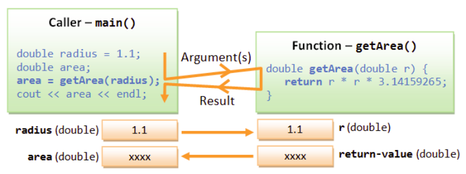
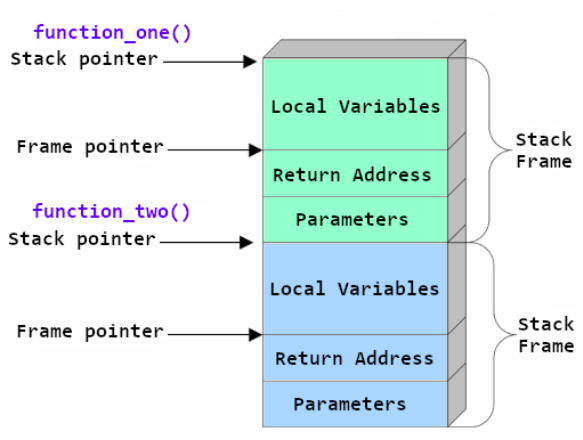

# Лекція 5: Функції в C++

## 🏁 Експрес-опитування

Перед тим, як ми почнемо "розділяти та володарювати", давайте пригадаємо:

1.  Що таке "масив"? Для чого він використовується?
2.  Як називається спеціальний символ, що позначає кінець C-рядка (C-string)?
3.  Що таке "вихід за межі масиву" (наприклад, `arr[10]` у масиві `arr[10]`) і чому це небезпечно?

<details markdown="1">
<summary>Натисніть, щоб побачити відповіді</summary>

1.  **Масив** — це структура даних, що зберігає набір елементів **одного типу** під одним ім'ям (наприклад, `int scores[5]`).
2.  **Нуль-термінатор** (`\0`).
3.  Це **невизначена поведінка (Undefined Behavior)**. C++ не перевіряє індекси, і ви можете випадково записати дані поверх інших змінних або "зламати" програму.

</details>

## Навіщо потрібні функції?

Часто певні ділянки коду потрібно використовувати багато разів у різних місцях програми. Замість того, щоб копіювати один і той самий код (що ускладнює його підтримку), краще винести цей код в окремий блок, який називається **функцією** (або підпрограмою), і викликати його за потребою.

**Основні переваги використання функцій:**

  * **"Розділяй та володарюй" (Divide and Conquer):** Дозволяє розбити велику складну програму на менші, простіші та незалежні компоненти. Це робить програму модульною.
  * **Уникнення повторення коду (DRY - Don't Repeat Yourself):** Легко скопіювати, але важко підтримувати та синхронізувати всі копії. Функції вирішують цю проблему.
  * **Повторне використання коду (Software Reuse):** Ви можете використовувати написані вами функції в інших програмах, об'єднуючи їх у бібліотеки.

-----

## Анатомія функції

У взаємодії з функцією завжди беруть участь дві сторони: **той, хто викликає (caller)**, і **функція, яку викликають (called function)**. Процес виглядає так:

1.  **Caller** викликає функцію, передаючи їй необхідні дані — **аргументи**.
2.  **Функція** отримує ці дані у свої **параметри**, виконує закладені в неї операції.
3.  Після завершення роботи функція повертає **результат** назад до **caller-а**.



### Визначення функції (Function Definition)

Це повний опис того, що робить функція.

```cpp
// Синтаксис:
// тип_повернення ім'я_функції ( список_параметрів ) {
//     тіло_функції;
// }

// Приклад:
double getArea(double r) {
    return r * r * 3.14159265;
}
```

  * **`returnValueType`:** Тип даних, який функція повертає (наприклад, `int`, `double`). Якщо функція нічого не повертає, використовується тип `void`.
  * **`parameterList`:** Список параметрів, які функція приймає, у форматі `тип1 ім'я1, тип2 ім'я2, ...`.

### Прототип функції (Function Prototype)

У C++ функція має бути оголошена **до** її першого виклику. Це можна зробити, розмістивши її повне визначення вище по коду, або за допомогою **прототипу**. Прототип — це лише заголовок функції, що повідомляє компілятору про її інтерфейс.

```cpp
// Прототипи функцій
double getArea(double);
int max(int, int);

// ... інший код, наприклад, функція main(), яка їх викликає ...

// Повні визначення функцій можна розмістити нижче
double getArea(double r) { /* ... */ }
int max(int a, int b) { /* ... */ }
```

Прототипи зазвичай розміщують у заголовочних файлах (`.h`), щоб їх можна було підключати до різних частин програми.

### ❓ Питання до групи

У `main()` ми завжди пишемо `return 0;`. А тут `getArea` повертає `r * r * 3.14...`. У чому концептуальна різниця між `return` у `main` та `return` у `getArea`? (Підказка: *Кому* вони повертають це значення?)

<details markdown="1">
<summary>Натисніть, щоб побачити відповідь</summary>
`return` у `getArea` повертає обчислене значення **тому, хто викликав функцію** (тобто, коду всередині `main`). `return 0;` у `main` повертає значення (код виходу) **операційній системі**, повідомляючи їй, що програма завершилася успішно.
</details>

### Оператор `return` та тип `void`

  * **`return`**: Використовується для повернення результату з функції та передачі керування назад у точку виклику.
  * **`void`**: Використовується для функцій, які виконують дії, але не повертають значення (наприклад, функція, що просто друкує щось на екран). У таких функціях `return;` можна використовувати для дострокового виходу, але він не є обов'язковим.

-----

### Угода про іменування функцій (Function Naming Convention)

Ім'я функції має бути **дієсловом** або дієслівною фразою (описувати дію), що складається з одного або кількох слів.

* Перше слово пишеться з малої літери.
* Решта слів пишуться з великої літери (цей стиль називається **camel-case**).

Наприклад: `getArea()`, `setRadius()`, `moveDown()`, `isPrime()`.

-----

## Параметри та стек викликів

  * **Формальні параметри (Formal Parameters):** Це змінні, оголошені у заголовку функції (наприклад, `double r` у `getArea(double r)`). Вони існують лише всередині функції.
  * **Фактичні параметри (Actual Parameters / Arguments):** Це реальні значення або змінні, які передаються у функцію під час її виклику (наприклад, `radius1` у `getArea(radius1)`).

### Стек викликів (Call Stack)

Стек викликів — це спеціальна область пам'яті, яка зберігає інформацію про активні функції. Коли одна функція викликає іншу, для нової функції створюється **фрейм стеку (stack frame)**, який розміщується на вершині стеку. Цей фрейм містить параметри функції, її локальні змінні та адресу повернення (куди повернутися після завершення). Коли функція завершує роботу, її фрейм видаляється зі стеку.



### ❓ Питання до групи

Стек викликів має обмежений розмір. Що, на вашу думку, станеться, якщо функція буде викликати саму себе безкінечно (це називається нескінченною рекурсією)? (Підказка: що станеться, якщо нескінченно класти тарілки одну на одну?)

<details markdown="1">
<summary>Натисніть, щоб побачити відповідь</summary>
Станеться помилка **"переповнення стеку" (stack overflow)**. Стек "переповниться" фреймами, і програма аварійно завершить роботу. Це одна з найвідоміших помилок у програмуванні (настільки, що на її честь назвали популярний сайт для розробників).
</details>

-----

## Область видимості змінних (Scope)

Область видимості визначає, де саме у програмі доступна та чи інша змінна.

#### Локальна область видимості (Local Scope)

  * **Визначення:** Змінні, оголошені всередині функції.
  * **Видимість:** Тільки всередині цієї функції.
  * **Час життя:** Створюються при виклику функції, знищуються при виході з неї.

#### Глобальна область видимості (Global Scope)

  * **Визначення:** Змінні, оголошені поза будь-якими функціями.
  * **Видимість:** Доступні з будь-якої частини коду після їх оголошення.
  * **Час життя:** Існують протягом усього часу виконання програми.
  * **Рекомендація:** **Уникайте використання глобальних змінних\!** Вони ускладнюють відстеження логіки та можуть призводити до непередбачуваних побічних ефектів.

#### Блочна область видимості (Block Scope)

  * **Визначення:** Змінні, оголошені всередині блоку коду (`{...}`).
  * **Видимість:** Тільки всередині цього блоку.
  * **Час життя:** Створюються при вході в блок, знищуються при виході з нього.

-----

## Розширені можливості функцій C++

### Аргументи за замовчуванням (Default Arguments)

C++ дозволяє задавати значення за замовчуванням для параметрів функції. Такі параметри можна не передавати при виклику.

```cpp
// Прототип з аргументом за замовчуванням
void greet(string name = "Guest");

greet();       // Виведе "Hello, Guest!"
greet("Alice");  // Виведе "Hello, Alice!"
```

**Правило:** Аргументи за замовчуванням мають бути вказані **справа наліво**.

### Вбудовані функції (Inline Functions)

Для дуже маленьких функцій, що часто викликаються, можна використовувати ключове слово `inline`. Це **рекомендація** для компілятора — замість реального виклику функції підставити її код прямо в місце виклику, щоб зменшити накладні витрати.

```cpp
inline int square(int x) {
    return x * x;
}
```

**Важливо:** Компілятор може проігнорувати цю рекомендацію.

### Лямбда-функції (Lambda Functions, C++11)

Це анонімні (безіменні) функції, які можна визначати прямо "на місці". Вони дуже корисні для коротких операцій, що передаються як аргументи в інші функції.

```cpp
// Лямбда-функція, що додає два числа
auto add = [](int a, int b) -> int {
    return a + b;
};

cout << add(3, 4); // Виведе 7
```

### Рекурсивні функції

**Рекурсія** — це техніка, при якій функція викликає саму себе для вирішення задачі.

```cpp
// Класичний приклад - обчислення факторіалу
int factorial(int n) {
    if (n <= 1) {
        return 1; // Базовий випадок, що зупиняє рекурсію
    } else {
        return n * factorial(n - 1); // Рекурсивний виклик
    }
}
```

-----

## Контрольні питання

1.  **Концепція.** Поясніть різницю між прототипом функції та її визначенням. Чому в C++ прототипи є важливими?
2.  **Область видимості.** Що буде виведено на екран? Поясніть свою відповідь, посилаючись на правила області видимості змінних.
    ```cpp
    #include <iostream>
    using namespace std;

    int x = 10; // Глобальна змінна

    void myFunction() {
        int x = 20; // Локальна змінна
        cout << x << endl;
    }

    int main() {
        myFunction();
        cout << x << endl;
        return 0;
    }
    ```
3.  **Застосування.** Напишіть функцію `double average(int a, int b)` та її прототип. Функція має приймати два цілих числа і повертати їхнє середнє арифметичне у вигляді дійсного числа.
4.  **Розширені можливості.** Що таке вбудована (inline) функція і в яких випадках її доцільно використовувати? Чи є директива `inline` обов'язковою для виконання компілятором?

<details markdown="1">
<summary>Натисніть, щоб побачити відповіді</summary>

**1. Прототип vs Визначення:**

  * **Визначення (Definition)** — це *повна реалізація* функції (заголовок + тіло з кодом).
  * **Прототип (Prototype)** — це *тільки заголовок* функції, що закінчується `;` (напр., `double getArea(double);`).
  * **Важливість:** C++ компілятор читає файл зверху вниз. Якщо ви спробуєте викликати функцію *до* того, як компілятор її "побачив" (або її прототип, або її повне визначення), він видасть помилку. Прототипи дозволяють нам повідомити компілятору "інтерфейс" всіх функцій наперед (зазвичай у `.h` файлах), а їх реалізацію розміщувати де завгодно (зазвичай у `.cpp` файлах).

**2. Аналіз коду:**
На екран буде виведено:

```
20
10
```

  * **Пояснення:**
    1.  `myFunction()` викликається першою.
    2.  Всередині `myFunction()` створюється *нова локальна змінна* `x = 20`, яка "ховає" (shadows) глобальну. `cout << x` виводить локальне значення `20`.
    3.  Функція завершується, її локальна `x` знищується.
    4.  Керування повертається в `main`.
    5.  `cout << x` у `main` звертається до єдиної змінної `x`, яку "бачить" `main` — це *глобальна* `x = 10`.

**3. Функція `average`:**

  * **Прототип:**
    ```cpp
    double average(int a, int b);
    ```
  * **Визначення:**
    ```cpp
    double average(int a, int b) {
        // Важливо зробити приведення типів ДО ділення,
        // щоб уникнути цілочисельного ділення!
        // (a + b) / 2.0 - також правильний варіант.
        return static_cast<double>(a + b) / 2.0;
    }
    ```

**4. Inline-функції:**

  * **Що це:** `inline` — це *рекомендація* (не наказ\!) для компілятора. Вона просить його не виконувати повноцінний "виклик" функції (який має певні накладні витрати), а просто взяти тіло цієї функції і *вставити* його код прямо в те місце, де вона викликається.
  * **Коли використовувати:** Тільки для дуже маленьких, тривіальних функцій (наприклад, 1-2 рядки), які викликаються дуже часто (наприклад, всередині циклу).
  * **Чи обов'язкова:** Ні. Компілятор може проігнорувати `inline`, якщо функція занадто складна, рекурсивна або він просто вважатиме це неефективним. Сучасні компілятори також можуть самі робити "inline" функції, які ви не позначали, якщо бачать у цьому сенс.

</details>