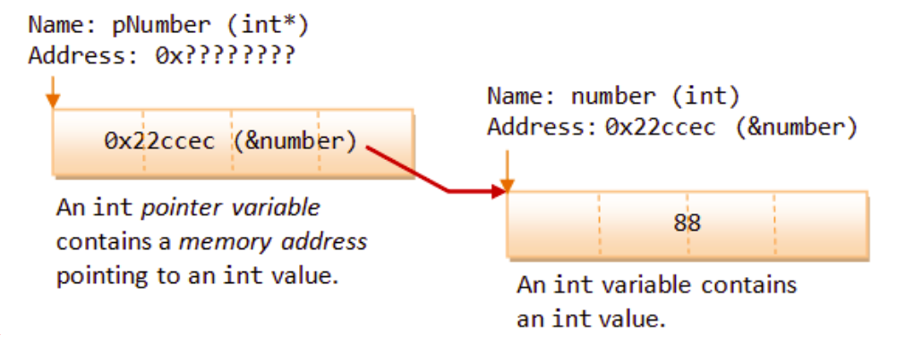

# Лекція 6: Вказівники (Pointers) в C++

## 🏁 Експрес-опитування

Вказівники тісно пов'язані з тим, як C++ працює з пам'яттю. Давайте пригадаємо дещо з минулої лекції.

1.  Що таке "функція" і яка її головна перевага?
2.  Чим відрізняється "глобальна" змінна від "локальної"? Де "живе" кожна з них?
3.  Що таке `int main()`? Це функція?
4.  Коли функція завершує роботу, що стається з її локальними змінними?

<details markdown="1">
<summary>Натисніть, щоб побачити відповіді</summary>

1.  **Функція** — це іменований блок коду, який можна викликати. Переваги: **"Розділяй та володарюй"** (розбиття складних завдань) та **DRY** (неповторення коду).
2.  **Глобальна** "живе" поза всіма функціями, доступна звідусіль. **Локальна** "живе" всередині функції (або блоку `{}`) і доступна лише там. Локальні змінні створюються на **стеку викликів**.
3.  Так, `int main()` — це головна функція, з якої починається виконання програми.
4.  Вони **знищуються**. Їхня пам'ять (у стековому фреймі) звільняється. Це *дуже* важливий момент, який ми скоро пов'яжемо з вказівниками.

</details>

## Що таке вказівник і навіщо він потрібен?

**Вказівники (Pointers)**, **посилання (References)** та **динамічне виділення пам'яті** — це найпотужніші можливості C++, що дозволяють програмісту напряму керувати пам'яттю. Це критично важливо для досягнення максимальної продуктивності.

Водночас, вказівники є однією з найскладніших тем. Роботу з ними влучно описують як **"заряджений пістолет в руках новачка"**:

  * **Потужність:** Дозволяють напряму звертатися до комірок пам'яті та змінювати їх вміст.
  * **Складність:** Важкі для коректного використання.
  * **Ризики:** Неправильне використання призводить до нечитабельного коду, витоків пам'яті, переповнення буфера та вразливостей у безпеці.

Сучасні мови, як-от Java та C\#, уникають вказівників на користь автоматичного управління пам'яттю. Однак для C++ розуміння вказівників є фундаментальним.

### ❓ Питання до групи

Як ви думаєте, чому мови типу Java/C\# вирішили "приховати" вказівники від розробника? Який тут компроміс? Вони обміняли частину *чого* (що є у C++) на *що* (чого бракує C++)?

<details markdown="1">
<summary>Натисніть, щоб побачити відповідь</summary>
Це класичний компроміс: **Продуктивність проти Безпеки**. Вони обміняли *прямий контроль над пам'яттю* (і максимальну швидкість C++) на *безпеку* та *простоту розробки*. Автоматичне "збирання сміття" (Garbage Collector) запобігає витокам пам'яті, але додає невеликі накладні витрати.
</details>

-----

## Пам'ять комп'ютера: Адреси та дані

Щоб зрозуміти вказівники, потрібно уявити пам'ять комп'ютера. Це довга послідовність комірок, кожна розміром в 1 байт.

  * Кожна комірка має унікальний числовий номер — **адресу** (зазвичай у шістнадцятковому форматі).
  * Кожна комірка зберігає якесь значення — **дані**.

Змінні, які ми створюємо в програмі, розміщуються в цих комірках. Тип даних (`int`, `double`) каже компілятору, скільки байт займати і як інтерпретувати дані в них.

| Комп'ютер | | Програміст | | |
| :--- | :--- | :--- | :--- | :--- |
| **Адреса** | **Вміст (Hex)** | **Ім'я** | **Тип** | **Значення** |
| `0x90000000` | `00` | | | |
| `0x90000001` | `00` | `sum` | `int` (4 байти) | `0x000000FF` (255) |
| `0x90000002` | `00` | | | |
| `0x90000003` | `FF` | | | |
| `0x90000004` | `FF` | `age` | `short` (2 байти) | `0xFFFF` (-1) |
| `0x90000005` | `FF` | | | |
| ... | ... | | | |
| `0x9000000E` | `90` | `ptrSum` | `int*` (4 байти) | `0x90000000` |
| `0x9000000F` | `00` | | | |
| `0x90000010` | `00` | | | |
| `0x90000011` | `00` | | | |

**Вказівник — це змінна, яка зберігає не звичайне значення (як 255), а адресу іншої комірки пам'яті.**

-----

## Робота з вказівниками

### Оголошення вказівників

Вказівник оголошується за допомогою символу `*`. Він завжди пов'язаний з певним типом даних.

```cpp
// Синтаксис:
// тип_даних *ім'я_вказівника;

int *iPtr; // iPtr - це вказівник, що може зберігати адресу змінної типу int
double *dPtr; // dPtr - вказівник на double
```

**Дуже важливий нюанс синтаксису ("пастка C++"):**

```cpp
int* p1, p2; // p1 - це вказівник на int, АЛЕ p2 - це звичайний int!
int *p1, *p2; // Правильно: p1 та p2 - це вказівники на int.
```

Через цю плутанину багато програмістів (включаючи мене) надають перевагу стилю `int *p1;` (зірочка біля імені), бо це чітко показує, що *змінна* `p1` є вказівником.

**Угода про іменування:** Рекомендується додавати до імені вказівника префікс `p` або суфікс `Ptr` (наприклад, `pNumber`, `numberPtr`).

### Оператор отримання адреси `&`

Щоб отримати адресу існуючої змінної, використовується **оператор `&`**. Результат цієї операції можна присвоїти вказівнику. Може бути тільки **RHS** оператором.

```cpp
int number = 88;       // Звичайна змінна
int *pNumber;          // Оголошення вказівника
pNumber = &number;     // Присвоєння адреси змінної 'number' вказівнику 'pNumber'

// Можна оголосити та ініціалізувати одразу
int *pAnother = &number;
```



## LHS та RHS: Ліва та Права сторони операції

У мовах програмування, особливо при роботі з оператором присвоєння (`=`), поняття **LHS (Left-Hand Side)** та **RHS (Right-Hand Side)** є фундаментальними. Вони означають ліву та праву сторони від оператора і мають абсолютно різні ролі та правила.

### RHS (Права сторона) — Сторона "Значення"

**Роль:** Основна задача правої сторони — **бути обчисленою (evaluated) до єдиного, конкретного значення.** Це сторона, яка "дає" результат.

**Чим може бути RHS:**

  * **Літералом:** `x = 10;` (RHS — це число `10`)
  * **Змінною:** `x = y;` (RHS — це значення, що зберігається у змінній `y`)
  * **Арифметичним виразом:** `x = y + z * 2;` (RHS — це результат обчислення виразу)
  * **Викликом функції, що повертає значення:** `x = getArea(5.0);` (RHS — це значення, яке поверне функція `getArea`)
  * **Оператором `&`:** `ptr = &x;` (RHS — це адреса змінної `x`)

> **Аналогія:** Уявіть, що RHS — це математична задача на дошці. Перш ніж щось робити далі, вам потрібно її розв'язати і отримати одну чітку відповідь.

### LHS (Ліва сторона) — Сторона "Призначення"

**Роль:** Основна задача лівої сторони — **визначити місце в пам'яті (бути локатором), куди буде збережено результат**, отриманий з правої сторони.

**Чим може бути LHS (в операції присвоєння):**

  * **Змінною:** `x = 10;` (LHS — це комірка пам'яті, що асоційована зі змінною `x`)
  * **Елементом масиву:** `arr[0] = 20;`
  * **Розіменованим вказівником:** `*ptr = 30;`

**Важливо:** LHS не може бути виразом або літералом. Саме тому запис `x + y = 10;` є **некоректним** у програмуванні. Вираз `x + y` обчислюється у значення, але він не є коміркою пам'яті, куди можна щось записати.

> **Аналогія:** Уявіть, що LHS — це поштова скринька з номером. Ви не можете відправити лист "на відповідь задачі 2+2". Ви можете відправити його лише на конкретну адресу, наприклад, "скринька №4".

### Підсумкова таблиця

| Характеристика | LHS (Ліва сторона) | RHS (Права сторона) |
| :--- | :--- | :--- |
| **Основна роль** | Призначення (Destination / Locator) | Значення (Value / Source) |
| **Що робить?** | Вказує, **куди** зберегти результат. | Обчислюється, **що** саме зберегти. |
| **Приклади** | `myVar`, `myArray[i]`, `*myPtr` | `100`, `anotherVar`, `5 * (x + y)`, `getValue()`, `&myVar` |

### Оператор розіменування `*`

Щоб отримати або змінити **значення, що зберігається за адресою**, яку тримає вказівник, використовується **оператор розіменування `*`**.

```cpp
int number = 88;
int *pNumber = &number;

// Вивід інформації
cout << pNumber << endl;  // Виведе адресу змінної number (напр., 0x22ccec)
cout << *pNumber << endl; // Виведе значення, що лежить за цією адресою (88)

// Зміна значення через вказівник
*pNumber = 99; // Записати значення 99 в комірку, на яку вказує pNumber

cout << *pNumber << endl; // Виведе 99
cout << number << endl;   // Значення оригінальної змінної також змінилося на 99
```

### ❓ Питання до групи

У нас є два оператори, які позначаються `*`:

1.  Оголошення: `int *ptr;`
2.  Розіменування: `*ptr = 99;`
    А тепер подивіться на `*pNumber = 99;` та `number = 99;`. Вони роблять те саме. Навіщо нам взагалі `*pNumber`, якщо є `number`? Де це може бути корисним? (Підказка: згадайте про функції).

<details markdown="1">
<summary>Натисніть, щоб побачити відповідь</summary>
Це корисно, коли ми хочемо **дати функції можливість змінити нашу змінну**. Ми не можемо передати `number` в іншу функцію і змінити її (це буде pass-by-value, C++ створить копію). Але ми можемо передати *адресу* `number` (тобто `pNumber`). Функція, отримавши адресу, може "дотягнутися" до нашої `number` за допомогою оператора `*` і змінити її. Це називається **pass-by-pointer**.
</details>

-----

## Правила та найчастіші помилки

### Сувора типізація вказівників

Вказівник є строго типізованим. Вказівник на `int` може зберігати лише адресу змінної `int`, вказівник на `double` — лише адресу `double`.

```cpp
int i = 88;
double d = 55.66;
int *iPtr = &i;
// iPtr = &d; // ПОМИЛКА: не можна присвоїти адресу double вказівнику на int
// iPtr = i;  // ПОМИЛКА: вказівник зберігає адресу, а не значення
```

### Неініціалізовані вказівники ("дикі" вказівники)

Оголошення вказівника без ініціалізації є вкрай небезпечним.

```cpp
int *iPtr;   // iPtr вказує на випадкову адресу в пам'яті (на "сміття")
*iPtr = 55;  // Запис числа 55 у випадкову комірку!
             // Це може "зламати" інші частини вашої програми або всю систему.
```

Це одна з найсерйозніших помилок, яку компілятор може не виявити.

### Нульові вказівники (Null Pointers)

Щоб уникнути проблеми з "дикими" вказівниками, якщо вказівник ще не вказує на реальний об'єкт, його варто ініціалізувати нульовим значенням.

```cpp
int *iPtr = 0;    // Старий стиль C
int *p = NULL;    // Стиль C, використовує макрос
int *pNew = nullptr; // Сучасний, рекомендований стиль C++11
```

**`nullptr` є кращим вибором**, оскільки він є типізованим і запобігає певним видам помилок.

Спроба розіменувати нульовий вказівник (`*pNew`) призведе до негайного аварійного завершення програми, що набагато краще, ніж тихе пошкодження пам'яті.

-----

## Керування доступом: `const` та вказівники

Ключове слово `const` може застосовуватися як до даних, на які вказує вказівник, так і до самого вказівника. Це створює чотири комбінації:

> **Мнемонічне правило:** Читайте оголошення **справа наліво**.

### 1. `int * iptr` (Звичайний вказівник)
* **Що:** Вказівник (`*`) на `int`.
* **Дозволено:** Можна змінювати і **значення** (`*iptr = 9;`), і сам **вказівник** (`iptr = &i2;`). 
* **Приклад:** `int i1 = 8, i2 = 9; int * iptr = &i1; *iptr = 9; iptr = &i2;` 

### 2. `const int * iptr` (Вказівник на константу)
* **Що:** Вказівник (`*`) на `int`, який є `const` (константою).
* **Дозволено:** Можна змінювати **вказівник** (`iptr = &i2;`). 
* **Заборонено:** Не можна змінювати **значення** за адресою (`*iptr = 9;`). 
* **Приклад:** `const int * iptr = &i1; iptr = &i2;` 

### 3. `int * const iptr` (Константний вказівник)
* **Що:** `const` (константний) вказівник (`*`) на `int`.
* **Дозволено:** Можна змінювати **значення** (`*iptr = 9;`). 
* **Заборонено:** Не можна змінювати сам **вказівник** (`iptr = &i2;`).  Також він **повинен бути ініціалізований** при оголошенні. 
* **Приклад:** `int * const iptr = &i1; *iptr = 9;` 

### 4. `const int * const iptr` (Константний вказівник на константу)
* **Що:** `const` (константний) вказівник (`*`) на `int`, який є `const`.
* **Заборонено:** Не можна змінювати **ні значення** (`*iptr = 9;`), **ні сам вказівник** (`iptr = &i2;`). 
* **Приклад:** `const int * const iptr = &i1;` 

-----

## Контрольні питання

1.  **Концепція.** Поясніть різницю між змінною-вказівником та звичайною змінною. Що зберігає кожна з них?

2.  **Синтаксис та аналіз.** Що буде виведено на екран в результаті виконання коду? Поясніть значення `&x`, `ptr` та `*ptr`.

    ```cpp
    #include <iostream>
    using namespace std;

    int main() {
        int x = 10;
        int *ptr = &x;
        *ptr = 20;
        
        cout << "Address of x: " << &x << endl;
        cout << "Value of ptr: " << ptr << endl;
        cout << "Value pointed to by ptr: " << *ptr << endl;
        cout << "Value of x: " << x << endl;
        return 0;
    }
    ```

3.  **Помилки.** Знайдіть дві серйозні помилки в цьому коді. Поясніть, чому вони небезпечні.

    ```cpp
    int *pValue;
    *pValue = 100;

    double pi = 3.14;
    pValue = &pi;
    ```

4.  **Застосування.** Оголосіть змінну `double price = 19.99;` та вказівник `pPrice`, який вказує на неї. Потім, використовуючи **лише вказівник `pPrice`**, змініть значення `price` на `24.99`.

<details markdown="1">
<summary>Натисніть, щоб побачити відповіді</summary>

**1. Вказівник vs Змінна:**

  * **Звичайна змінна** (напр., `int x = 10;`) зберігає **безпосереднє значення** (число 10).
  * **Змінна-вказівник** (напр., `int *ptr = &x;`) зберігає **адресу в пам'яті**, де лежить інше значення (напр., `0x7ffc...`, адресу `x`).

**2. Аналіз коду:**
На екран буде виведено (адреса буде відрізнятися):

```
Address of x: 0x7ffc12345678
Value of ptr: 0x7ffc12345678
Value pointed to by ptr: 20
Value of x: 20
```

  * **`&x`**: Оператор "взяти адресу `x`". Виводить адресу, де живе `x`.
  * **`ptr`**: Змінна-вказівник. Вона зберігає адресу `x`, тому виводить те саме, що й `&x`.
  * **`*ptr`**: Оператор "розіменування". "Іди за адресою, що в `ptr`, і візьми значення". Оскільки рядок `*ptr = 20;` змінив це значення, він виводить `20`.
  * **`x`**: Оригінальна змінна `x`. Оскільки `*ptr = 20;` змінив значення в комірці `x`, `x` тепер теж дорівнює `20`.

**3. Помилки в коді:**

  * **Помилка 1:** `*pValue = 100;`. `pValue` — це **неініціалізований ("дикий") вказівник**. Він вказує на випадкову адресу. Цей рядок намагається записати `100` у випадкову комірку пам'яті, що є катастрофічною помилкою (Undefined Behavior).
  * **Помилка 2:** `pValue = &pi;`. `pValue` — це вказівник типу **`int*`**, а `&pi` — це адреса змінної типу **`double`**. Це **невідповідність типів**. Компілятор C++ забороняє присвоювати адресу `double` вказівнику на `int` без явного (і небезпечного) приведення типів.

**4. Застосування (Зміна через вказівник):**

```cpp
double price = 19.99;
double *pPrice = &price; // 1. Оголошуємо та ініціалізуємо вказівник

*pPrice = 24.99; // 2. Використовуємо оператор розіменування (*)
                 //    для зміни значення за адресою
```

</details>