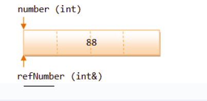
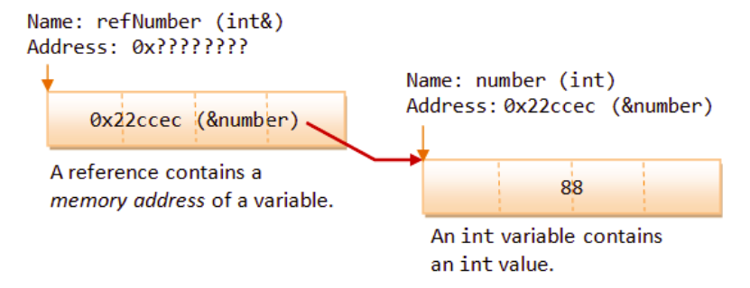

# Лекція 7: Посилання (References) та передача параметрів у функції

## 🏁 Експрес-опитування

У лекції 6 ми "гралися з вогнем" — вказівниками. Давайте перевіримо, чи ми засвоїли ключові ідеї, перш ніж перейти до безпечнішої альтернативи.

1.  Якщо `int x = 10;`, що поверне вираз `&x`?
2.  Якщо `int *ptr = &x;`, що поверне вираз `*ptr`?
3.  Яка головна небезпека "неініціалізованого" вказівника (напр., `int *p; *p = 10;`)?
4.  Який символ ми рекомендуємо використовувати для "нульових" вказівників у сучасному C++ (`0`, `NULL` чи `nullptr`)?

<details markdown="1">
<summary>Натисніть, щоб побачити відповіді</summary>

1.  Оператор `&` поверне **адресу** змінної `x` у пам'яті (наприклад, `0x7ffc...`).
2.  Оператор `*` (розіменування) поверне **значення**, що лежить за адресою, тобто `10`.
3.  **Невизначена поведінка (Undefined Behavior)**. Вказівник `p` вказує на випадкову адресу ("сміття"), і ми намагаємося записати `10` у цю випадкову комірку, що може "зламати" програму.
4.  **`nullptr`**. Це ключове слово, спеціально створене для цього, воно безпечніше і чіткіше.

</details>

## Що таке посилання (Reference)?

**Посилання (Reference)**, яке з'явилося в C++, — це **псевдонім (alias)** або альтернативне ім'я для *вже існуючої* змінної. Після створення посилання, ви можете звертатися до однієї і тієї ж комірки пам'яті, використовуючи як оригінальне ім'я, так і ім'я-псевдонім.

Основне призначення посилань — використання в якості параметрів функцій для реалізації механізму **передачі за посиланням (pass-by-reference)**.



### Подвійне значення символу `&`

Символ `&` в C++ має два значення залежно від контексту:

  * **В виразах (RHS):** Це оператор **отримання адреси**. `&number` повертає адресу змінної `number`.
  * **В оголошеннях (LHS):** Це частина ідентифікатора типу, що створює **посилання**. `int &refNumber = number;` створює посилання `refNumber` на змінну `number`.

**Синтаксис оголошення:**

```cpp
// newName стає новим ім'ям (псевдонімом) для existingName
type &newName = existingName;

// Приклад:
int number = 10;
int &refNumber = number; // refNumber - це тепер інше ім'я для 'number'

refNumber = 20; // Це змінює 'number' на 20
cout << number; // Виведе 20
```

Внутрішньо посилання працює подібно до вказівника: воно зберігає адресу змінної, на яку посилається.



-----

## Посилання проти вказівників

Хоча посилання та вказівники схожі, між ними є принципові відмінності, що роблять посилання простішими та безпечнішими у використанні.

| Критерій | Вказівник (`*`) | Посилання (`&`) |
| :--- | :--- | :--- |
| **Ініціалізація** | Може бути неініціалізованим (вказувати будь-куди). Можна ініціалізувати `nullptr`. | **Обов'язково** має бути ініціалізоване існуючою змінною в момент оголошення. |
| **Зміна цілі** | Може бути перенаправлений на іншу змінну в будь-який момент. (`ptr = &anotherVar;`) | **Не може бути змінене.** Завжди посилається на ту саму змінну, з якою було ініціалізоване. |
| **Синтаксис доступу** | Потребує **явного розіменування** за допомогою оператора `*` (`*pNumber = 10;`). | Розіменовується **неявно**. Використовується як звичайна змінна (`refNumber = 10;`). |
| **Null-значення** | Може бути нульовим (`nullptr`), тобто не вказувати на жодну змінну. | **Не може бути `null`**. Завжди має посилатися на валідну змінну. |

### ❓ Питання до групи

Виходячи з таблиці, як ви думаєте, чому творці C++ додали посилання? Яку головну проблему вказівників вони намагалися вирішити?

<details markdown="1">
<summary>Натисніть, щоб побачити відповідь</summary>
Вони вирішували дві проблеми:

1.  **Безпека:** Посилання *не можуть* бути `nullptr` і *не можуть* бути неініціалізованими. Це миттєво прибирає два найчастіших джерела помилок з вказівниками.
2.  **Читабельність:** Синтаксис `refNumber = 10;` набагато чистіший і простіший для читання, ніж `*pNumber = 10;`. Це робить код (особливо у параметрах функцій) менш "зашумленим".
</details>

-----

## Передача параметрів у функції

Це ключове застосування посилань. Існує три основні способи передачі параметрів у функцію:

#### 1\. За значенням (Pass-by-Value)

  * **Що відбувається:** У функцію передається **копія** аргументу.
  * **Ефект:** Усі зміни всередині функції відбуваються з локальною копією і **не впливають** на оригінальну змінну.
  * **Приклад:** `void func(int x);`
  * **Недолік:** Дуже неефективно, якщо `x` — це великий об'єкт (наприклад, `string` або вектор), оскільки створення копії займає час і пам'ять.

#### 2\. За вказівником (Pass-by-Pointer) - *Стиль C*

  * **Що відбувається:** У функцію передається **адреса** змінної (копія вказівника).
  * **Ефект:** Функція може змінювати оригінальну змінну, розіменовуючи вказівник.
  * **Синтаксис:** Вимагає `*` та `&` у коді, що робить його менш читабельним.
  * **Приклад:** `void func(int* x) { *x = 10; }` // Виклик: `func(&myVar);`

#### 3\. За посиланням (Pass-by-Reference) - *Стиль C++*

  * **Що відбувається:** У функцію передається **псевдонім** оригінальної змінної.
  * **Ефект:** Функція працює **безпосередньо з оригінальною змінною**. Усі зміни впливають на неї.
  * **Синтаксис:** Чистий та інтуїтивний, як при передачі за значенням.
  * **Приклад:** `void func(int& x) { x = 10; }` // Виклик: `func(myVar);`

-----

## Безпека та ефективність: `const` у параметрах

Ключове слово `const` у поєднанні з посиланнями є потужним інструментом.

**Синтаксис:** `void func(const string& str);`

Цей запис означає: "Передати об'єкт `str` за посиланням (щоб **уникнути копіювання**), але я обіцяю, що **не буду його змінювати** (`const`)".

**Переваги:**

1.  **Ефективність:** Дозволяє передавати у функцію великі об'єкти (як `string` або структури) **без дорогого копіювання**, як при передачі за значенням.
2.  **Безпека:** Гарантує, що функція **не зможе випадково змінити** оригінальний об'єкт. Це робить код надійнішим.

> **Золоте правило:** Якщо функція не повинна змінювати вхідний параметр-об'єкт, **завжди** передавайте його як **константне посилання (`const &`)**.

-----

## Повернення значень за посиланням

Функції також можуть повертати значення за посиланням (`int& func()`). Це дозволяє, наприклад, використовувати виклик функції з лівого боку від оператора присвоєння.

#### ⚠️ Критична помилка: Повернення посилання на локальну змінну

**Ніколи не повертайте посилання на локальну змінну функції\!**

```cpp
// ПОГАНИЙ КОД - НЕ РОБІТЬ ТАК!
int& badFunction() {
    int localVar = 10;
    return localVar; // Повернення посилання на змінну, яка буде знищена
}

int main() {
    int& ref = badFunction();
    // 'ref' тепер є "висячим" посиланням.
    // Змінна 'localVar' вже знищена, 'ref' вказує на сміття в пам'яті.
    // Подальше використання ref призведе до непередбачуваної поведінки.
}
```

Локальні змінні знищуються (на стеку) після виходу з функції, і посилання стає "висячим", вказуючи на невалідну область пам'яті.

-----

## Контрольні питання

1.  **Концепція.** Назвіть дві ключові відмінності між вказівником та посиланням в C++.
2.  **Застосування.** Що таке "передача за посиланням" (pass-by-reference)? Які переваги вона дає порівняно з "передачею за значенням" (pass-by-value), особливо при роботі з великими об'єктами?
3.  **Аналіз коду.** Знайдіть критичну логічну помилку в наступній функції. Поясніть, чому цей код небезпечний.
    ```cpp
    int& getSomeValue() {
        int temp = 5;
        // ... якісь обчислення ...
        return temp;
    }
    ```
4.  **Синтаксис.** Напишіть прототип функції `processUserData`, яка приймає великий об'єкт `string` на ім'я `userData` для читання (без права на зміну) та цілочисельну змінну `errorCounter`, яку вона повинна мати змогу змінювати. Використовуйте найефективніший та найбезпечніший спосіб передачі параметрів.

<details markdown="1">
<summary>Натисніть, щоб побачити відповіді</summary>

**1. Вказівник vs Посилання:**

  * **Ініціалізація:** Посилання *повинно* бути ініціалізоване в момент створення. Вказівник може бути неініціалізованим або `nullptr`.
  * **Зміна:** Посилання *не можна* перенаправити на іншу змінну після створення. Вказівник можна.
  * **Синтаксис:** Посилання використовується як звичайна змінна (неявне розіменування). Вказівник вимагає явного розіменування (`*`).
  * **Null:** Посилання *не може* бути `null`. Вказівник може.

**2. Pass-by-Reference:**

  * Це спосіб передачі параметрів, при якому функція отримує не копію, а **псевдонім (посилання)** на оригінальну змінну.
  * **Переваги:**
    1.  **Ефективність:** При передачі великих об'єктів (як `string`, вектори, структури) ми **уникаємо дорогої операції копіювання**.
    2.  **Модифікація:** Дозволяє функції **змінювати оригінальну змінну** (що неможливо при передачі за значенням).

**3. Аналіз коду:**

  * **Помилка:** Функція повертає **посилання на локальну змінну (`temp`)**.
  * **Небезпека:** Змінна `temp` існує лише на стеку функції `getSomeValue`. Як тільки функція завершує роботу (після `return`), `temp` **знищується**. Повернене посилання стає "висячим" — воно вказує на невалідну, вже звільнену пам'ять. Спроба прочитати або записати дані через це посилання призведе до **невизначеної поведінки** (Undefined Behavior).

**4. Синтаксис прототипу:**

```cpp
// void processUserData(const string& userData, int& errorCounter);

// Пояснення:
// 1. const string& userData:
//    - string& (за посиланням) - для ефективності, щоб не копіювати великий рядок.
//    - const - для безпеки, гарантуючи, що функція не змінить 'userData'.
// 2. int& errorCounter:
//    - int& (за посиланням) - щоб функція могла змінювати оригінальну змінну 'errorCounter',
//      а не її локальну копію.
void processUserData(const std::string& userData, int& errorCounter);
```

</details>