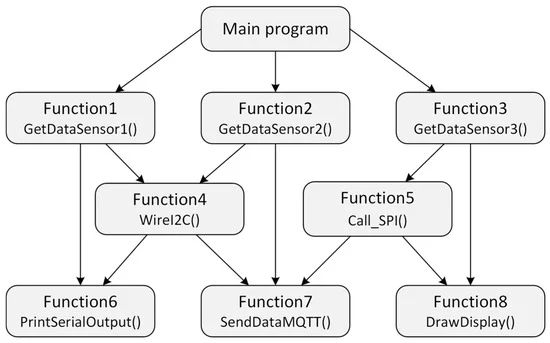
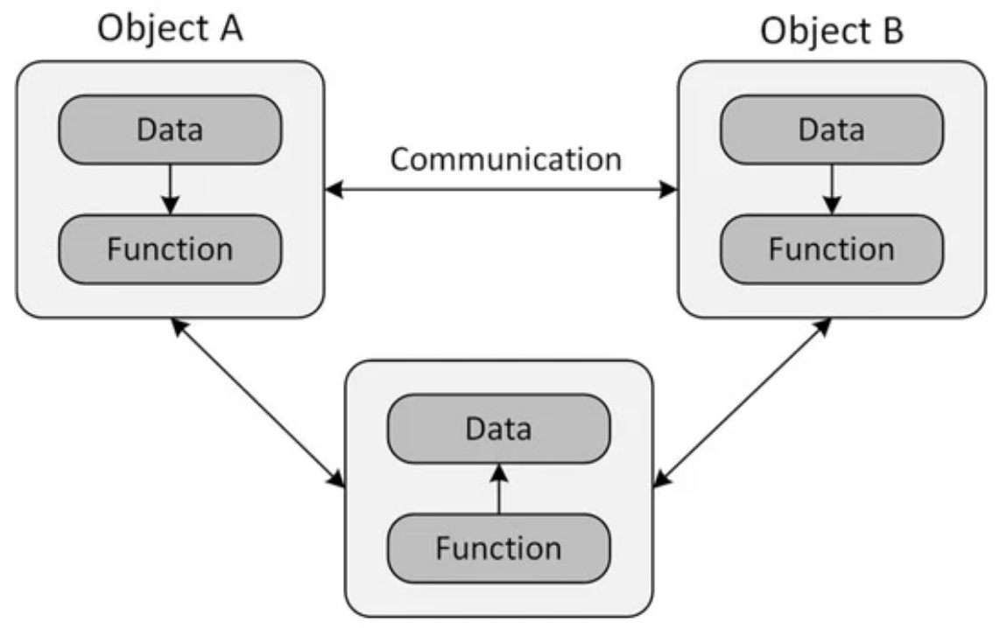

# Лекція 13: OOP Reboot — Від Скриптів до Архітектури

← [Index](index.md) | [Далі: Лекція 14 →](14_raii_lifecycle.md)

## Наш фокус сьогодні
У першому семестрі ми вчилися бути "володарями пам'яті" (Pointers, Memory Layout).
У другому семестрі ми вчимося бути "архітекторами систем".

Ми відповідаємо на питання: **Як написати програму на 100 000 рядків і не збожеволіти?**

## Експрес-опитування (Warm-up)

Згадайте [Вступ до курсу з C++: Філософія та підхід -> Ключ до всього — піраміда абстракції](../00_why_cpp.md)

1.  На якому рівні ми працювали, коли писали `int* p = new int[10]`? (Залізо, ОС, Мова, чи Модель?)
2.  Якщо ви пишете гру, чи зручно вам думати про "орка" як про набір `float x, y, z` та `int hp`?
3.  Що станеться, якщо ви забудете ініціалізувати змінну в `struct`?

<details markdown="1">
<summary>Інженерний погляд</summary>

1.  Це був рівень **Мови та ОС**. Ми вручну керували ресурсами.
2.  **Ні.** Нам зручніше думати поняттями "Орк атакує", а не "зменшити `hp` на 10". Нам потрібна вища абстракція.
3.  **Сміття (Garbage Value).** Об'єкт народиться у "невалідному" стані. У великій системі це гарантований баг.

</details>

---

## Частина 1: Криза складності (Software Crisis)

У 70-х роках Міністерство оборони США (DoD) зіткнулося з проблемою: вони витрачали мільярди доларів на софт, але він постійно ламався.
**Діагноз інженерів:** Процедурний код (функції + глобальні дані) не масштабується.

### Проблема "Божественного Скрипта"
Уявіть, що ви пишете код для екскаватора у процедурному стилі:

```cpp
struct ExcavatorData {
    int fuel;
    int hydraulicPressure;
    bool isEngineOn;
};

void dig(ExcavatorData& e) {
    e.fuel -= 10;
    // А хто перевірив, чи включений двигун?
    // А хто перевірив, чи достатньо тиску?
}

```

Ви, як програміст, маєте тримати в голові **всі правила** в **кожній функції**. Забули перевірку в одному місці (`main.cpp`, рядок 5000) — екскаватор зламався.

### Рішення: Підняття абстракції

Ми переходимо від керування даними до моделювання **поведінки**.

* **Рівень 1 (Sem 1):** `earth.dig()` — це абсурд. Земля не копає сама себе.
* **Рівень 2 (Sem 2):** Ми створюємо "розумний" Екскаватор, і даємо йому команду: `excavator.dig()`. Він **сам** перевірить паливо, тиск і стан двигуна.

---

## Частина 2: Class vs Struct — Зміна ментальної моделі

У C++ `struct` і `class` технічно майже ідентичні (єдина різниця — доступ за замовчуванням). Але в інженерній культурі вони означають полярно різні речі.

### Struct: Passive Data (DTO)

Використовуємо, коли нам просто треба передати пачку даних. "Відкритий мішок".

```cpp
struct Point {
    float x, y; // Все відкрито (public)
};
// Point p; p.x = 100; // Ми можемо робити що завгодно

```

Тут немає правил. `x` може бути хоч `-1000000`.

### Class: Active Behavior (Model)

Використовуємо, коли дані мають **сенс** і **правила**. "Чорна скринька".

```cpp
class BankAccount {
    double balance; // Закрито (private)
public:
    void deposit(double amount); // Пульт керування
};

```

Тут ми не можемо просто написати `balance = 1000000`. Ми змушені грати за правилами класу.

### Memory Layout: "3-Compartment Box" Model



*Рис. 1: Приклади POP — акцент на діях(алгоритм), функції, глобальні дані, перетворення даних, проектування "згори донизу"*

* Акцент на діях (алгоритмах).
* Великі програми поділяються на менші, відомі як функції.
* Більшість функцій мають спільні глобальні дані.
* Дані вільно переміщуються по системі від функції до функції.
* Функції перетворюють дані з однієї форми в іншу.
* Використовується підхід до проектування програм «згори донизу».



*Рис. 2: Приклади OOP — акцент на даних, дані приховані, взаїмодія через методи, проектування "знизу догори"*

* Акцент на даних, а не на процедурах.
* Програми поділяються на так звані об'єкти.
* Структури даних розроблені так, щоб характеризувати об'єкти.
* Функції, що працюють із даними об'єкта, пов’язані разом у структурі даних.
* Дані приховані та недоступні для зовнішніх функцій.
* Об'єкти можуть взаємодіяти один з одним через функції (методи).
* Нові дані та функції можна легко додавати за потреби.
* Використовується підхід до проектування «знизу вгору».

Щоб зрозуміти, як об'єкт або клас насправді влаштований у пам'яті, уявіть його як **коробку з трьома відділеннями**:

```
┌─────────────────────────────────────┐
│  Class Name: BankAccount            │  ← Type Identifier
├─────────────────────────────────────┤
│  📦 Data Members (State)            │
│                                     │
│  STATIC (Class-level, shared):      │  ← One copy for ALL objects
│     • static nextAccountId: int     │     
│                                     │
│  INSTANCE (Object-level):           │  ← Each object has own copy
│     - balance: double               │     
│     - owner: std::string            │
│     - accountNumber: int            │
├─────────────────────────────────────┤
│  ⚙️ Member Functions (Behavior)     │
│     + deposit(double)               │  ← Methods (shared by all instances)
│     + withdraw(double)              │
│     + getBalance()                  │
│                                     │
│     + static getNextId(): int       │  ← Static method (no 'this')
└─────────────────────────────────────┘
```

**Ключові моменти:**

1. **Name (Тип)**: Компілятор знає, що це `BankAccount`, а не `Point`
2. **Data (Стан)**: 
   - **Static members**: Один екземпляр на весь клас (спільний для всіх об'єктів)
   - **Instance members**: Кожен об'єкт має свою копію

   ```cpp
   class BankAccount {
       static int nextAccountId;  // Спільна змінна для всіх BankAccount
       double balance;            // Окрема для кожного об'єкта
   };
   
   BankAccount acc1, acc2;
   acc1.balance ≠ acc2.balance       // Різні значення
   acc1.nextAccountId == acc2.nextAccountId  // Одне і те саме значення!
   ```
3. **Functions (Поведінка)**: Методи зберігаються **один раз** у пам'яті (Code Section), а не копіюються для кожного об'єкту

**sizeof() Demonstration:**

```cpp
// код якій виводить на екран sizeof

class Empty {};          // sizeof(Empty) = 1 byte (C++ rule: no zero-size objects)
class JustInt {
    int x;               // sizeof(JustInt) = 4 bytes (data only)
};
class WithMethod {
    int x;
    void foo();          // sizeof(WithMethod) = 4 bytes (methods don't add size!)
};
class WithStatic {
    int x;
    static int count;    // sizeof(WithStatic) = 4 bytes (static doesn't add size!)
};
```

**Чому методи та static members не займають місце в об'єкті?**  
Компілятор перетворює `obj.foo()` на `ClassName::foo(&obj)` — метод отримує вказівник `this` як перший аргумент. Тому методи зберігаються в Code Segment, а не в кожному об'єкті. Static members зберігаються в окремій Data Segment (одна копія на програму).

---

## Частина 3: Інкапсуляція та Інваріант

Ми підходимо до найважливішого поняття ООП.
Чому ми ховаємо дані (`private`)? Не від хакерів. Ми захищаємо об'єкт від переходу у **Невалідний Стан**.

> **Інваріант (Invariant)** — це логічна умова, яка відрізняє "правильний" об'єкт від "сміття". Це правило, яке НЕ МОЖЕ бути порушене.

**Приклад:**

* Для `Date`: `1 <= day <= 31`.
* Для `Vector`: `size <= capacity`.

### Захищаємо дату

```cpp
// частина коду яка забезпечує іллюстрацію - snippet

// BAD: Процедурний стиль (Struct)
struct DateStruct {
    int d, m, y;
};

void badExample() {
    DateStruct ds;
    ds.d = 45; // Інваріант порушено! Такої дати не існує.
    // Далі програма працює з "битим" станом.
}

// GOOD: OOP Style (Class)
class DateClass {
private: 
    int d, m, y; // Ніхто не торкнеться цього руками

public:
    // Єдиний спосіб змінити дату — пройти через "митницю"
    void setDay(int day) {
        if (day < 1 || day > 31) {
            std::cerr << "Error: Invalid day!" << std::endl;
            return; // Ми відхиляємо зміни! Інваріант збережено.
        }
        this->d = day;
    }
};

```

**Висновок:** Інкапсуляція гарантує, що об'єкт **завжди** знаходиться у правильному (валідному) стані.


<details>
<summary>🔬 <b>Mathematical View:</b> Invariants as Predicates</summary>

**Formal Definition:**

Let $S$ be the **state space** of an object (all possible values of its members).

An **invariant** is a predicate:
$$I: S \to \{\text{true}, \text{false}\}$$

A **valid object** exists in the subset:
$$S_{\text{valid}} = \{s \in S \mid I(s) = \text{true}\}$$

**Example: Date Invariant**

```cpp
class Date {
    int day, month, year;  // State space S = ℤ³
};
```

Invariant predicate:
$$I(d, m, y) = (1 \leq d \leq 31) \land (1 \leq m \leq 12) \land (y > 0)$$

**Encapsulation Theorem:**

For any public method $f: S \to S$:
$$\forall s \in S_{\text{valid}}: I(s) = \text{true} \implies I(f(s)) = \text{true}$$

Private members + controlled public interface = Guaranteed invariant preservation.

Without encapsulation (`struct`):

```cpp
//snippet
DateStruct ds;
ds.day = 99;  // Direct mutation → I(ds) = false → Invalid state!
```

With encapsulation (class):

```cpp
//snippet
class Date {
    int day;  // Private!
public:
    void setDay(int d) {
        if (d < 1 || d > 31) return;  // Guard: maintains I
        day = d;
    }
};
```

**Proof of correctness:**  
If $I(s_0) = \text{true}$ (initial state valid), then all reachable states via public methods satisfy $I$.

**See also:** [Memory Model Glossary](00_memory_model_glossary.md) for formal definitions of storage duration.

</details>
---

## Частина 4: Симетрія Життя (Constructor & Destructor)

Якщо об'єкт — це "жива істота", вона має **народитися** і **померти**.
У C++ це реалізовано через пару спеціальних методів. Це фундамент ідіоми **RAII**.

Це **найважливіша ідіома C++**, яка відрізняє його від C (ручне керування) та Java/C# (Garbage Collection).

Назва **RAII** (Resource Acquisition Is Initialization) — це історична помилка Б'ярна Страуструпа. Це жахлива назва.
Інженерна назва: **SBRM (Scope-Bound Resource Management)** — Керування ресурсами, прив'язане до області видимості.

### 1. Суть проблеми (The "Why")

У C або "старому C++" ресурс живе окремо від об'єкта.

```cpp
// BAD: C-Style: Disaster waiting to happen
void badCode() {
    FILE* f = fopen("data.txt", "r"); // (1) Acquire
    if (!f) return;

    // ... якийсь код ...
    if (error_condition) {
        // ЗАБУЛИ fclose(f)! -> Resource Leak
        return; 
    }

    // ... код, який може кинути Exception ...
    // Exception перериває функцію -> fclose(f) ніколи не викличеться -> Resource Leak

    fclose(f); // (2) Release
}

```

### 2. Рішення RAII (The "How")

Ми зв'язуємо життя **Ресурсу** (пам'ять, файл, м'ютекс, сокет) з життям **Об'єкта на стеку**.

* **Constructor:** Захоплює ресурс (відкриває файл, виділяє пам'ять, блокує м'ютекс). Встановлює інваріант.
* **Destructor:** Звільняє ресурс.

**Магія C++:** Деструктори об'єктів на стеку викликаються **автоматично** і **гарантовано** при виході з `scope` (навіть якщо вилетів Exception). Це називається **Stack Unwinding**.

```cpp
// GOOD: RAII Style
void goodCode() {
    // Constructor відкриває файл
    std::fstream f("data.txt"); 

    if (!f.is_open()) return;

    // ... код ...
    if (error_condition) {
        return; // Dtor викликається АВТОМАТИЧНО. Файл закрито.
    }

    // ... код кидає Exception ...
    // Stack Unwinding викликає Dtor. Файл закрито.
} 
// Тут кінець scope. Dtor викликається АВТОМАТИЧНО.

```

### 3. Канонічні приклади RAII в STL

Вам не часто доведеться писати свої RAII-обгортки, бо вони вже є:

1. **Пам'ять:** `std::unique_ptr<T>` / `std::shared_ptr<T>`.
* Ctor: робить `new`.
* Dtor: робить `delete`.
* *Замінює ручні `new/delete`.*

2. **Файли:** `std::fstream`.
* Ctor: `fopen`.
* Dtor: `fclose`.

3. **Багатопотоковість (Concurrency):** `std::lock_guard` / `std::unique_lock`.
* Ctor: `mutex.lock()`.
* Dtor: `mutex.unlock()`.
* *Критично важливо: якщо потік впаде з помилкою, м'ютекс розблокується, інакше буде Deadlock всієї системи.*

### 4. Народження (Constructor / ctor)

Конструктор перетворює "сиру пам'ять" на "валідний об'єкт".
Його головна задача — **встановити інваріант**.

```cpp
class Player {
    std::string name;
    int hp;

public:
    // BAD: Дефолтний конструктор (якщо ми його не замінимо)
    // Створить гравця без імені і з сміттям в HP.
    
    // GOOD: Параметризований конструктор
    Player(std::string n, int startHp) {
        if (startHp <= 0) startHp = 1; // Виправляємо помилку на старті
        name = n;
        hp = startHp;
        std::cout << "[Spawn] Player " << name << " created." << std::endl;
    }
};

```

**Правило:** Не можна дати можливість створити об'єкт "наполовину". Або він створюється повністю готовим до роботи, або не створюється взагалі (Exception).

**Constructor Syntax: Assignment vs Initializer List**

Існує **дві синтаксичні форми** ініціалізації членів класу в конструкторі. Вони **не еквівалентні**:

```cpp
//snippet

class Point {
    const int x;  // const member!
    int y;
    
public:
    // ❌ BAD: Assignment in body
    Point(int a, int b) {
        x = a;  // ERROR! const member already initialized to garbage
        y = b;  // OK, but inefficient (default init + assignment)
    }
    
    // ✓ GOOD: Initializer list
    Point(int a, int b) : x(a), y(b) {
        // Members initialized BEFORE body executes
        // Body runs AFTER all members are fully constructed
    }
};
```

**Чому initializer list краще:**

| Аспект	| Присвоєння у тілі (Body) | Список ініціалізації (Initializer List) |
|--------|-------------------|------------------|
| Const члени |	❌ Помилка: const не можна змінити після створення |	✅ Дозволено: ініціалізація до створення об'єкта|
| Reference члени |	❌ Помилка: посилання мають бути ініціалізовані одразу |	✅ Дозволено: зв'язування посилання при створенні|
| Ефективність |	📉 Дефолтна ініціалізація + присвоєння (2 кроки) |	🚀 Пряма ініціалізація (1 крок)|
| Порядок |	Визначається послідовністю в тілі конструктора |	Порядок оголошення у класі (незалежно від списку)|

**Помилка компіляції: Присвоєння замість ініціалізації**

```cpp
class MetricCollector {
    const int interval_ms;
    double& global_counter;
    
public:
    MetricCollector(int interval, double& counter) {
        interval_ms = interval;    // ❌ error: assignment of read-only data-member
        global_counter = counter;  // ❌ error: uninitialized reference member
    }
};

```

**Вимоги до Initializer List:**

* `const` члени класу.
* Посилання (`Type&`).
* Класи/структури без конструктора за замовчуванням (Default Constructor).
* Performance-critical секції (уникнення overhead від патерну `default constructor` $\rightarrow$ `assignment operator`).

**Advanced: Initialization Order**

```cpp
class Dangerous {
    int a;
    int b;
    
public:
    Dangerous(int x) : b(x), a(b + 1) {  // ⚠️ Problem!
        // Ініціалізація порядку DECLARATION, не списку!
        // 1. a ініціалізується першим (але b ще не ініціалізовано!)
        // 2. b ініціалізується другим
        // a містить garbage + 1
    }
};
```

Члени ініціалізуються в порядку **оголошення в класі**, не в порядку initializer list!

#### Explicit Keyword — Preventing Implicit Conversions


Конструктори з одним параметром дозволяють **неявні перетворення** (implicit conversions), що може призвести до помилок:

```cpp
class BankAccount {
    double balance;
public:
    // ПРОБЛЕМА: Implicit conversion
    BankAccount(double initialBalance) : balance(initialBalance) {}
};

void processAccount(BankAccount acc) { /* ... */ }

int main() {
    processAccount(100.0);  // ❌ Компілюється, але це помилка!
                             // Compiler автоматично створює BankAccount(100.0)
}
```

**Проблема:** Програміст хотів передати `BankAccount`, але випадково передав `double`. Компілятор "допоміг", створивши тимчасовий об'єкт.

**Рішення: `explicit`**

```cpp
class BankAccount {
    double balance;
public:
    // GOOD: Заборона неявних перетворень
    explicit BankAccount(double initialBalance) : balance(initialBalance) {}
};

void processAccount(BankAccount acc) { /* ... */ }

int main() {
    processAccount(100.0);  // ✓ Compilation error: no implicit conversion
    processAccount(BankAccount(100.0));  // ✓ Explicit construction — OK
}
```

**Коли використовувати `explicit`:**
- Для конструкторів з одним параметром (щоб заборонити неявні перетворення)
- Для `operator bool()` (щоб не дозволити `if (object + 1)`)

**Виключення:** Не використовуйте explicit, якщо conversion логічний (наприклад, `std::string(const char*)`).

**Advanced Puzzle: Chained Implicit Conversions**

C++ дозволяє **тільки одне** неявне перетворення у ланцюжку. Це важливо розуміти:

```cpp
struct Foo {
    Foo(int) {}  // int → Foo conversion
};

struct Faz {
    Faz(Foo) {}  // Foo → Faz conversion
};

int main() {
    // Один крок: OK
    Foo f1 = 42;         // ✓ int → Foo (implicit)
    Faz faz1 = Foo(42);  // ✓ Foo → Faz (implicit)
    
    // Два кроки: ERROR!
    Faz faz2 = 42;       // ❌ Error! Потрібно int → Foo → Faz (два кроки)
                          // Compiler: cannot convert 'int' to 'Faz'
    
    // Рішення: explicit conversion
    Faz faz3 = Faz(Foo(42));  // ✓ Обидва кроки explicit
}
```

**Чому так?**  
Якби компілятор дозволяв необмежені ланцюжки, код став би нечитабельним:
```cpp
MyClass obj = 42;  // Що тут відбувається? 1 крок? 5 кроків? 10 кроків?
```

Правило "одне неявне перетворення" — це компроміс між зручністю та читабельністю.

#### Static Cast — Modern C++ Type Conversion

До C++, type casting виглядав як C-style: `(int)value`. У Modern C++ це замінено на **type-safe casts**:

```cpp
// C-Style (небезпечний, застарілий)
float f = 3.14;
int a = (int)f;  // Працює, але компілятор не перевіряє безпеку

// Modern C++ (type-safe)
int a = static_cast<int>(f);  // ✓ Compile-time check
```

**Чотири види cast в C++:**

| Cast | Призначення | Приклад |
|------|-------------|---------|
| `static_cast<T>` | Стандартні перетворення (int↔float, upcast) | `static_cast<int>(3.14)` |
| `const_cast<T>` | Зняти/додати const | `const_cast<int&>(const_val)` |
| `dynamic_cast<T>` | Безпечний downcast (з перевіркою у runtime) | `dynamic_cast<Derived*>(base)` |
| `reinterpret_cast<T>` | Бітове переінтерпретування (небезпечно!) | `reinterpret_cast<int*>(&float_val)` |

**Чому static_cast краще за C-style cast:**

C-style cast діє як небезпечний fallback-механізм, що послідовно (і приховано) намагається застосувати const_cast, static_cast або reinterpret_cast до першого вдалого результату, маскуючи критичні порушення type safety. Натомість static_cast гарантує строгу валідацію графа типів на етапі компіляції, ізолює семантику перетворення та забезпечує абсолютну лексичну видимість (grep-ability) для статичного аналізатора і рефакторингу.

```cpp
int raw_data = 42;

// C-style: Компілятор мовчки ігнорує несумісність типів.
// Відбувається прихована деградація до reinterpret_cast.
float* dangerous = (float*)&raw_data;  // ❌ Компілюється. Dereferencing = UB (Strict Aliasing violation)

// static_cast: Строга перевірка семантичної сумісності на етапі компіляції.
// float* safe_ptr = static_cast<float*>(&raw_data); // ✓ Compilation error!

// Правильне використання для конверсії значень:
float float_val = static_cast<float>(raw_data); // ✓ Безпечна конверсія (int -> float)

```

**Коли використовувати кожен:**

* **static_cast**: 95% випадків. Детерміновані конверсії (numeric types, `void*` → `T*`).
* **const_cast**: Маніпуляції з cv-qualifiers (зняття `const`/`volatile`, переважно для legacy C API).
* **dynamic_cast**: RTTI downcast у поліморфних ієрархіях (має runtime overhead).
* **reinterpret_cast**: Низькорівневий реінтерпретатор бітового представлення (memory-mapped I/O, serialization).


### 2. Смерть (Destructor / dtor)

Деструктор викликається автоматично, коли об'єкт виходить з області видимості (або коли викликається `delete`).
Його задача — **прибрати за собою**.

```cpp
    // Синтаксис: тильда (~) + ім'я класу
    ~Player() {
        std::cout << "[Despawn] Player " << name << " left the game." << std::endl;
        // Тут ми закриваємо файли, звільняємо пам'ять (delete),
        // розриваємо з'єднання з БД.
    }

```

### Питання до групи (Life Cycle Analysis)

Подивіться на цей код і скажіть, що буде виведено в консоль?

```cpp
#include <iostream>
#include <string>

class Player {
private:
    std::string name;
    int health;

public:
    Player(std::string n, int h) : name(std::move(n)), health(h) {
        std::cout << "[Spawn] Player " << name << " created." << std::endl;
    }

    ~Player() {
        std::cout << "[Despawn] Player " << name << " left the game." << std::endl;
    }
};

void gameSession() {
    std::cout << "Game Start" << std::endl;
    Player p("Ghost", 100);
    
    if (true) {
        Player p2("Soap", 80);
    } // <--- Що тут станеться?

    std::cout << "Game End" << std::endl;
} // <--- А тут?

int main() {
    gameSession();
    return 0;
}

```

<details markdown="1">
<summary>Відповідь (Trace)</summary>

1. Game Start
2. `[Spawn] Player Ghost created.`
3. `[Spawn] Player Soap created.`
4. `[Despawn] Player Soap left the game.` (Бо `p2` вийшов з блоку `if`)
5. Game End
6. `[Despawn] Player Ghost left the game.` (Бо функція завершилась)

**Важливо:** Зверніть увагу на порядок. LIFO (Last In, First Out). Останній створений помирає першим (як на стеку).

</details>

---

## Частина 5: Узагальнення (The Big Picture)

Ми перейшли на новий рівень мислення.

| Рівень 1 (C / Procedural) | Рівень 2 (C++ / OOP) |
| --- | --- |
| **Struct:** Просто дані | **Class:** Дані + Поведінка |
| **Initialization:** Можна забути | **Constructor:** Гарантує ініціалізацію |
| **Cleanup:** Треба пам'ятати (`free`) | **Destructor:** Автоматичний (`~`) |
| **State:** Може бути будь-яким | **Invariant:** Завжди валідний |

Це і є **інженерія**: ми створюємо такі типи даних, які **важко використовувати неправильно**.

---

## Практичне застосування

**Див.:** [Практикум 9: Monobank Lite](p09_oop_bank.md) — перше застосування ООП принципів на реальному прикладі банківської системи.

---

## Контрольні питання (Definition of Done)

1. Чому ми кажемо, що конструктор встановлює інваріант? Наведіть приклад "поганого" конструктора, який цього не робить.
2. Якщо у вашому класі є `MyClass* ptr = new MyClass();` у конструкторі, що **обов'язково** має бути у деструкторі?
3. Чи може деструктор приймати аргументи? Чому?
4. Ви проектуєте клас `Gun` (Зброя). Які поля будуть в `private`? Який у них інваріант (наприклад, `ammo`)?

<details markdown="1">
<summary>Відповіді для самоперевірки</summary>

1. Тому що він перевіряє вхідні дані. Поганий конструктор: `Date(int d) { day = d; }` — він дозволяє створити день `99`.
2. У деструкторі має бути `delete ptr;`. Інакше буде Memory Leak. Це закон RAII.
3. **Ні.** Деструктор викликається системою автоматично. Ми не можемо передати туди параметри, бо ми не викликаємо його явно.
4. `private: int ammo, int clipSize;`. Інваріант: `0 <= ammo <= clipSize`. Методи `reload()` та `fire()` повинні слідкувати, щоб це правило ніколи не порушувалось.

</details>
