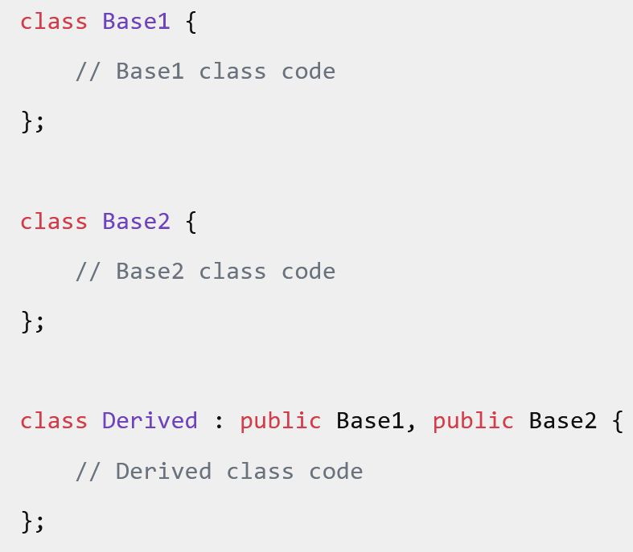
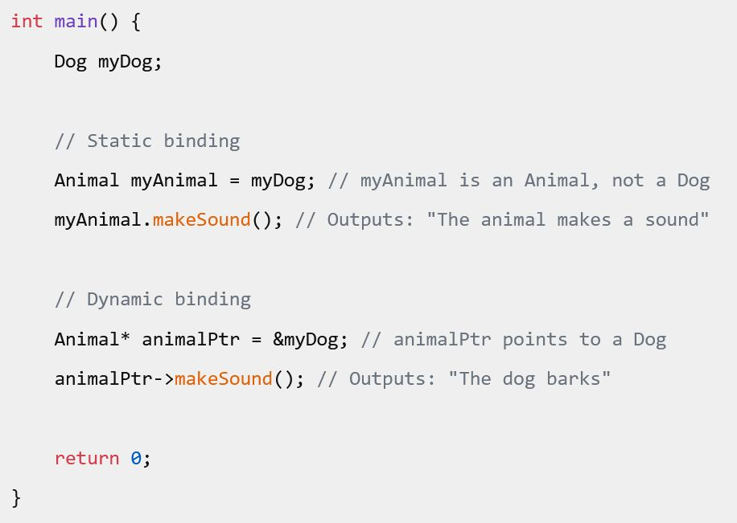
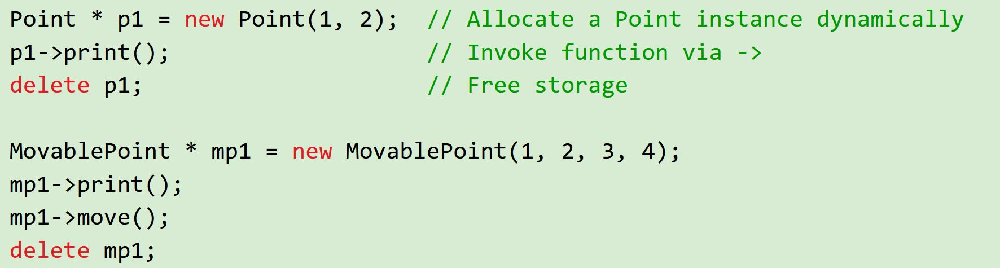

# Лекція 16: Спадкування, Поліморфізм та V-Table

[← Лекція 15](15_rule_of_three.md) | [Index](index.md) | [Далі: Лекція 17 →](17_generics_operators.md)


## Мета
Зрозуміти, як будувати ієрархії класів. Дізнатися, що таке **Dynamic Dispatch** (динамічна диспетчеризація) і скільки вона коштує процесору.

## Експрес-опитування
1.  Якщо клас `Dog` успадковує клас `Animal`, який розмір `sizeof(Dog)`? (Більший, менший чи рівний `Animal`?)
2.  Що таке **Coupling** (зв'язність) і чому ми хочемо, щоб він був низьким?
3.  Чи можна створити масив об'єктів різних типів: `Animal zoo[10]`? (Спойлер: Ні, але можна `Animal* zoo[10]`).

<details markdown="1">
<summary>Інженерна відповідь</summary>

1.  **Більший (або рівний).** Спадкоємець містить всі поля батька + свої власні.
2.  **Coupling** — це міра залежності між модулями. Якщо зміна в батьківському класі ламає 10 дочірніх класів — це High Coupling (погано). Спадкування — це найсильніший вид зв'язку.
3.  Масив об'єктів — ні (Slicing Problem). Масив вказівників — так (Поліморфізм).

</details>

---

## Частина 1: Архітектура — Coupling & Cohesion

У вашій презентації є чудова аналогія з кухонним комбайном.

* **Low Cohesion (Низька згуртованість):** Клас "Швейцарський ніж", який робить все: ріже, грає музику, відправляє email. Це погано.
* **High Coupling (Висока зв'язність):** Якщо ви хочете замінити лезо ножа, вам доводиться розбирати весь "комбайн".

**Спадкування (Inheritance)** створює дуже сильний зв'язок.
* **Is-A Relationship:** `Dog` **IS A** `Animal`.
* Якщо ви змінюєте `Animal`, ви автоматично змінюєте `Dog`. Будьте обережні з цим.

> **Правило:** Віддавайте перевагу Композиції ("Has-A"), а не Спадкуванню ("Is-A"), якщо це можливо.

### UML Class Diagrams — Visual Notation

> **💡 Visual Schema from Source Material**  
> Джерело: s02e02. OOP its getting darker.pdf



*Рис. 1: UML Diagram — візуалізація спадкування класів* — стандартний спосіб візуалізації класів та їх відносин:

```
┌──────────────────────────┐
│      Point               │  ← Class Name
├──────────────────────────┤
│  - x: int                │  ← Attributes (- =private, + = public, # = protected)
│  - y: int                │
├──────────────────────────┤
│  + Point(int, int)       │  ← Methods
│  + getX(): int           │
│  + getY(): int           │
│  + setX(int): void       │
│  + display(): void       │
└──────────────────────────┘
           △
           │ (inheritance)
           │
┌──────────────────────────┐
│    MovablePoint          │
├──────────────────────────┤
│  - dx: int               │  ← Additional attributes
│  - dy: int               │
├──────────────────────────┤
│  + move(): void          │  ← Additional methods
│  + setSpeed(int, int)    │
└──────────────────────────┘
```

**Notations:**
- **`-`** = private
- **`+`** = public
- **`#`** = protected
- **`△`** (triangle arrow) = inheritance (is-a)
- **`◇`** (diamond) = composition (has-a)

**Memory Layout для MovablePoint:**
```
MovablePoint object in memory:
[Point::x][Point::y][MovablePoint::dx][MovablePoint::dy]
  ← Base class       ← Derived class additions
```

### Types of Coupling — Detailed Classification

> **💡 Visual Schema from Source Material**  
> Джерело: s02e02. OOP its getting darker.pdf



*Рис. 2: Типи Coupling — від найкращого (Data) до найгіршого (Content)*

Coupling (зв'язність) вимірює ступінь залежності між модулями. Існує **6 рівнів** від найкращого до найгіршого:

```
Best (Weak Coupling) ↑
         │
1. Data Coupling        ── Parameters are simple types (int, float)
         │
2. Stamp Coupling       ── Parameters are structs/objects (entire structure passed)  
         │
3. Control Coupling     ── One module controls flow of another (flags, modes)
         │
4. Common Coupling      ── Multiple modules share global data
         │
5. Content Coupling     ── One module directly modifies another's internals
         │
Worst (Tight Coupling) ↓
```

**1. Data Coupling (найкращий):**
```cpp
// Функція отримує тільки необхідні дані
double calculateArea(double width, double height) {
    return width * height;
}
```

**2. Stamp Coupling:**
```cpp
// Функція отримує всю структуру, але використовує лише частину
struct Rectangle { double width, height, color; };
double calculateArea(const Rectangle& rect) {
    return rect.width * rect.height;  // color не потрібен
}
```

**3. Control Coupling:**
```cpp
// Викликаючий контролює, що робить функція
void process(int mode) {
    if (mode == 1) { /* ... */ }
    if (mode == 2) { /* ... */ }
}
```

**4. Common Coupling:**
```cpp
// Глобальні змінні
int globalCounter = 0;  // Багато модулів модифікують це
```

**5. Content Coupling (найгірший):**
```cpp
// Клас B безпосередньо модифікує private дані класу A
class A {
    int x;
    friend class B;  // Даємо B повний доступ до інтерналів A
};
```

**Спадкування і Coupling:**

Спадкування створює **сильний coupling** (між рівнями 2-3). Дочірній клас знає **всю** структуру батька. Зміни в `protected` полях батька впливають на всіх нащадків.

**Альтернатива: Composition (Has-A)**
```cpp
// Слабший coupling
class Car {
    Engine engine;  // Car HAS-A Engine (композиція)
public:
    void start() { engine.ignite(); }  // Делегування
};
```

**Spaghetti Code vs Modular Code Visualization**

> **💡 Visual Diagram from Source Material**  
> Джерело: s02e02. OOP its getting darker.pdf, стор. 393



*Рис. 3: Spaghetti Code vs Modular Code — візуальне порівняння*

```
❌ SPAGHETTI CODE (High Coupling):

    ┌────┐     ┌────┐
    │ A  │←───→│ B  │
    └────┘     └────┘
      ↕ ╲   ╱ ↕
         ✖ ✖
      ╱   ╲ ↕
    ┌────┐     ┌────┐
    │ C  │←───→│ D  │
    └────┘     └────┘

"Spaghetti Graph"
• Everyone knows everyone
• Change in A breaks C, D
• Testing requires entire system
• Fragile, hard to maintain


✓ MODULAR CODE (Low Coupling):

    ┌────┐     ┌────┐
    │ A  │───→ │ B  │
    └────┘     └────┘
       │          │
       ↓          ↓
    ┌──────────────────┐
    │    Interface     │  ← Contract
    └──────────────────┘
       ↑          ↑
       │          │
    ┌────┐     ┌────┐
    │ C  │───→ │ D  │
    └────┘     └────┘

"Layer Architecture"
• Dependencies через контракти
• Change in C doesn't affect A
• Can test each module in isolation
• Flexible, maintainable
```

**Key Insight:** High coupling = graph with many edges (spaghetti). Low coupling = tree/layered structure (hierarchy).

---

## Частина 2: Механіка Спадкування

```cpp
class Unit {
public:
    int hp;
    void move() { cout << "Walking..."; }
};

// Soldier успадковує все від Unit
class Soldier : public Unit {
public:
    int ammo;
    void shoot() { cout << "Bang!"; }
};

```

**Memory Layout:**
У пам'яті об'єкт `Soldier` виглядає так, ніби ми просто "приклеїли" поля `Soldier` до полів `Unit`.

```text
[  Unit::hp  ][ Soldier::ammo ]
^             ^
Адреса Unit   Адреса Soldier

```

Тому ми можемо безпечно передати `Soldier*` туди, де очікують `Unit*`.

<details>
<summary>🔬 <b>Mathematical View:</b> Inheritance as Set Relations</summary>

**Public Inheritance (Is-A):**

$$\text{Soldier} \subset \text{Unit}$$

This means:
- Every soldier is a unit (subset property)
- Any function $f: \text{Unit} \to T$ is valid for $f: \text{Soldier} \to T$

**Liskov Substitution Principle (formalized):**

For derived class $D \subset B$ (base), any property $P$ provable for $B$ must hold for $D$:
$$\forall x \in D: P(x) \text{ holds if } P \text{ is proven for } B$$

**Example:**
```cpp
void processUnit(Unit* u) {
    u->move();  // Works for ANY Unit subtype
}

Soldier* s = new Soldier();
processUnit(s);  // Valid: Soldier ⊂ Unit
```

**Composition (Has-A):**

$$\text{Car} \cong \text{Engine} \times \text{Chassis} \times \text{Wheels}$$

This is a **Cartesian product**, not a subset:
- Car contains an engine (element of product)
- Car is NOT an engine (not a subset)

**Why this matters:**
- Inheritance: `Dog` can be passed wherever `Animal` is expected (subset)
- Composition: `Car` cannot be passed as `Engine` (different types)

**See also:** [Memory Model Glossary](00_memory_model_glossary.md) for memory layout details.

</details>

---

## Частина 3: Поліморфізм (Virtual Functions)

У нас є проблема:

```cpp
Unit* u = new Soldier();
u->move(); // Викличеться Unit::move(), а не Soldier::move()!

```

Компілятор бачить тип вказівника (`Unit*`) і викликає метод `Unit`. Це **Static Binding** (швидко, але не те, що треба).

Щоб це виправити, ми використовуємо ключове слово `virtual`.

```cpp
class Unit {
public:
    virtual void move() { cout << "Unit moves"; }
};

class Soldier : public Unit {
public:
    // override - перевірка компілятором, що ми дійсно замінюємо метод
    void move() override { cout << "Soldier marches"; }

<details>
<summary>🔬 <b>Mathematical View:</b> V-Table as Dispatch Function</summary>

**Static Function Call:**
$$f(x) = \text{determined at compile time based on declared type}$$

**Dynamic Function Call (Virtual):**
$$f(x, \tau(x))$$

where $\tau: \text{Object} \to \text{Type}$ is the **runtime type function**.

**V-Table as Lookup Matrix:**

Let $C$ = set of classes, $M$ = set of method names.  
The V-table is a mapping:
$$\text{VTable}: C \times M \to \text{FunctionPointer}$$

Example:
```
VTable(Unit, "move") → 0x1000      // Unit::move
VTable(Soldier, "move") → 0x2000   // Soldier::move (override)
```

**Execution Model:**

When calling `unit_ptr->move()`:
1. Runtime determines $\tau(\text{unit\_ptr}) = \text{Soldier}$
2. Lookup: $\text{VTable}(\text{Soldier}, \text{"move"}) = 0x2000$
3. Call function at address 0x2000

**Cost Analysis:**

Direct call: 1 instruction (`call 0x1000`)  
Virtual call: 3 instructions + memory access  
- Load vptr from object: $L(\text{vptr}) \approx 4$ cycles (if in cache)
- Load function pointer ме V-table: $L(\text{func}) \approx 4$ cycles  
- Indirect jump: 1 cycle + branch prediction miss penalty (~15 cycles)

**Expected overhead:** ~24 cycles per virtual call vs ~1 cycle for direct call.

When does this matter? Tight loops with millions of calls per second.

**See also:** [Complexity Profiling](19_complexity_profiling.md#3-hardware-latency) for hardware latency models.

</details>
    void shoot() { cout << "Bang!"; }  // Доступно тільки через Soldier*
};

Unit* u = new Soldier();
u->move();   // Run subclass version!! → "Soldier marches"
             // Завдяки virtual, викликається Soldier::move()

// u->shoot();  // error: 'class Unit' has no member named 'shoot'
                // Компілятор бачить тип вказівника (Unit*), а Unit не має shoot()
                // Поліморфізм працює тільки для virtual методів!

// Щоб викликати shoot(), потрібен downcast:
Soldier* s = dynamic_cast<Soldier*>(u);  // Safe downcast
if (s) {
    s->shoot();  // ✓ OK: тепер компілятор знає про Soldier::shoot()
}

```

Це **Dynamic Binding**. Рішення приймається під час виконання програми.

---

## Частина 4: Under the Hood — V-Table

Як програма дізнається, яку функцію викликати, якщо тип вказівника однаковий?

Коли в класі з'являється хоча б одна `virtual` функція, компілятор робить магію:

1. Створює приховану таблицю **V-Table** (масив вказівників на функції) для кожного класу.
2. Додає в кожен об'єкт прихований вказівник **vptr** (Virtual Pointer), який вказує на цю таблицю.

**Ціна поліморфізму:**

1. **Пам'ять:** +8 байт у кожному об'єкті (на vptr).
2. **Швидкість:** Замість прямого виклику (`call 0x1234`), процесор робить:
* Прочитати vptr з об'єкта.
* Знайти адресу функції у V-Table.
* Стрибнути за адресою (Indirect Call).
* *Це ламає Branch Prediction процесора.*


---

## Частина 5: Абстрактні класи (Interfaces)

Іноді нам потрібен клас лише як "контракт".
Наприклад, `Shape` (Фігура). Ми не можемо створити "просто фігуру". Ми можемо створити Коло або Квадрат.

```cpp
class Shape {
public:
    // Pure Virtual Function (= 0)
    virtual double getArea() const = 0; 
};

```

* Клас з `pure virtual` функцією називається **Абстрактним**.
* Ми **не можемо** створити його екземпляр: `new Shape()` — помилка.
* Спадкоємці **зобов'язані** реалізувати цей метод, інакше вони теж стануть абстрактними.

Це аналог `interface` в Java/C#.

---

## Частина 6: Virtual Destructor (Пастка для новачків)

Це класичне питання на співбесідах.

```cpp
class Base { 
    // ~Base() { cout << "Base dtor"; } // ПОМИЛКА!
    virtual ~Base() { cout << "Base dtor"; } // ПРАВИЛЬНО
};

class Derived : public Base {
    int* data;
public:
    Derived() { data = new int[100]; }
    ~Derived() { delete[] data; cout << "Derived dtor"; }
};

void memoryLeak() {
    Base* ptr = new Derived();
    delete ptr; 
}

```

* **Без `virtual`:** Викличеться тільки `~Base()`. Пам'ять `data` в `Derived` не звільниться -> **Memory Leak**.
* **З `virtual`:** Програма загляне у V-Table, побачить, що це насправді `Derived`, і викличе спочатку `~Derived()`, а потім `~Base()`.

> **Золоте правило:** Якщо клас має хоча б одну віртуальну функцію -> Деструктор **мусить** бути віртуальним.

---

## Приклади коду для аналізу

* 👨‍💻 **[10-oop-next/inheritance_modifiers.cpp](https://github.com/vplanto/cpp/blob/main/10-oop-next/inheritance_modifiers.cpp)** — Практична перевірка того, що стає доступним (а що приховується) при `public`, `protected` та `private` спадкуванні.
* 👨‍💻 **[10-oop-next/TestMovablePoint.cpp](https://github.com/vplanto/cpp/blob/main/10-oop-next/TestMovablePoint.cpp)** — Класичний приклад базового `Point` та похідного `MovablePoint`, що демонструє розширення класу і перевизначення поведінки.
* 👨‍💻 **[09-oop-intro/oop.cpp](https://github.com/vplanto/cpp/blob/main/09-oop-intro/oop.cpp)** — Демонстрація поліморфізму на практиці: як працюють `virtual` функції, ключове слово `override` та цікавий кейс із викликом віртуальних функцій одна з одної у ієрархії.

---

## Контрольні питання

1. Чому спадкування збільшує Coupling?
2. Що таке `override` і чому його варто писати, хоча це необов'язково?
3. Якщо `sizeof(int) = 4`, який розмір буде у класу:
```cpp
class A { 
    int x; 
    virtual void f(); 
};

```


(Підказка: згадайте про vptr і вирівнювання).
4. Чи може конструктор бути віртуальним? (Відповідь: Ні, бо vptr ще не ініціалізований).

<details markdown="1">
<summary>Відповіді</summary>

1. Бо дочірній клас залежить від реалізації батьківського. Зміни в батьку можуть зламати нащадка.
2. `override` просить компілятор перевірити, чи існує такий віртуальний метод у батька. Це захищає від помилок у назвах (наприклад, `move()` vs `Move()`).
3. `int` (4 байта) + `vptr` (8 байт на 64-bit). Через вирівнювання (padding) розмір буде скоріше за все **16 байт** (а не 12).
4. **Ні.** Щоб викликати віртуальну функцію, потрібен vptr. Vptr записується в об'єкт саме під час роботи конструктора. До цього моменту поліморфізм не працює.

</details>
