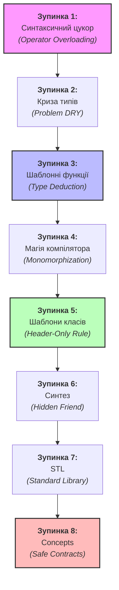
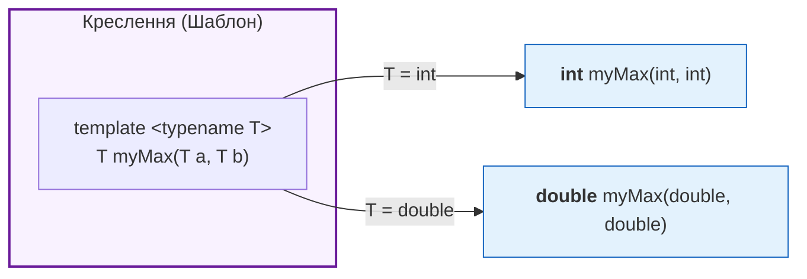

# Лекція 17: Узагальнене програмування (Generics) та Перевантаження Операторів

[← Лекція 16](16_inheritance_polymorphism.md) | [Index](index.md) | [Далі: Лекція 18 →](18_modern_cpp_move_smart.md)


## Мета
Перестати писати функції `addInt()`, `addFloat()`, `addDouble()`. Навчитися писати код **один раз** для будь-якого типу даних. Зрозуміти механізм, який лежить в основі узагальнених структур даних.

## Експрес-опитування
1.  Чому вираз `std::cout << "Hello"` використовує побітовий зсув (`<<`), хоча ми нічого не зсуваємо?
2.  Чи можна перевантажити оператор `.` (крапка) або `sizeof`?

<details markdown="1">
<summary>Інженерна відповідь</summary>

1.  Це і є **Operator Overloading**. Розробники C++ "навчили" оператор `<<` працювати по-іншому, якщо зліва стоїть об'єкт `ostream`. Це просто "цукор" для виклику функції.
2.  **Ні.** Ці оператори фундаментальні для мови, їх зміна зламала б парсинг коду.

</details>

---

## Навчальна траєкторія: Metro Test

Щоб не заплутатися в одній з найскладніших тем C++, ми використаємо підхід **Metro Test**. Кожна "зупинка" — це новий рівень абстракції. На кожному етапі ми вводимо лише **одну** нову концепцію, щоб ви могли будувати знання крок за кроком, не втрачаючи зв'язку з практикою.



---

## Зупинка 1: Синтаксичний цукор — Перевантаження операторів (Operator Overloading)

**Що таке `Vector2D`?**

- **Бізнес-контекст:** Вектор — це математичний об'єкт з координатами (x, y). Він повсюди: позиція ворога в грі, швидкість фізичного тіла, зміщення на карті.
- **Технічний опис:** Клас, що зберігає два числа `x` і `y` та надає операції над ними: додавання, віднімання, масштабування.

Ми вже знаємо, як написати такий клас і додати метод `add()`. Але як виглядає його використання?

### Варіант 1 — метод `.add()`:
```cpp
class Vector2D {
public:
    float x, y;
    Vector2D(float x, float y) : x(x), y(y) {}

    // const Vector2D& other — не змінюємо other (тільки читаємо)
    // const в кінці   — не змінюємо this (внутрішній стан об'єкта)
    Vector2D add(const Vector2D& other) const {
        return Vector2D(x + other.x, y + other.y);
    }
};


Vector2D v1(1, 2), v2(3, 4);
Vector2D v3 = v1.add(v2).add(v2); // Важко читати ланцюжки
```

Ми хочемо, щоб наші класи поводилися як вбудовані типи (`int`, `float`) — тоді математичні вирази залишаються математичними:

### Варіант 2 — перевантажений оператор:

```cpp
Vector2D v3 = v1 + v2 + v2; // Читається природно
```

### Як це реалізувати?

Оператор — це просто функція з дивним ім'ям `operatorX`. Достатньо оголосити її в класі:

```cpp
class Vector2D {
public:
    float x, y;
    Vector2D(float x, float y) : x(x), y(y) {}

    // Перевантаження '+' як методу класу
    // const Vector2D& other - щоб не копіювати при передачі
    // const в кінці - ми не змінюємо this (лівий операнд)
    Vector2D operator+(const Vector2D& other) const {
        return Vector2D(this->x + other.x, this->y + other.y);
    }
};
```

> **🏗️ Архітектурне рішення: чому `x`, `y` — `public`?**
> Інкапсуляція захищає **інваріанти** — правила, яким має відповідати стан об'єкта.
> У `Vector2D` немає жодного інваріанту: будь-яка пара чисел `(x, y)` є валідним вектором.
> `private` + геттери/сеттери тут додають синтаксичний шум без жодної семантичної користі.
> Це загальноприйнята практика: `glm::vec2`, `sf::Vector2f` (SFML), `ImVec2` (Dear ImGui) — всюди `x`/`y` є `public`.
> Порівняйте з `BankAccount`, де баланс `private`, бо він не може стати від'ємним без дозволу.

Перш ніж переходити до шаблонів — одна коротка, але важлива деталь. Шаблонний клас `Vector2D<T>` буде використовуватись з **будь-якими** типами, зокрема і з `const`-об'єктами. Ось конкретний приклад:

```cpp
// метод БЕЗ const в кінці:
Vector2D add(const Vector2D& other) { ... } // ← компілятор думає: "може змінювати this"

const Vector2D frozen(1, 2);
frozen.add(other); // ❌ error: passing 'const Vector2D' as 'this' discards qualifiers
                   // Компілятор не дозволяє — раптом метод змінить frozen?
```

```cpp
// метод З const в кінці:
Vector2D add(const Vector2D& other) const { ... } // ← обіцянка: "не чіпаю this"

const Vector2D frozen(1, 2);
frozen.add(other); // ✅ — компілятор довіряє обіцянці
```

Тому `const`-коректність — це не "гарна практика", це **умова компіляції** для шаблонних класів, які мають працювати з будь-яким кодом користувача.


### Три обіцянки `const` в операторі

> **🔁 Нагадування:** у виразі `a + b`:
> - **LHS** *(Left-Hand Side)* — `a`, лівий операнд → всередині методу це **`this`**
> - **RHS** *(Right-Hand Side)* — `b`, правий операнд → параметр **`other`**


Повний підпис `operator+` має **три** використання `const`. Кожне — окрема обіцянка компілятору:

| # | Позиція | Захищає | Що обіцяємо |
|---|---|---|---|
| 1 | **Відсутність** `const` перед return-типом | Швидкість | Дозволяє компілятору застосовувати **RVO** (Return Value Optimization) та **Move Semantics**. У сучасному C++ (C++17+) об'єкт часто створюється одразу в цільовій пам'яті, минаючи копіювання чи переміщення. Це і є **Zero-Cost Abstraction**. |
| 2 | `const Vector2D&` параметр | **RHS** (`b`, `other`) | не змінюємо правий операнд |
| 3 | `const` після `()` | **LHS** (`a`, `this`) | не змінюємо лівий операнд |

```cpp
Vector2D operator+(const Vector2D& other) const {
// ^1              ^2                         ^3
}
```

**Порівняння `operator+` vs `operator+=`:**

Оператори бувають двох типів за відношенням до стану об'єкта:
- **Immutable (незмінний)** — операція **не змінює** жоден з операндів, а повертає **новий** результат. Як у математиці: `3 + 5` не змінює `3`.
- **Mutating (мутуючий)** — операція **змінює** лівий операнд на місці. `a += b` — це "додати `b` до `a` і зберегти результат в `a`".

```cpp

// operator+ (immutable) — повертає новий об'єкт:
Vector2D operator+(const Vector2D& other) const {
    return Vector2D(x + other.x, y + other.y);
}

// operator+= (mutating) — змінює this, жодного const у кінці:
Vector2D& operator+=(const Vector2D& other) {
    x += other.x;
    y += other.y;
    return *this; // посилання дозволяє chain: a += b += c
}
```

**Чому return type різний:**
- `operator+` повертає **новий об'єкт за значенням** → `Vector2D` (без `const`, щоб працював **RVO** та Move)
- `operator+=` змінює поточний об'єкт і повертає **посилання на нього** → `Vector2D&` (дозволяє chain: `a += b += c`)

> **✅ Підсумок зупинки 1:** Ми навчились писати оператори — тепер `v1 + v2` виглядає як математика, а не як виклик методу. Але наш `Vector2D` досі прив'язаний до типу `float`. Якщо потрібен `Vector2D` для `int`, `double` або будь-якого іншого типу — доведеться копіювати клас. Це і є наступна проблема.

---

## Зупинка 2: Криза типів — Проблема DRY

Наш `Vector2D` чудовий, але захардкоджений на `float`. А що як нам потрібен `Vector2D` для `int` (клітинкове поле на шахівниці) або `double` (фізичний двигун)?

```cpp
// Рішення "в лоб" — копіювати клас для кожного типу:
class Vector2D_int {
public:
    int x, y;
    Vector2D_int(int x, int y) : x(x), y(y) {}
    Vector2D_int operator+(const Vector2D_int& o) const { ... }
};

class Vector2D_double {
public:
    double x, y;
    Vector2D_double(double x, double y) : x(x), y(y) {}
    Vector2D_double operator+(const Vector2D_double& o) const { ... }
};

// І так далі для кожного типу...
```

**Що робити, якщо потрібен ще й `long double`? Копіювати ще раз?**

Це жорстке порушення принципу **DRY (Don't Repeat Yourself)**. Якщо знайдеться помилка в логіці — доведеться виправляти в кожній копії. Нам потрібен інструмент. Але почнемо з простішого прикладу.

---

## Зупинка 3: Шаблонні функції (Function Templates) та Виведення типів (Type Deduction)

### Мотивація: Проблема дублювання коду

Уявіть функцію знаходження максимуму. Спершу ви реалізуєте її для цілих чисел:

```cpp
int myMax(int a, int b) {
    return (a > b) ? a : b;
}
```

Згодом виникає потреба порівнювати `double`. Ви використовуєте перевантаження функцій (Overloading) і копіпастите код:

```cpp
double myMax(double a, double b) {
    return (a > b) ? a : b;
}
```

**Що робити, якщо нам потрібен `float`? Копіювати код ще раз?**

Такий підхід веде до стрімкого розростання "спагетті-коду". Якщо знайдеться помилка в логіці (чи ви захочете її змінити), вам доведеться шукати і виправляти кожну скопійовану версію функції.

### Лікування шаблонами

Замість копіпасту ми можемо створити **шаблон функції**. Ми кажемо компілятору: "Зараз я опишу функцію один раз, але конкретний тип даних `T` я скажу пізніше".

```cpp
// Працює для int, double, String...
// Головне, щоб у типа T був оператор '>'
template <typename T>
T myMax(T a, T b) {
    return (a > b) ? a : b;
}
```

### Магія компілятора: Виведення типів (Type Deduction)

Як викликати цю шаблонну функцію? Логічно було б явно вказувати тип `T` у кутових дужках:

```cpp
int a = myMax<int>(5, 7);
double b = myMax<double>(3.14, 2.71);
```

Але писати кутові дужки щоразу — це зайвий візуальний шум. На щастя, компілятор C++ має потужний механізм **Type Deduction**. Коли ви викликаєте функцію просто як `myMax(5, 7)`, компілятор:
1. Аналізує типи переданих аргументів (`5` та `7` — це `int`).
2. Зіставляє їх з параметрами шаблону `(T a, T b)`.
3. Автоматично "виводить" (deduces) правило: `T = int`.

Тому ми можемо писати код чисто і красиво, немов це звичайна нешаблонна функція:

```cpp
int a = myMax(5, 7);          // T автоматично виведено як int
double b = myMax(3.14, 2.71); // T автоматично виведено як double
```

### ⚠️ Пастка Type Deduction (Ambiguous Deduction)

Механізм виведення типів працює лише тоді, коли висновок є **однозначним**. Що станеться, якщо ми змішаємо типи?

```cpp
auto m = myMax(5, 7.2); // ❌ Помилка компіляції!
```

**Чому це не працює:**
Компілятор намагається підставити типи у шаблон `T myMax(T a, T b)`:
1. Дивлячись на перший аргумент (`5`), він думає: `T = int`.
2. Дивлячись на другий аргумент (`7.2`), він думає: `T = double`.
3. Оскільки `T` може бути лише **одним** конкретним типом, компілятор видає помилку: *"no matching function... ambiguous deduction for template parameter T"*. Він не бере на себе сміливість вирішувати за вас, до якого типу приводити дані.

**Рішення — Явне вказування типу:**
Якщо автоматика не справляється, ми повертаємось до кутових дужок. Це примусово встановлює `T`, а інший аргумент буде автоматично приведений до цього типу (як у звичайних функціях):

```cpp
auto m1 = myMax<double>(5, 7.2); // ✅ Працює. T = double, 5 стає 5.0
auto m2 = myMax<int>(5, 7.2);    // ✅ Працює. T = int, 7.2 обрізається до 7
```

---

<details>
<summary><b>🔬 Глибоке занурення: Duck Typing vs. SOLID LSP</b></summary>

### Що таке Compile-time Duck Typing?

В мовах кшталт Python існує **Runtime Duck Typing**: програма перевіряє, чи вміє об'єкт "крякати", прямо під час виконання. Якщо ні — програма падає.

Шаблони C++ працюють інакше — це **Compile-time Duck Typing**:
*   **Статична перевірка:** Компілятор робить перевірку під час збірки (Monomorphization).
*   **Неявний інтерфейс:** Йому байдуже, якого типу `T`. Йому важливо лише те, щоб вираз `a > b` був синтаксично коректним.

### Це "L" із SOLID?

Не зовсім. Хоча обидва поняття стосуються **підстановки** (Substitution), вони працюють на різних рівнях:

1.  **Liskov Substitution Principle (L)** — це **Nominal** substitution (за іменем). Ви можете підставити `Duck` замість `Bird`, тому що вони пов'язані ієрархією успадкування. Компілятор вірить вам, бо ви так задекларували (`class Duck : public Bird`).
2.  **Templates (Duck Typing)** — це **Structural** substitution (за структурою). Ви можете підставити будь-що замість `T`, поки у нього є потрібні "шматочки" (оператори, методи). Їм не обов'язково бути родичами.

### Проблема: Провал підстановки

Поки ми передаємо "правильні" типи, все працює ідеально. Але як тільки ми намагаємось підставити в шаблон тип, який не відповідає структурі (наприклад, `Cat` у `myMax`), виникає конфлікт. 

Оскільки в класичних шаблонах (до C++20) немає способу заздалегідь описати правила "підстановки", компілятор змушений видавати технічний звіт про помилку. І тут ми стикаємось із проблемою **повідомлень**.

**C++20 Concepts** вирішують це, дозволяючи встановити **Явний контракт**. Детальніше про це — у **Зупинці 8**.

</details>

---

## Зупинка 4: Магія компілятора — Мономорфізація (Monomorphization)

Що насправді робить компілятор, коли бачить `myMax(5, 7)` і `myMax(3.14, 2.71)`? Він **не** створює одну магічну функцію, яка вміє все. Він фізично генерує **дві різні функції** з різним асемблерним кодом. Цей процес називається **Monomorphization**.



### Архітектурний компроміс (Trade-off)

1. **✅ Zero-Cost Abstraction (Здобуток)**:
   Оскільки компілятор генерує точний код під конкретний тип, виклики методів працюють зі швидкістю нативного коду. Ніяких перевірок під час виконання (runtime overhead $O(1)$). Ви отримуєте абстракцію високого рівня без жодної втрати продуктивності.
2. **❌ Code Bloat (Ціна)**:
   Якщо ви використаєте шаблон з 10 різними типами, компілятор згенерує 10 копій функції/класу. Це збільшує розмір бінарного файлу та сповільнює час збірки проєкту.


---

## Зупинка 5: Шаблони класів (Class Templates) та реалізація в заголовках

Тепер масштабуємо знання з функції `myMax` на цілий клас. Повертаємось до кризи зі Зупинки 2: нам потрібен `Vector2D` для різних типів. Ми вже знаємо відповідь — **шаблон класу**.

> **📚 Глосарій:**
> 1. **Class template (Шаблон класу)** — це саме креслення (blueprint) у коді. Це опис правил, за якими компілятор має створювати класи.
> 2. **Template class (Конкретизація / Instantiation)** — це фізичний згенерований клас (наприклад, `Vector2D<int>`), створений у процесі мономорфізації.

### Синтаксис

```cpp
template <typename T> // T - це плейсхолдер (замінник)
class Vector2D {
public:
    T x, y; // Тип полів залежить від T

    Vector2D(T x, T y) : x(x), y(y) {}

    Vector2D<T> add(const Vector2D<T>& other) const {
        return Vector2D<T>(x + other.x, y + other.y);
    }
};

// Використання — тип вказується явно (Type Deduction тут не спрацьовує)
Vector2D<int>    v_int(1, 2);
Vector2D<double> v_dbl(1.5, 2.5);
Vector2D<float>  v_flt(0.1f, 0.2f);
```

Компілятор у момент збірки застосовує Monomorphization і фізично створює три різних класи: `Vector2D_int`, `Vector2D_double`, `Vector2D_float`.

> **💡 Чи обмежені ми одним параметром?**
> Ні. Шаблони можуть приймайти декілька типів одночасно. Вони просто перелічуються через кому:
> ```cpp
> template <typename T, typename U>
> class Pair {
>     T first;
>     U second;
> };
> 
> Pair<int, std::string> account(101, "Admin");
> ```
> Це дозволяє створювати універсальні контейнери (як `std::map<Key, Value>`) або адаптери.

### ⚠️ Архітектурне правило: Реалізація тільки в заголовках (Header-Only)

З Monomorphization випливає важливий наслідок, який є найпоширенішою помилкою під час переходу від звичайних класів до шаблонних.

**Чому виникає проблема:** Компілятор обробляє `.cpp` файли **незалежно** один від одного. Щоб згенерувати `Vector2D<int>`, він повинен побачити **повне тіло шаблону** у момент, коли зустрічає `Vector2D<int> v(1, 2)`.

Якщо ви спробуєте розділити шаблон традиційним способом:

**vector2d.h** (Оголошення):
```cpp
template <typename T>
class Vector2D {
public:
    T x, y;
    Vector2D(T x, T y);
    Vector2D<T> operator+(const Vector2D<T>& other) const;
};
```

**vector2d.cpp** (Реалізація):
```cpp
#include "vector2d.h"

template <typename T>
Vector2D<T>::Vector2D(T x, T y) : x(x), y(y) {}

template <typename T>
Vector2D<T> Vector2D<T>::operator+(const Vector2D<T>& other) const {
    return Vector2D<T>(x + other.x, y + other.y);
}
```

**main.cpp** (Використання):
```cpp
#include "vector2d.h"

int main() {
    Vector2D<int> v(1, 2);
    Vector2D<int> res = v + v; // ❌ Помилка лінкера!
    return 0;
}
```

### Сценарій катастрофи

При спробі зібрати цей проєкт:
```bash
g++ main.cpp vector2d.cpp -o app
```

Ви отримаєте помилку **лінкера** (не компілятора!):
```text
/usr/bin/ld: main.cpp: undefined reference to `Vector2D<int>::Vector2D(int, int)'
/usr/bin/ld: main.cpp: undefined reference to `Vector2D<int>::operator+(Vector2D<int> const&) const'
collect2: error: ld returned 1 exit status
```

Лінкер шукає вже скомпільований код для `Vector2D<int>`, але його не існує:
1. У `main.cpp` компілятор бачив лише оголошення ("заглушку"), але не тіло шаблону, тому не зміг згенерувати код (Monomorphization).
2. У `vector2d.cpp` компілятор бачив тіло, але не знав, що комусь у програмі знадобиться саме версія для `int`.

**Правило:** Повне тіло шаблону (і оголошення, і реалізація) завжди мають бути у `.h` файлі:

```cpp
// ✅ Правильно: vector2d.h (все в одному файлі)
template <typename T>
class Vector2D {
public:
    T x, y;
    Vector2D(T x, T y) : x(x), y(y) {}

    // Реалізація прямо тут, у .h
    Vector2D<T> add(const Vector2D<T>& other) const {
        return Vector2D<T>(x + other.x, y + other.y);
    }
};
```

> **📌 Зв'язок з Моделлю пам'яті:** Детально про те, чому компілятор обробляє `.cpp` файли незалежно і як працює лінкер — [Memory Model Glossary](00_memory_model_glossary.md#2-compilation--linking-model).

---

## Зупинка 6: Синтез — Шаблони + Перевантаження операторів

Ми маємо шаблон `Vector2D<T>`. Але виклик `add` виглядає так само громіздко, як на Зупинці 1:

### Before:
```cpp
Vector2D<float> v1(1, 2), v2(3, 4);
Vector2D<float> v3 = v1.add(v2); // Громіздкий виклик методу
```

Тепер ми знаємо обидва інструменти — оператори і шаблони. Об'єднаємо їх:

### After:
```cpp
Vector2D<float> v3 = v1 + v2; // Математика, типобезпечна для будь-якого T
```

### Реалізація: `operator+` всередині шаблонного класу

```cpp
template <typename T>
class Vector2D {
public:
    T x, y;
    Vector2D(T x, T y) : x(x), y(y) {}

    // Перевантаження '+' — тепер T є параметром шаблону
    Vector2D<T> operator+(const Vector2D<T>& other) const {
        return Vector2D<T>(this->x + other.x, this->y + other.y);
    }

    // operator+= (mutating):
    Vector2D<T>& operator+=(const Vector2D<T>& other) {  // НЕ const!
        x += other.x;
        y += other.y;
        return *this;
    }
};
```

### Особливий гість: `operator<<` та концепція `friend`

#### Чому метод класу не підійде?

Ми навчили наш вектор математиці (`v1 + v2`). Тепер ми хочемо так само природно відображати його стан у консолі. 

Під час розробки нам постійно потрібно бачити значення в консолі для перевірки (дебагу). Писати кожного разу довжелезну конструкцію:
`cout << "(" << v.x << ", " << v.y << ")" << endl;`
— це знову крок назад до копіпасту. Ми хочемо писати просто: `std::cout << v1;`.

Але тут є нюанс. Оператор `<<` завжди приймає **два** аргументи: лівий (`cout`) і правий (`v1`). 

Якщо б ми спробували реалізувати його як **метод класу** (внутрішню функцію), то лівим операндом автоматично ставав би сам об'єкт `Vector2D` (через покажчик `this`). Це змусило б нас писати код "догори дригом":
`v1 << cout; // ❌ Це абсурд (ми "засовуємо" консоль у вектор)`

Проблема в тому, що лівий операнд — це `std::ostream` (системний клас), і ми не можемо "вломитися" в код стандартної бібліотеки, щоб дописати туди свій метод. Рішення — **вільна функція** (free function), яка стоїть поза класом і вміє працювати з обома типами одночасно:

```cpp
// Зовнішня функція — лівий операнд тепер ostream
std::ostream& operator<<(std::ostream& os, const Vector2D<float>& v) {
    os << "(" << v.x << ", " << v.y << ")";
    return os;
}
```

> **🔍 Чому ми повертаємо `std::ostream&` і чому він не `const`?**
> 1. **Ланцюжок викликів (Chaining):** Коли ми пишемо `cout << v1 << v2;`, це працює як `(cout << v1) << v2;`. Тобто результат першої операції (`cout << v1`) має бути знову об'єктом `cout`, щоб до нього можна було застосувати наступний `<<`. Тому ми повертаємо посилання на той самий потік.
> 2. **Потік не може бути `const`:** Коли ми щось виводимо, ми **змінюємо** стан `ostream` (буфер заповнюється, можуть змінитися прапорці стану потоку). Об'єкт, що змінюється, не може бути константним.

#### Новий виклик: доступ до приватних полів

Але тут виникає інша проблема. Якщо поля `x` та `y` є `private` (а за принципом інкапсуляції вони **мають** бути `private`), то зовнішня функція не матиме до них доступу:

```cpp
class Vector2D {
private:
    float x, y; // ← приватне поле
    // ...
};

// Компілятор скаже: error: 'x' is private within this context
std::ostream& operator<<(std::ostream& os, const Vector2D& v) {
    os << v.x; // ❌ немає доступу!
}
```

#### Рішення: ключове слово `friend` (Звичайний клас)

`friend` — це **декларація довіри** всередині класу. Вона каже: "цій конкретній зовнішній функції я довіряю і дозволяю їй бачити мої приватні члени". Дуже важливо: `friend` **не** робить функцію частиною класу і **не** порушує ООП-принципи — це свідомо контрольований виняток.

```cpp
// 🟢 Приклад для нешаблонного (звичайного) класу:
class Vector2D {
private:
    float x, y; // 🔒 Закрито для всього світу

    // 🤝 "Декларації довіри" у звичайному класі достатньо:
    friend std::ostream& operator<<(std::ostream& os, const Vector2D& v);
};

// 🌏 Функція стоїть ПОЗА класом...
std::ostream& operator<<(std::ostream& os, const Vector2D& v) {
    os << "(" << v.x << ", " << v.y << ")"; // ✅ Бачимо private x та y
    return os; // 🔗 Повертаємо потік для ланцюжка
}
```

#### Рішення: Ідіома "Hidden Friend" (Сучасний стандарт)

Синтаксис `friend`-функцій для шаблонів, визначених поза класом, є громіздким і часто призводить до помилок лінкера. Тому в індустрії використовують ідіому **Hidden Friend**: ми пишемо тіло функції прямо всередині класу.

**Інженерна суть Hidden Friend:**
1. **ADL (Argument-Dependent Lookup):** Функція "прихована" від глобального пошуку. Компілятор знайде її лише тоді, коли одним з аргументів оператора буде саме `Vector2D`.
2. **Захист простору імен:** Це запобігає "засміченню" (Namespace pollution) — глобальна область видимості залишається чистою, що зменшує час компіляції та ризик конфліктів імен.
3. **Синтаксис:** Код стає значно коротшим, а магічні дужки `<>` після імені оператора більше не потрібні.

```cpp
template <typename T>
class Vector2D {
private:
    T x, y;
public:
    Vector2D(T x, T y) : x(x), y(y) {}

    Vector2D<T> operator+(const Vector2D<T>& other) const {
        return Vector2D<T>(x + other.x, y + other.y);
    }

    // 🤝 Hidden Friend: функція прихована в класі, але залишається ЗОВНІШНЬОЮ.
    // Вона знайдеться лише через механізм ADL, не засмічуючи глобальний простір імен.
    friend std::ostream& operator<<(std::ostream& os, const Vector2D<T>& v) {
        os << "(" << v.x << ", " << v.y << ")";
        return os;
    }
};
```

#### Результат: Симетрія теорії та реалізації

```cpp
Vector2D<int>    vi(1, 2);
Vector2D<double> vd(3.14, 2.71);

// Шаблони + Оператори + Friend = красивий, типобезпечний код
std::cout << vi + vi << std::endl; // → (2, 4)
std::cout << vd + vd << std::endl; // → (6.28, 5.42)
```

Дві теми, які здавалися окремими — **оператори** і **шаблони** — об'єдналися в єдину, елегантну конструкцію.

---

## Частина 7: STL — Стандартна бібліотека шаблонів

Тепер ви розумієте, як працює магія, що стоїть за назвою **Standard Template Library (STL)**. Фактично вся стандартна бібліотека C++ побудована на шаблонах.

Найбільш знайома вам заміна звичайним масивам (`int arr[]`) — це **`std::vector`**. Це той самий "розумний масив", який може змінювати свій розмір і працювати з будь-яким типом даних завдяки шаблонам. Спрощено він виглядає так:

```cpp
template <typename T>
class vector {
    T* data;
    size_t size;
    size_t capacity;
public:
    T& operator[](size_t i) { return data[i]; }
    // ...
};
```

STL — це набір готових інструментів, що позбавляють вас необхідності щоразу "винаходити велосипед". Вона складається з трьох ключових елементів:

* **Контейнери (Containers):** Це шаблонні класи-сховища (структури даних). Вони автоматично керують пам'яттю і дозволяють зберігати будь-які типи `T`. 
  * *Приклади:* `vector` (гнучкий масив), `list` (зв'язний список), `map` (пари ключ-значення).
* **Алгоритми (Algorithms):** Шаблонні функції, які виконують типові операції над даними в контейнерах.
  * *Приклади:* `sort` (сортування), `find` (пошук), `transform` (зміна елементів).
* **Ітератори (Iterators):** "Розумні вказівники", які є клеєм між контейнерами та алгоритмами. Вони дозволяють алгоритмам працювати з будь-яким контейнером однаково.

---

## Частина 8: Анонс — C++20 Concepts (Обмеження шаблонів)

Ми вже знаємо: шаблони в C++ за замовчуванням мають "неявний інтерфейс" (Duck Typing). Якщо ви спробуєте створити `Vector2D<std::string>`, компілятор почне підставляти `string` у шаблон і "зламається" десь глибоко всередині, намагаючись додати один рядок до іншого.

### Проблема: Wall of Text

Без концептів помилка виникає **у нутрощах реалізації**, а не **у місці виклику**. Коли ми пишемо:

```cpp
Vector2D<std::string> v("a", "b"); // ❌ string не підтримує мат. операції
```

Ми отримуємо "стіну тексту" на 50 рядків, де компілятор скаржиться на помилку в `operator+` всередині `vector2d.h`. Це як якщо б на будівництві вас штрафували за те, що ви неправильно зварили сталь для крана, хоча ви просто намагалися підняти ним неможливу вагу.

Ми бачимо помилку **у реалізації**, а не **у виклику**.

### Рішення: C++20 Concepts (Явні Контракти)

**Concept** — це іменована вимога до типу `T`, яку компілятор перевіряє **у точці виклику**, до того як намагатися підставити тип у шаблон.

```cpp
#include <concepts>

// Вимагаємо, щоб T був числом (цілим або з плаваючою крапкою)
template <typename T>
concept Number = std::integral<T> || std::floating_point<T>;

template <Number T>
class Vector2D {
    T x, y;
public:
    Vector2D(T x, T y) : x(x), y(y) {}
    // ...
};

Vector2D<int> v1(1, 2);          // ✅ OK: int — це Number
Vector2D<std::string> v2("a", "b"); // ❌ error: constraints not satisfied
                                    // 'std::string' does not satisfy 'Number'
```

Тепер компілятор одразу каже: `std::string` не є числом, тому я навіть не буду намагатися заходити всередину шаблону.

### Стандартні Concepts з `<concepts>`

Для математичних об'єктів найважливішими є:

| Concept | Що вимагає від `T` | Для чого у Vector2D |
|---|---|---|
| `std::integral` | Цілочисельний тип (`int`, `long`, `char`...) | Позиції на дискретній сітці |
| `std::floating_point` | Тип з плаваючою крапкою (`float`, `double`) | Реальні фізичні координати |
| `std::totally_ordered` | Підтримка `<`, `>`, `<=`, `>=` | Порівняння векторів за довжиною |
| `std::regular` | Можна копіювати, порівнювати та дефолтно конструювати | Поводження як "звичайне число" |

### Власний Concept: Arithmetic

Ми можемо описати власні вимоги до типу через ключове слово `requires`:

```cpp
// Вимагаємо, щоб тип T підтримував базову арифметику
template <typename T>
concept Arithmetic = requires(T a, T b) {
    { a + b } -> std::same_as<T>;
    { a - b } -> std::same_as<T>;
    { a * b } -> std::same_as<T>;
    { a / b } -> std::same_as<T>;
};

template <Arithmetic T>
class Matrix { ... }; // Працюватиме лише з тим, що "вміє в математику"
```

> **📌 Індустріальний стандарт:** Concepts — це частина сучасного C++20. У великих проєктах (ігрові двигуни, HPC, фінансові системи) вони є нормою. Вміння читати та писати Concepts відрізняє Mid від Senior C++ розробника.

---

## Практичне застосування

**Див.:** [Практикум 11: Matrix Engine](p11_generic_matrix.md) — створення математичної бібліотеки з templates та операторами.

## Контрольні питання

1. Чому `operator+` зазвичай повертає об'єкт за значенням (`Vector2D`), а `operator+=` — за посиланням (`Vector2D&`)?
2. Що буде, якщо спробувати викликати `std::sort` для вектора об'єктів, у яких не перевантажено `operator<`?
3. В чому різниця між `class template` (шаблон класу) та `template class` (конкретизація шаблону)?
4. Чому шаблонний код зазвичай пишуть повністю в `.h` файлах, а не розділяють на `.h` та `.cpp`?

<details markdown="1">
<summary>Відповіді</summary>

1. `a + b` створює **новий** результат, не змінюючи `a` чи `b`. Тому повертаємо нове значення. `a += b` змінює `a`, тому повертаємо посилання на змінений `a` (щоб робити `(a += b).print()`).
2. **Помилка компіляції.** Шаблон `sort` всередині використовує `<`, і якщо його немає, компілятор не зможе згенерувати код.
3. `class template` — це саме креслення (`template <typename T> class X...`). `template class` (або instantiation) — це вже згенерований код для конкретного типу (`X<int>`).
4. **Linker Error.** Компілятор має бачити тіло шаблону в момент використання (щоб згенерувати код). Якщо тіло сховано в `.cpp`, то в `main.cpp` компілятор не знатиме, як створити `Vector<int>`.

</details>
