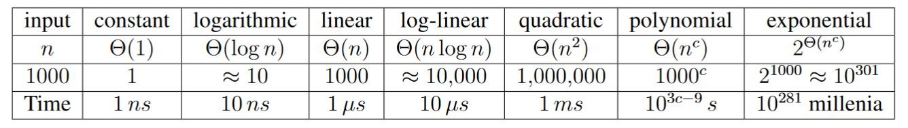

# Лекція 19: Performance Engineering — Big O та Брехня CPU

[← Лекція 18](18_modern_cpp_move_smart.md) | [Index](index.md) | [Далі: Лекція 20 →](20_lists_vector.md)


## Мета
Перестати гадати, чому код гальмує. Зрозуміти різницю між "Алгоритмічною складністю" (Big O) та "Реальною швидкістю" (Hardware Latency). Навчитися бачити O(N^2) до запуску коду.

## Експрес-опитування
1.  Що швидше: прочитати 1 МБ даних послідовно чи прочитати 1 МБ даних стрибками по 4 байти у випадкових місцях?
2.  Якщо алгоритм А робить N операцій, а алгоритм Б — 100 * N, який з них має кращу складність в O-нотації?
3.  Чи гарантує O(1) (константний час) миттєве виконання?

<details markdown="1">
<summary>Інженерна відповідь</summary>

1.  **Послідовно — у ~30 разів швидше.** Механізм **Prefetching** процесора передбачає ваші кроки і завантажує дані в кеш наперед (Cache Lines). Випадковий доступ (Linked List) ламає цю оптимізацію (Cache Misses).
2.  **Однакову — O(N).** В Big O ми ігноруємо константи та молодші члени. Але в реальному житті цей множник 100 може бути критичним.
3.  **Ні.** O(1) означає, що час **не залежить** від розміру вхідних даних N. Але ця "константа" може дорівнювати 5 хвилинам (наприклад, ініціалізація з'єднання з супутником).

</details>

---

## Частина 1: Big O Notation (Теорія)

Ми оцінюємо алгоритми за тим, як **росте час виконання** при зростанні вхідних даних (N) у найгіршому випадку (Worst Case).

### Правила аналізу коду (Code Analysis Rules)

**Правило 1: Цикли (For Loops)**
Складність = Кількість ітерацій * Складність тіла циклу.
```cpp
// N ітерацій, тіло O(1)
for (int i = 0; i < N; i++) {
    k++; 
}
// Total: O(N)

```

**Правило 2: Вкладені цикли (Nested Loops)**
Складність = Добуток розмірів циклів.

```cpp
// Зовнішній: N разів
for (int i = 0; i < N; i++) {
    // Внутрішній: N разів
    for (int j = 0; j < N; j++) {
        k++; 
    }
}
// Total: O(N * N) = O(N^2)

```

**Правило 3: Послідовні дії**
Ми додаємо складності, але залишаємо тільки домінуючу (найбільшу).

```cpp
for (int i = 0; i < N; i++) { ... }       // O(N)
for (int i = 0; i < N; i++) {             // O(N^2)
   for (int j = 0; j < N; j++) { ... } 
}
// Math: O(N + N^2)
// Engineering: O(N^2) (Квадрат "з'їдає" лінію при великих N)

```

### Шкала жаху (від кращого до гіршого):

| Нотація | Назва | Приклад | Коментар |
| --- | --- | --- | --- |
| **O(1)** | Constant | `arr[i]`, `push_back` | Мрія інженера. |
| **O(log N)** | Logarithmic | Binary Search, `std::map` | Дуже швидко. Подвоєння даних додає лише +1 крок. |
| **O(N)** | Linear | `for` loop, `std::find` | Норма. Час росте пропорційно даним. |
| **O(N log N)** | Linearithmic | `std::sort`, MergeSort | Найкращий час для сортування. |
| **O(N^2)** | Quadratic | Bubble Sort, Nested loops | **Гальмує** при N > 10,000. |
| **O(2^N)** | Exponential | Fibonacci Recursive | **Смерть** при N > 40. |

### Scale of Universe Comparison

> **💡 Mathematical Examples from Source Material**  
> Джерело: s02e06. Introduction to Algorithms.pdf, стор. 449



*Рис. 1: Шкала алгоритмічних складностей — від константного до експоненціального часу*

Щоб відчути різницю між складностями, подивимося, скільки часу займуть алгоритми на сучасному комп'ютері (1 GHz CPU, 1 млрд операцій/с):

| Algorithm | n=1,000 | n=1,000,000 | n=1,000,000,000 |
|-----------|---------|-------------|-----------------|
| **O(1)** | 1 ns | 1 ns  | 1 ns |
| **O(log n)** | ~10 ns | ~20 ns | ~30 ns |
| **O(n)** | 1 μs | 1 ms | 1 second |
| **O(n log n)** | 10 μs | 20 ms | 30 seconds |
| **O(n²)** | 1 ms | 16.7 minutes | **31,688 years** |
| **O(2ⁿ)** | **10²⁸¹ millenia** | Heat death of universe | Beyond comprehension |

**Key Insights:**
- O(n²) для n=10⁹: **31 тисяча років**. Це довше, ніж існує письменність людства!
- O(2ⁿ) для n=1000: **10²⁸¹ millenia** (одиниця з 281 нулем). Для порівняння, вік Всесвіту — 10¹⁰ років.

> **Engineering Rule:** Якщо ваш алгоритм O(2ⁿ) і n > 30, ви маєте проблему. Навіть найшвидший суперкомп'ютер не допоможе.

---

## Частина 2: Hardware Reality (Масштаб часу)

Теорія алгоритмів часто ігнорує залізо. Це помилка.
Сучасний CPU набагато швидший за пам'ять (Memory Wall).

Щоб відчути це, уявімо, що **1 такт процесора (0.3 нс) = 1 секунда** людського життя.

| Подія | Реальний час | **Людський масштаб** (якщо 1 такт = 1 с) |
| --- | --- | --- |
| **1 CPU Cycle** | 0.3 ns | **1 секунда** (одне серцебиття) |
| **L1 Cache access** | 1 ns | **3 секунди** (взяти книгу зі столу) |
| **L2 Cache access** | 4 ns | **12 секунд** (дійти до книжкової полиці) |
| **RAM Access** (Main Memory) | 100 ns | **5 хвилин** (сходити за кавою в сусідню будівлю) |
| **SSD Access** (NVMe) | 100 us | **3-4 дні** (поїздка машиною Одеса-Львів і назад) |
| **HDD Access** (Rotational) | 10 ms | **1 рік** (піша подорож навколо світу) |
| **Internet Call** (Ping) | 150 ms | **15 років** (виростити дитину) |

> **Інсайт:** Кожного разу, коли процесор звертається до RAM (через `std::list` або Cache Miss), він "йде пити каву" на 5 хвилин. Ось чому структури, що тримають дані щільно (`std::vector`), перемагають.

---

## Частина 3: Практика — Benchmark (`std::chrono`)

Не вірте інтуїції ("мені здається, це швидко"). Міряйте.
Скопіюйте цей код і запустіть у себе.

```cpp
#include <iostream>
#include <vector>
#include <cmath>
#include <chrono> // 1. Підключаємо бібліотеку часу

// Тайпдеф для скорочення коду
using namespace std::chrono;

int main() {
    // Готуємо дані: 10 мільйонів чисел
    const int N = 10'000'000;
    std::vector<double> data(N, 1.5);

    std::cout << "Benchmarking " << N << " elements...\n\n";

    // --- Benchmark 1: Simple Sum (Легка операція) ---
    auto start = high_resolution_clock::now(); // 2. Старт
    
    double sum = 0;
    for(double val : data) {
        sum += val; // Процесор робить це за < 1 такту (суперскалярність)
    }

    auto stop = high_resolution_clock::now(); // 3. Стоп
    
    // 4. Переводимо в мікросекунди
    auto duration = duration_cast<microseconds>(stop - start);
    
    std::cout << "[Simple Loop]\n";
    std::cout << "Result: " << sum << "\n";
    std::cout << "Time:   " << duration.count() / 1000.0 << " ms\n"; // ~5-10 ms


    // --- Benchmark 2: Heavy Math (Важка операція) ---
    start = high_resolution_clock::now();
    
    double heavySum = 0;
    for(double val : data) {
        // Тригонометрія — це дуже дорого для CPU
        heavySum += std::sin(val) * std::cos(val);
    }

    stop = high_resolution_clock::now();
    duration = duration_cast<microseconds>(stop - start);
    
    std::cout << "\n[Heavy Loop]\n";
    std::cout << "Result: " << heavySum << "\n";
    std::cout << "Time:   " << duration.count() / 1000.0 << " ms\n"; // ~300-500 ms
    
    return 0;
}

```

---

## Частина 4: Рекурсія — Друг чи Ворог?

Класичний приклад неефективності — рекурсивний Фібоначчі.

```cpp
// O(2^N) — Експоненціальна складність
long fib(int n) {
    if (n <= 1) return 1;
    return fib(n-1) + fib(n-2);
}

```

**Чому це погано?**

* Щоб порахувати `fib(5)`, ми рахуємо `fib(3)` **двічі**.
* Щоб порахувати `fib(50)`, комп'ютеру знадобляться роки.
* Дерево викликів росте як лавина.

**Інженерне рішення:** Використовувати **цикл** (Iteration) або **Memoization** (запам'ятовування вже порахованих значень). У циклі це O(N).

---

---

## Практичне застосування

**Див.:** [Практикум 12: Performance Lab](p12_performance_lab.md) — оптимізація коду та профілювання.

**Поглиблене вивчення:** [Лекція 24: Performance Deep Dive](24_performance_deep_dive.md) — advanced profiling tools (perf), compiler optimization flags, та екстремальна оптимізація.

## Контрольні питання

1. **Питання:** У вас є вкладений цикл: зовнішній йде до N, а внутрішній — фіксовано 100 разів. Яка складність: O(N^2) чи O(N)?
<details markdown="1">
<summary>Відповідь</summary>

**O(N).** Точний розрахунок: N * 100. В Big O константи відкидаються. Для великих N це лінійний алгоритм.
</details>

2. **Питання:** Чому доступ до жорсткого диска (HDD) називають "вбивцею продуктивності"?
<details markdown="1">
<summary>Відповідь</summary>

У "людському масштабі" доступ до HDD займає **1 рік** (порівняно з 1 секундою CPU). Будь-яка синхронна операція з диском у головному потоці заморожує програму (UI Lag).
</details>

3. **Питання:** Алгоритм A робить 1000 * N операцій, а Алгоритм B робить N^2. При якому (приблизно) N алгоритм B стане повільнішим за A?
<details markdown="1">
<summary>Відповідь</summary>

**При N > 1000.**
Рівняння: 1000*N = N^2 => N = 1000.
При малих даних (N < 1000) квадратичний алгоритм може бути швидшим через менші накладні витрати (overhead). Але ми оптимізуємо під великі дані, тому O(N) завжди виграє в перспективі.
</details>

4. **Питання:** Ви використовуєте `std::vector::insert` (вставка в початок) всередині циклу `for`. Яка загальна складність?
<details markdown="1">
<summary>Відповідь</summary>

**O(N^2).**
Цикл дає N. Вставка в початок вектора змушує перемістити всі існуючі елементи вправо — це операція O(N).
Разом: N * N = N^2. Це класична помилка продуктивності (Hidden Complexity). Для таких задач краще підходить `std::list` або `std::deque`.
</details>
