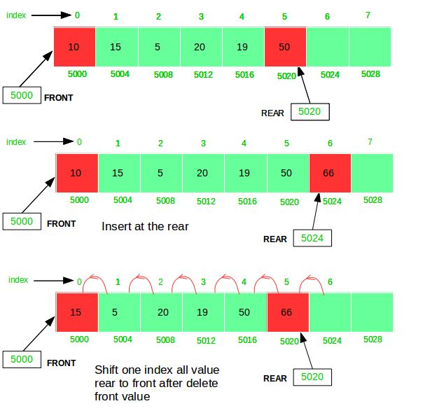
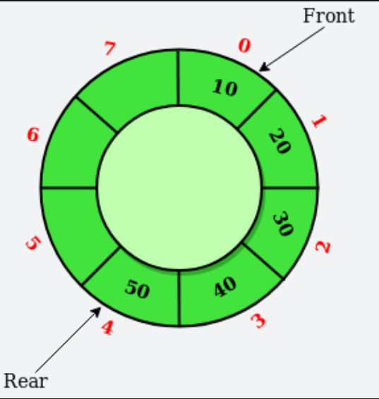
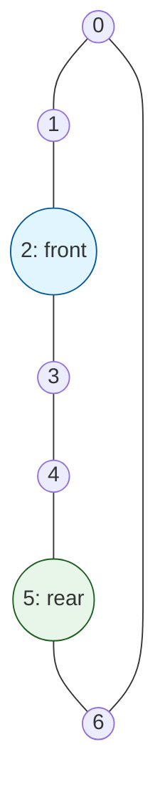

# Лекція 20: Лінійні структури — Битва Vector vs List

[← Лекція 19](19_complexity_profiling.md) | [Index](index.md) | [Далі: Лекція 20b →](20b_adt_stack_queue.md)

## Мета
Зрозуміти, як реалізовані списки "під капотом". Навчитися обирати між масивом (`std::vector`) та зв'язним списком (`std::list`).
Спойлер: У 95% випадків ви маєте брати Vector.

## Експрес-опитування
1.  Якщо ми додаємо елемент у **середину** масиву, що стається з іншими елементами?
2.  Що простіше: вставити аркуш у середину папки на кільцях чи вклеїти його всередину зшитого зошита?
3.  Скільки пам'яті (байт) займає зберігання одного `int` у двозв'язному списку?
    ```cpp
    struct Node {
        int value;
        Node* next;
        Node* prev;
    };
    ```

<details markdown="1">
<summary>Інженерна відповідь</summary>

1.  Ми мусимо **зсунути** (скопіювати) всі наступні елементи вправо. Це повільно $O(N)$.
2.  **У папку на кільцях (Список).** Ми просто роз'єднуємо ланцюг в одному місці. У зошиті (Масив) нам довелося б "пересувати" все, що йде далі.
3.  **24 байти!** (4 байти значення + 4 padding + 8 вказівник `next` + 8 вказівник `prev`). Оверхед у 5 разів!

</details>

---

## Частина 1: Абстракція "Список" (ADT)

> **ADT (Abstract Data Type)** — це теоретична модель, яка описує **що** структура даних має робити (набір операцій), але не каже, **як** саме вона це реалізує в пам'яті.

Список — це упорядкована колекція елементів. Базові операції:
| Операція | Опис |
| --- | --- |
| `insert(pos, value)` | Додати елемент у певну позицію |
| `remove(pos)` | Видалити елемент із певної позиції |
| `get(index)` | Отримати значення елемента за номером |

Але саме **реалізація** диктує швидкість. 

Пам'ятайте **Золоте правило** з [Лекції 19](19_complexity_profiling.md):  
> **Структура даних = Пам'ять = Алгоритм.**  

Те, як ми розташуємо список у пам'яті (суцільним блоком чи окремими вузлами), фундаментально змінить продуктивність наших операцій.

---

## Частина 2: Dynamic Array (`std::vector`)

**Суть:** Суцільний блок пам'яті. Якщо місце закінчилось — виділяємо новий блок (x2), копіюємо все туди, старий видаляємо.

**Переваги:**
* **Pros:** **Cache Friendly:** Всі дані лежать поруч. Процесор "ковтає" їх пачками (**Cache Lines**).
    > **💡 Як це працює?** Процесор не читає дані з RAM по одному байту. Він завантажує їх блоками по **64 байти**. Якщо ви звернулися до `vec[0]`, процесор автоматично завантажить у кеш і наступні 15 елементів (якщо це `int`). Коли ви до них дійдете, вони вже будуть на чіпі — це у сотні разів швидше, ніж знову йти в RAM.

* **Pros:** **Random Access:** `vec[500]` — це миттєва математика адреси ($Base + 500 \cdot Size$). $O(1)$.

**Недоліки:**
* **Cons:** **Insert/Delete in middle:** Треба зсувати хвіст. $O(N)$.
* **Cons:** **Reallocation:** Періодичні дорогі копіювання при зростанні.

| Структура Даних (Пам'ять) | Алгоритм (Операція) | Швидкість |
| --- | --- | --- |
| Суцільний масив (Contiguous) | Прямий доступ (`vec[i]`) | $O(1) +$ Cache |
| Суцільний масив (Contiguous) | Додавання в кінець | $O(1)$ аморт. |
| Суцільний масив (Contiguous) | Вставка в середину | $O(N)$ через зсув |

> **💡 Чому це важливо?** Навіть якщо два алгоритми мають однакову складність $O(N)$, той, що працює з кешем (як вектор), буде в **10–50 разів швидшим** за той, що постійно спричиняє **Cache Miss** (як список), бо йому не треба кожного разу чекати на дані з повільної оперативної пам'яті (RAM).

---

## Частина 3: Linked List (`std::list`)

Це класичний двозв'язний список (Double Linked List).
**Суть:** Кожен елемент — це окремий об'єкт (Node) у купі (Heap), який знає, хто його сусіди.

```cpp
struct Node {
    int value;
    Node* next; // +8 байт
    Node* prev; // +8 байт
};
```

**Переваги:**
* **Pros:** **Insert/Delete in middle:** Просто перекинути вказівники (якщо у вас вже є ітератор на позицію). $O(1)$.
* **Pros:** **No Reallocation:** Вказівники залишаються валідними завжди.

**Недоліки:**
* **Cons:** **Cache Killer:** Вузли розкидані по пам'яті хаотично. Кожен перехід `node->next` — це потенційний **Cache Miss**.
    > **⚠️ Що таке Cache Miss?** Це момент, коли процесор шукає дані в кеші, не знаходить їх і змушений чекати, поки вони прийдуть із повільної оперативної пам'яті (RAM). Це "простій" процесора довжиною в сотні тактів — за цей час він міг би обробити тисячі елементів вектора.

* **Cons:** **No Random Access:** Щоб дістати 500-й елемент, треба пройти 499 попередніх. $O(N)$.
* **Cons:** **Memory Overhead:** Платимо за вказівники (x3 пам'яті для `int`).

| Структура Даних (Пам'ять) | Алгоритм (Операція) | Швидкість |
| --- | --- | --- |
| Окремі вузли в Heap | Пошук за номером | $O(N)$ через "стрибки" |
| Окремі вузли в Heap | Вставка (з ітератором) | $O(1)$ тільки вказівники |
| Окремі вузли в Heap | Послідовний обхід | $O(N) +$ Cache Miss |

---

## Частина 4: Порівняння Складності (Cheat Sheet)

| Операція | Vector (`std::vector`) | List (`std::list`) |
| --- | --- | --- |
| **Access `[i]`** | $O(1)$ | $O(N)$ |
| **Insert Head** | $O(N)$ | $O(1)$ |
| **Insert Tail** | $O(1)$ (amortized) | $O(1)$ |
| **Insert Middle** | $O(N)$ | $O(1)$ (з ітератором) |
| **Cache Locality** | 🔥 Висока | 🧊 Низька |

> **💡 Що таке амортизована складність?** 
> Це "середня ціна" операції. У вектора `push_back` майже завжди $O(1)$, бо в кінці є вільне місце. Але раз на багато кроків місце закінчується, і комп'ютеру доводиться виділяти новий блок пам'яті та копіювати все туди ($O(N)$). Проте, оскільки це стається рідко, усереднена швидкість на довгій дистанції все одно залишається **$O(1)$**.

---

## Частина 5: Вердикт Б'ярна Страуструпа

Сам творець C++ проводив тест: генерував випадкові числа і вставляв їх у відсортований список/вектор.
Теоретично `list` мав виграти (вставка в середину).
Практично **`vector` переміг**, навіть з урахуванням зсувів.

**Чому?**
Поки `list` шукає місце в пам'яті (стрибає по вказівниках), `vector` встигає зсунути мегабайт даних завдяки кешу та SIMD-інструкціям процесора.

---

## Додаток: Кільцева черга (Circular Queue / Ring Buffer)

### Що таке FIFO та LIFO?

Це фундаментальні принципи порядку обробки даних:
*   **FIFO (First In, First Out)** — "Першим прийшов — першим пішов". Хто перший став у чергу, той перший з неї вийде. Це принцип роботи **Черги (Queue)**.
*   **LIFO (Last In, First Out)** — "Останнім прийшов — першим пішов". Останній доданий елемент буде вилучений першим (як стопка тарілок). Це принцип роботи **Стека (Stack)**.

### Черга як ADT (Абстрактний тип даних)

**Черга (Queue)** — це структура даних, де доступ до елементів обмежений: ми можемо додавати лише в "хвіст" (rear), а забирати — лише з "голови" (front).

**Базові операції черги:**

| Операція | Опис | Складність |
| --- | --- | --- |
| `enqueue(x)` | Додати елемент `x` у кінець (rear) | $O(1)$ |
| `dequeue()` | Видалити елемент із початку (front) | $O(1)$ |
| `front()` | Отримати значення першого елемента | $O(1)$ |
| `isEmpty()` | Перевірити, чи не порожня черга | $O(1)$ |




*Рис. 1: Черга (Queue) — наочне зображення принципу FIFO (First In, First Out)*

### Переваги та недоліки черги на масиві

*   **Переваги:** Неймовірна швидкість ($O(1)$ для всіх операцій) та простота коду.
*   **Недоліки:** Фіксований розмір та ризик "втечі" даних за межі пам'яті.

| Структура Даних (Пам'ять) | Алгоритм (Операція) | Швидкість |
| --- | --- | --- |
| Статичний масив | `enqueue` / `dequeue` | $O(1)$ |
| Статичний масив | `dequeue` зі зсувом | $O(N)$ (наївно) |
| Статичний масив | Додавання при "дрейфі" | **Overflow** (хоча місце є) |

> **💡 Наївні підходи до видалення (`dequeue`):**
> 1.  **Зсув даних:** Кожного разу пересуваємо всі елементи на початок масиву. Це гарантує, що `front` завжди дорівнює 0, але швидкість впаде до **$O(N)$**.
> 2.  **Зсув індексу:** Ми просто рухаємо вказівник `front` вперед. Це миттєво (**$O(1)$**), але черга починає "дрейфувати" в кінець масиву, марнуючи простір на початку.

### Історія про "Чергу, що тікає"

Уявіть, що ви пишете програму для буфера клавіатури. У вас є масив на 10 символів.

1.  Користувач швидко натиснув 5 клавіш. Ваш `rear` (хвіст) тепер на індексі 4.
2.  Програма обробила (видалила) 3 клавіші. Ваш `front` (голова) перемістився на індекс 3.
3.  Користувач натискає ще 5 клавіш. Ваш `rear` доходить до кінця масиву (індекс 9).
4.  **Критичний момент (це і є дрейф):** Ви хочете додати ще один символ. Ви бачите, що на початку масиву є 3 вільні комірки (бо перші клавіші вже оброблені), але ваш "хвіст" вже вперся в стінку масиву.

Черга ніби "проповзла" крізь пам'ять і вперлася в край, хоча фізично місце ще є.

**Як це вирішити?**
*   **Наївний шлях:** Кожного разу після видалення зсувати всі елементи до початку. Це перетворить видалення з $O(1)$ на повільне $O(N)$.
*   **Інженерний шлях:** Уявити, що після останнього індексу знову йде нульовий. "Зігнути" масив у кільце.




*Рис. 2: Кільцева черга (Ring Buffer) — оптимальне використання пам'яті через зациклений індекс*

**Проблема:** Наївна реалізація черги на масиві марнує простір.

**Наївна черга:**
```
[  ][  ][A][B][C][ ][ ]
        ↑       ↑
      front    rear
     (голова) (хвіст)
```

Після `dequeue()` (видалення) двічі:
```
[  ][  ][  ][  ][C][ ][ ]
                ↑   ↑
              front rear
```

Попередній простір (`[0], [1]`) втрачено назавжди! Хвіст (`rear`) може дійти до кінця масиву, навіть якщо на початку є вільне місце.

**Рішення: Кільцева черга (Circular Queue / Ring Buffer)**

Уявляємо масив як **кільце**. Індекси "зациклюються" через арифметику залишком від ділення (modulo):



**front = 2, rear = 5**  
Елементи в черзі: `[2], [3], [4], [5]`

Після `enqueue(X)`:  
`rear = (rear + 1) % 7 = 6`


**Реалізація:**

```cpp
class CircularQueue {
    int* data;
    int front, rear, size, capacity;
    
public:
    CircularQueue(int cap) {
        capacity = cap;
        data = new int[capacity];
        front = rear = -1;
        size = 0;
    }
    
    // Додавання в чергу
    bool enqueue(int value) {
        if (size == capacity) return false;  // Черга повна
        
        if (front == -1) front = 0;  // Перший елемент
        
        rear = (rear + 1) % capacity;  // ⭐ Зациклення індексу!
        data[rear] = value;
        size++;
        return true;
    }
    
    // Видалення з черги (повертає true, якщо успішно)
    bool dequeue(int& outValue) {
        if (size == 0) return false;  // Черга порожня
        
        outValue = data[front];
        front = (front + 1) % capacity;  // ⭐ Зациклення індексу!
        size--;
        
        if (size == 0) {  // Черга стала порожньою
            front = rear = -1;
        }
        
        return true;
    }
};
```

> **⚠️ Engineering Note:** Ніколи не використовуйте "магічні числа" (sentinel values) для позначення помилок.
> *   **Погано (Bad):** `int dequeue()` (наприклад, через `return -1`) — ви не можете відрізнити число `-1` у черзі від сигналу "черга порожня".
> *   **Добре (Good):** `bool dequeue(int& value)` або `std::optional<int> dequeue()`.

**Математика зациклення:**
- `(rear + 1) % capacity` — наступний індекс після `rear`.
- Якщо `rear = 6` і `capacity = 7`, то `(6 + 1) % 7 = 0` (повертаємося на початок масиву).

**Де це використовується?**
- **Аудіо/Відео буфери:** стрімінг даних, де старі дані постійно замінюються новими.
- **Producer-Consumer:** передача даних між потоками.
- **Ядро ОС:** кільцеві буфери логів (наприклад, `dmesg` у Linux).
- **Мережеві пристрої (маршрутизатори):** буферизація пакетів. У мережевому обладнанні пам'ять обмежена і дорога, тому кільцевий буфер дозволяє обробляти гігабіти трафіку, використовуючи пам'ять на 100% без переалокацій.

**Ефективність:**
- **Пам'ять:** Використовується 100% масиву (немає втраченого простору).
- **Час:** $O(1)$ для додавання та видалення.

| Структура Даних (Пам'ять) | Алгоритм (Операція) | Швидкість |
| --- | --- | --- |
| Зациклений масив (Ring) | `enqueue` / `dequeue` | $O(1)$ (істинно) |
| Зациклений масив (Ring) | Послідовна обробка | $O(1) +$ Cache |
| Зациклений масив (Ring) | Використання пам'яті | 100% без зсувів |

> **Інженерне правило:** Використовуйте `std::vector` як основу, але якщо вам потрібен патерн "черга" з частим додаванням/видаленням з обох кінців — кільцевий буфер набагато ефективніший за наївну чергу на масиві.

> **Головне правило:** За замовчуванням завжди беріть `std::vector`.
> Використовуйте `std::list` ТІЛЬКИ якщо вам потрібно гарантувати валідність вказівників при вставці в середину І ви точно знаєте, що робите.

---

## Практичне застосування

**Див.:** [Практикум 13: Algorithms & Good Taste](p13_algorithms_and_taste.md) — алгоритмічний дизайн та робота зі структурами даних.

## Контрольні питання

1. У вас є список з 1 млн об'єктів гри. Вам треба кожен кадр проходити по всім і оновлювати їхню позицію. Що ви оберете: `vector` чи `list`?
2. Чому `std::vector::push_back` називають "амортизованим"?
3. Як перетворити `vector` на "C-style array" (отримати вказівник на дані)? (Підказка: `vec.data()`).

---

## Ключові концепції лекції

| Концепція | Коротко: Для чого це? |
| :--- | :--- |
| **Random Access** | Можливість миттєво ($O(1)$) отримати будь-який елемент за його індексом. |
| **Cache Locality** | Розміщення даних суцільним блоком, що дозволяє CPU читати їх у 10-100 разів швидше. |
| **std::vector** | Основний інструмент програміста: швидкий, компактний, передбачуваний. |
| **std::list** | Коли вставки в середину відбуваються дуже часто, а доступ за індексом не потрібен. |
| **Circular Queue** | Створення черги у фіксованому шматку пам'яті (ідеально для "заліза" та мереж). |
| **Амортизаційна складність** | Середній час операції (коли одна повільна переалокація "розчиняється" серед тисяч швидких). |

---

<details markdown="1">
<summary>Відповіді на контрольні питання</summary>

1.  **Однозначно `std::vector`**. Для послідовного обходу 1 млн об'єктів вектор у десятки разів швидший завдяки **кеш-локальності**. Процесор завантажуватиме об'єкти пачками, тоді як у списку кожен елемент — це потенційний Cache Miss.
2.  Тому що більшість операцій додавання займають $O(1)$ (простий запис у вільну комірку). Лише раз на багато кроків відбувається дорога переалокація ($O(N)$). Якщо поділити час цієї переалокації на всі попередні "дешеві" кроки, середня ціна вставки залишиться сталою ($O(1)$).
3.  За допомогою методу `vec.data()` (повертає `T*`) або через адресу першого елемента `&vec[0]`.

</details>
