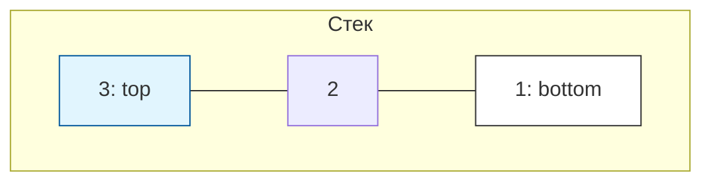
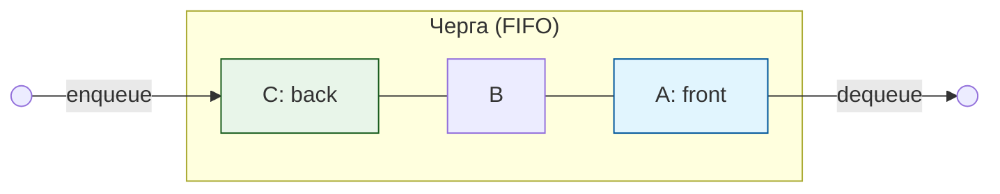
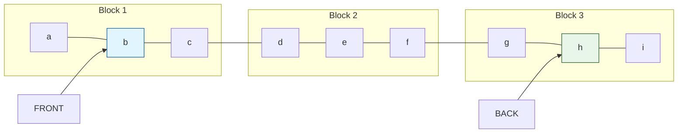
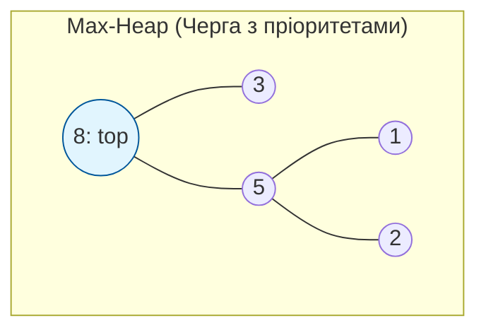

# Лекція 20b: АТД — Stack, Queue, Deque та Priority Queue

[← Лекція 20](20_lists_vector.md) | [Index](index.md) | [Далі: Лекція 21 →](21_sorting_algorithms.md)

## Мета

Зрозуміти поняття **Абстрактного Типу Даних (АТД)** як контракту між інтерфейсом і реалізацією. Вивчити чотири фундаментальні АТД: Stack, Queue, Deque та Priority Queue — їх властивості, складність операцій та практичне застосування в C++ STL.

## Експрес-опитування

1. Чим відрізняється `std::vector` від списку на рівні **ідеї** (не синтаксису)?
2. Якщо ви кладете книги в стопку і берете їх зверху — яка структура даних це моделює?
3. Яку чергу ви бачите в супермаркеті біля каси — Priority Queue чи звичайну Queue?

<details markdown="1">
<summary>Інженерна відповідь</summary>

1. `std::vector` — це **реалізація**. Список — це **концепція (АТД)**. Один АТД може мати багато реалізацій.
2. **Stack** (LIFO — Last In, First Out).
3. Обидві! Звичайна черга — FIFO. Priority Queue — якщо є "VIP-клієнти" або термінові замовлення.

</details>

---

## Частина 1: Абстрактний Тип Даних (АТД)

Як ми вже почали розбирати у [Лекції 20](20_lists_vector.md), **АТД (Abstract Data Type)** — це теоретична модель структури даних.

### Що таке АТД?

**Абстрактний Тип Даних (АТД)** — це математична модель структури даних, яка визначає:
- **Набір значень** (що зберігаємо)
- **Набір операцій** (що можемо робити)
- **Семантику операцій** (як вони поводяться)

АТД **НЕ** визначає, як операції реалізовані всередині.

```
АТД "Список" визначає:
  - операції: insert(i, x), delete(i), get(i), size()
  - семантику: елементи впорядковані, зберігають позицію

Реалізації:
  - std::vector     (суцільний масив у пам'яті)
  - std::list       (вузли з вказівниками)
  - std::deque      (chunked array — гібрид масиву та списку)
  - Circular Queue  (кільцевий буфер — деталі в [Лекції 20](20_lists_vector.md))
```

> Замість одного велетенського блоку пам'яті (як у вектора), `std::deque` розбиває дані на декілька менших блоків — "чанків" (chunks). Центральний контролер зберігає вказівники на ці блоки. Це дозволяє деку швидко ($O(1)$) додавати елементи як у кінець, так і в початок, не копіюючи весь масив при розширенні.

| Структура Даних (Пам'ять) | Алгоритм (Операція) | Швидкість |
| --- | --- | --- |
| Набір блоків (Chunks) | Доступ за індексом `[i]` | $O(1)$ (через таблицю вказівників) |
| Набір блоків (Chunks) | Вставка в початок/кінець | $O(1)$ (без повного копіювання) |
| Набір блоків (Chunks) | Кеш-локальність | 🌗 Середня (чудова всередині чанків, але зі стрибками між ними) |

> **💡 Чому кеш-локальність деки "середня"?**
> Всередині одного блоку (чанка) дані лежать суцільно, тому процесор "ковтає" їх пачками, як у вектора. Але коли чанк закінчується, деці доводиться "стрибати" до наступного блоку через таблицю вказівників. Це набагато краще за список (де ми стрибаємо на кожному елементі), але трохи гірше за вектор (де стрибків немає взагалі).


**Аналогія:** АТД — це **технічне завдання** (що робити), реалізація — це **виконання** (як робити).

> **Чому це важливо?** Ви можете замінити `std::vector` на `std::list` у вашій програмі, якщо обидва реалізують той самий АТД — решта коду не зміниться.
>
> Іншими словами, **АТД — це інтерфейс** або **чисто абстрактний клас** у C++. Це обіцянка того, які методи будуть доступні, незалежно від того, як вони працюють "під капотом".

---

## Частина 2: Stack (Стек) — LIFO

### Визначення

**Stack** — це АТД, в якому елементи додаються та видаляються тільки з **одного кінця** (вершина стеку).

**Принцип: LIFO** — Last In, First Out (останній прийшов — перший пішов).

```
ОПЕРАЦІЇ:
  push(x)  — додати елемент на вершину      O(1)
  pop()    — видалити елемент із вершини    O(1)
  top()    — переглянути верхній елемент    O(1)
  empty()  — чи стек порожній?             O(1)
  size()   — кількість елементів           O(1)
```

### Візуалізація



**Операції:**
1. `push(1) → push(2) → push(3)` — заповнення стеку.
2. `pop()` — видаляє `3` (вершину).
3. `top()` — тепер повертає `2`.


### std::stack у C++

```cpp
#include <stack>

std::stack<int> s;

s.push(10);       // стек: [10]
s.push(20);       // стек: [10, 20]
s.push(30);       // стек: [10, 20, 30]

std::cout << s.top();  // 30
s.pop();               // стек: [10, 20]
std::cout << s.top();  // 20

std::cout << s.size(); // 2
std::cout << s.empty() ? "empty" : "not empty"; // not empty
```

> **Реалізація під капотом:** `std::stack` — це **контейнерний адаптер** (adapter). Це означає, що він не реалізує зберігання даних самотужки, а "одягає" інтерфейс стека поверх іншого контейнера.
> *   За замовчуванням використовується `std::deque`.
> *   **Ви можете змінити це:** якщо вам потрібна максимальна кеш-локальність або ви хочете уникнути переалокацій, можна написати:
> 
> ```cpp
> // Стек на базі вектора (швидше для CPU через кеш)
> std::stack<int, std::vector<int>> s_vec; 
> 
> // Стек на базі списку (якщо вам потрібні стабільні вказівники на елементи)
> std::stack<int, std::list<int>> s_list; 
> ```
>
> **Чому це важливо?** `std::vector` швидший для процесора, але при розширенні він копіює дані. `std::deque` (стандарт) — це золота середина.

| Структура Даних (Пам'ять) | Алгоритм (Операція) | Швидкість |
| --- | --- | --- |
| Контейнерний адаптер | `push(x)` / `pop()` | $O(1)$ |
| Контейнерний адаптер | `top()` (тільки вершина) | $O(1)$ |
| Контейнерний адаптер | Довільний доступ `[i]` | ❌ **Заборонено** (лише вершина) |

### Класичне застосування: Перевірка дужок

**Задача:** Дано рядок, що містить дужки різних типів: `()`, `[]`, `{}`. Потрібно визначити, чи є ця послідовність **збалансованою**.

**Правила балансу:**
1.  Кожна відкрита дужка повинна мати відповідну закриту того ж типу.
2.  Дужки повинні закриватися у зворотному порядку до того, як вони були відкриті (принцип LIFO).

**Приклади:**
*   ✅ `({[]})` — **Збалансовано**. (Остання відкрита `[` закривається першою `]`, потім `{`, потім `(`).
*   ❌ `({[}])` — **Не збалансовано**. Квадратна дужка `]` намагається закритися раніше за фігурну `}`, хоча `{` була відкрита пізніше за `(`.
*   ❌ `(()` — **Не збалансовано**. Одна дужка залишилася без пари.

**Чому тут потрібен Stack?**
Стек ідеально моделює цю задачу: ми "складаємо" відкриті дужки в стопку, і коли бачимо закриту дужку — вона **зобов'язана** підходити до тієї, що лежить на самій вершині нашого стека.

> **💡 Золоте правило:** Тут ми бачимо мантру **Структура даних = Алгоритм** у дії. Властивість стека (LIFO) — це і є готовий алгоритм розв'язання задачі. Нам не потрібно вигадувати складну логіку: сама структура даних диктує правильний порядок перевірки.

Типовий алгоритм:

```cpp
bool isBalanced(const std::string& expr) {
    std::stack<char> s;
    
    for (char c : expr) {
        if (c == '(' || c == '[' || c == '{') {
            s.push(c);  // відкриваюча дужка — кладемо в стек
        } else if (c == ')' || c == ']' || c == '}') {
            if (s.empty()) return false;
            char top = s.top(); s.pop();
            // Перевіряємо збіг пар
            if (c == ')' && top != '(') return false;
            if (c == ']' && top != '[') return false;
            if (c == '}' && top != '{') return false;
        }
    }
    return s.empty(); // якщо стек порожній — всі дужки закриті
}

// isBalanced("({[]})") → true
// isBalanced("({[}])") → false
```

### Ітератори: Універсальний доступ до даних

Хоча АДТ описують *логіку* роботи з даними, **ітератори** забезпечують універсальний спосіб доступу до цих даних, незалежно від того, як вони зберігаються (у векторі, списку чи черзі).

**Ітератор** — це об'єкт, який працює як "розумний вказівник":
1. Він вказує на поточний елемент у контейнері.
2. Його можна перемістити до наступного елемента за допомогою оператора `++`.
3. З нього можна дістати значення через оператор разіменування `*`.

Стандартна бібліотека C++ (STL) базується на парі ітераторів:
- `begin()` — вказує на перший елемент.
- `end()` — вказує на умовну точку **після** останнього елемента.

> **⚙️ Синтаксичний цукор:** Зверніть увагу на цикл `for (char c : expr)`. Ми вже не вперше бачимо його у прикладах. Це зручний "цукор", який під капотом працює через стандартні ітератори контейнера.


### Практичне застосування Stack

- **Undo/Redo** у текстових редакторах
- **Call Stack** (стек викликів функцій у будь-якій мові)
- **Перетворення виразів** (Infix → Postfix)
- **Обхід дерева DFS** (без рекурсії)
- **Парсери та компілятори**

---

## Частина 3: Queue (Черга) — FIFO

### Визначення

**Queue** — це АТД, де елементи **додаються з одного кінця** (back/rear) і **видаляються з іншого** (front).

**Принцип: FIFO** — First In, First Out (перший прийшов — перший пішов).

```
ОПЕРАЦІЇ:
  push(x) / enqueue(x) — додати в кінець черги   O(1)
  pop() / dequeue()    — видалити з початку       O(1)
  front()              — переглянути перший        O(1)
  back()               — переглянути останній      O(1)
  empty()              — чи черга порожня?         O(1)
  size()               — кількість елементів      O(1)
```

### Візуалізація



**Операції:**
1. `enqueue(A) → enqueue(B) → enqueue(C)` — додавання в кінець.
2. `dequeue()` — видаляє `A` (той, хто прийшов першим).
3. `front()` — тепер повертає `B`.


### std::queue у C++
> [Документація: std::queue (cppreference.com)](https://en.cppreference.com/cpp/container/queue)

```cpp
#include <queue>

std::queue<std::string> q;

q.push("Alice");    // черга: [Alice]
q.push("Bob");      // черга: [Alice, Bob]
q.push("Charlie");  // черга: [Alice, Bob, Charlie]

std::cout << q.front(); // Alice
q.pop();                // черга: [Bob, Charlie]
std::cout << q.front(); // Bob
std::cout << q.back();  // Charlie
std::cout << q.size();  // 2
```

### Практичне застосування Queue

- **BFS** (Breadth-First Search — обхід графа у ширину)
- **Планувальник задач OS** (кожен процес стоїть у черзі CPU)
- **Буфер принтера** (документи друкуються по черзі)
- **Мережеві пакети** (FIFO опрацювання в роутерах)

---

## Частина 4: Deque (Дек) — Double-Ended Queue

### Визначення

**Deque** (Double-Ended Queue, вимовляється "deck") — АТД, де можна додавати та видаляти елементи з **обох кінців** — і спереду, іззаду.

```
ОПЕРАЦІЇ:
  push_front(x)  — додати на початок    O(1) amortized
  push_back(x)   — додати в кінець      O(1) amortized
  pop_front()    — видалити з початку   O(1)
  pop_back()     — видалити з кінця     O(1)
  front()        — перший елемент       O(1)
  back()         — останній елемент     O(1)
  operator[]     — доступ за індексом   O(1)
```

**Deque = Stack + Queue.** Він може поводитися як обидва.

### std::deque у C++

```cpp
#include <deque>

std::deque<int> dq;

dq.push_back(3);   // [3]
dq.push_front(1);  // [1, 3]
dq.push_back(5);   // [1, 3, 5]
dq.push_front(0);  // [0, 1, 3, 5]

std::cout << dq.front(); // 0
std::cout << dq.back();  // 5

dq.pop_front(); // [1, 3, 5]
dq.pop_back();  // [1, 3]

std::cout << dq[0] << " " << dq[1]; // 1 3
```

### Реалізація під капотом

`std::deque` — це не масив і не список, а **chunked array** (масив блоків фіксованого розміру). Це дає:
- O(1) для push/pop з обох кінців (як список)
- O(1) для доступу за індексом (як вектор)
- Але **гірша** cache locality, ніж `std::vector`



### Практичне застосування Deque

- **Sliding Window Maximum**: Пошук найбільшого елемента у вікні розміром $k$, яке "ковзає" по масиву. Дека дозволяє за лінійний час ($O(N)$) підтримувати список потенційних максимумів, відкидаючи застарілі індекси з одного боку та занадто малі значення з іншого.
- **Palindrome перевірка**: Порівняння символів слова одночасно з обох кінців. Ми просто робимо `pop_front()` та `pop_back()` і порівнюємо їх, поки дека не спорожніє.
- **Черга з двома пріоритетами (VIP + звичайні)**: Найпростіший спосіб реалізувати "пріоритет" для двох груп: додаємо звичайних клієнтів у кінець (`push_back`), а VIP-клієнтів — у початок (`push_front`).
- **Гнучкий Undo/Redo**: Використання деки як стека з обмеженим розміром. Коли історія дій стає занадто великою, ми можемо видаляти найдавніші дії з початку (`pop_front`), щоб не переповнювати пам'ять, зберігаючи при цьому можливість "відміни" останніх дій з кінця.

---

## Частина 5: Priority Queue (Черга з Пріоритетами)

### Визначення

**Priority Queue** — АТД, де кожен елемент має **пріоритет**. При видаленні завжди вилучається елемент з **найвищим пріоритетом** (незалежно від порядку додавання).

```
ОПЕРАЦІЇ:
  push(x)     — додати елемент                   O(log n)
  top()       — переглянути елемент з max priority O(1)
  pop()       — видалити елемент з max priority    O(log n)
  empty()     — чи порожня?                       O(1)
  size()      — розмір                            O(1)
```

### Візуалізація



**Операції:**
1. `push(5, 1, 3, 8, 2)` — елементи додаються, але структура завжди тримає найбільший зверху.
2. `top()` — повертає `8` (найвищий пріоритет).
3. `pop()` — видаляє `8`, новим `top` стає `5`.


### std::priority_queue у C++

```cpp
#include <queue>

// Max-heap (за замовчуванням): найбільший елемент зверху
std::priority_queue<int> pq;

pq.push(5);
pq.push(1);
pq.push(8);
pq.push(3);

std::cout << pq.top(); // 8 (максимум)
pq.pop();
std::cout << pq.top(); // 5
pq.pop();
std::cout << pq.top(); // 3

// Min-heap: найменший елемент зверху
std::priority_queue<int, std::vector<int>, std::greater<int>> minPQ;
minPQ.push(5); minPQ.push(1); minPQ.push(8);
std::cout << minPQ.top(); // 1 (мінімум)
```

### Реалізація під капотом: Binary Heap

**Що таке Купа (Heap)?**
> **⚠️ Важливо:** Не плутайте *структуру даних* "Купа" з *динамічною пам'яттю* (яка теж називається Heap).
**Купа (Heap)** — це спеціальна деревоподібна структура даних, яка автоматично підтримує найбільший (або найменший) елемент у "корені" (зверху).

**Чому обрано саме Binary Heap?**
При використанні звичайних масивів ми стикаємося з **дилемою (trade-off)**: ми не можемо зробити і вставку, і видалення швидкими одночасно. Вибір завжди стоїть "або-або":
*   **Невпорядкований масив:** вставка — $O(1)$, але видалення максимуму — $O(N)$ (треба шукати по всьому масиву).
*   **Впорядкований масив:** видалення — $O(1)$, але вставка — $O(N)$ (треба зсувати елементи, щоб вставити нове число в правильне місце).

**Binary Heap** — це золота середина. Вона дозволяє і вставляти, і видаляти елементи за **$O(\log N)$**. Це ідеальний компроміс для систем, де дані постійно приходять і обробляються.
> **Примітка:** Алгоритми на графах (де черга з пріоритетами є критично важливою, наприклад, алгоритм Дейкстри) ми будемо детально розглядати у [Лекції 22](22_graphs_search.md).
>
> **💡 Зверніть увагу:** Тут ми бачимо цікаву матрьошку концепцій: ми використовуємо **АТД** (черга з пріоритетом), реалізація якої по факту є **графом** (бінарним деревом), для того, щоб вирішувати складні **графові алгоритми**.

`std::priority_queue` реалізована через **бінарну купу (Binary Heap)** — масив, що підтримує властивість heap:

```
             8               ← корінь = максимум
           /   \
          5     3
         / \
        1   2

Масив:  [8, 5, 3, 1, 2]
        Батько(i) = (i-1)/2
        Дитина(i) = 2i+1, 2i+2
```
Окрім часової складності (швидкості), у Performance Engineering ми завжди дивимося на **просторову складність** (скільки додаткової пам'яті нам потрібно):

| Структура | push | pop | top | Пам'ять |
|-----------|------|-----|-----|---------|
| `priority_queue` (heap) | $O(\log N)$ | $O(\log N)$ | $O(1)$ | $O(N)$ |
| Невпорядкований масив   | $O(1)$ | $O(N)$ | $O(N)$ | $O(N)$ |
| Впорядкований масив     | $O(N)$ | $O(1)$ | $O(1)$ | $O(N)$ |

### Класичне застосування: K найбільших елементів

**Задача:** Дано велетенський масив чисел (наприклад, 1 млрд). Потрібно знайти $K$ найбільших значень (наприклад, ТОП-10 результатів гравців).

**Приклад:**  
Масив: `[3, 10, 5, 20, 15]`, $K = 3$.  
Результат: `[10, 15, 20]`.

**Як це зробити ефективно?**
1.  **Наївний підхід:** Відсортувати весь масив ($O(N \log N)$) і взяти останні $K$ елементів. Але якщо $N=10^9$, сортування займе гігабайти пам'яті та багато часу.
2.  **Інженерний підхід (Min-Heap):**
    *   Створюємо **мінімальну купу** розміром лише $K$.
    *   Проходимо по масиву. Якщо число більше за "найменше серед найбільших" (вершина купи), замінюємо вершину.
    *   **Складність:** $O(N \log K)$. Оскільки $K$ маленьке (наприклад, 10), це майже лінійний час.
    *   **Пам'ять:** Лише $O(K)$ — нам не треба тримати в пам'яті весь мільярд чисел.

```cpp
#include <queue>
#include <vector>

// Знайти K найбільших елементів у масиві
std::vector<int> kLargest(const std::vector<int>& arr, int k) {
    // Як це читати: 
    // 1. int — тип даних; 
    // 2. std::vector<int> — на чому базується (адаптер); 
    // 3. std::greater<int> — правило "більше", що перетворює Max-Heap на Min-Heap.
    std::priority_queue<int, std::vector<int>, std::greater<int>> minHeap;
    
    // Іншими словами: ми створюємо "фільтр" розміром K. 
    // Ми закидаємо туди всі числа, але як тільки їх стає більше ніж K, 
    // ми викидаємо найменше (minHeap.pop()). 
    // В результаті в купі залишаються тільки K найбільших "гігантів".
    for (int x : arr) {
        minHeap.push(x);
        if ((int)minHeap.size() > k) {
            minHeap.pop(); // Видаляємо мінімум, зберігаємо тільки K найбільших
        }
    }
    // Ми отримали результат всього за ОДИН прохід циклом!
    
    std::vector<int> result;
    while (!minHeap.empty()) {
        result.push_back(minHeap.top());
        minHeap.pop();
    }
    return result;
}
// kLargest({3,1,4,1,5,9,2,6}, 3) → [4, 5, 6, 9]
```

**Аналіз складності:**
*   **Time Complexity:** $O(N \log K)$. Ми робимо один прохід по $N$ елементах, і кожна вставка/видалення в купі розміром $K$ займає $\log K$. Це значно швидше за сортування $O(N \log N)$, якщо $K \ll N$.
*   **Space Complexity:** $O(K)$. Нам потрібно зберігати в пам'яті лише $K$ елементів. Це дозволяє обробляти терабайти даних, маючи лише кілька кілобайт оперативної пам'яті.

### Практичне застосування Priority Queue

- **Dijkstra's Algorithm** (найкоротший шлях у графі)
- **Huffman Encoding** (стискання даних, база для алгоритмів архівації ZIP, GZIP)
- **Планувальник задач OS** (процеси з різним пріоритетом)
- **Медіана потоку даних** (two-heaps trick): Використання двох куп одночасно (Max-Heap для меншої половини чисел і Min-Heap для більшої). Це дозволяє миттєво знайти медіану в потоці даних, що постійно оновлюється.

---

## Частина 6: Порівняльна таблиця

| АТД | Принцип | push | pop/деqueue | Peek | C++ контейнер |
|-----|---------|------|-------------|------|---------------|
| **Stack** | LIFO | O(1) | O(1) — з вершини | O(1) top() | `std::stack` |
| **Queue** | FIFO | O(1) | O(1) — з початку | O(1) front() | `std::queue` |
| **Deque** | Both ends | O(1) | O(1) | O(1) | `std::deque` |
| **Priority Queue** | Max/Min first | O(log n) | O(log n) | O(1) top() | `std::priority_queue` |

---

## Практичне застосування

**Практикуми:**
- [Практикум 13: Алгоритми та "Гарний смак"](p13_algorithms_and_taste.md) — Задача Йосипа Флавія (Черга) та Інфікс у Постфікс (Стек)
- [Практикум 14: Пошукова система](p14_search_engine.md) — черга задач для пошукового робота

---

## Ключові концепції лекції

| Концепція | Коротко: Для чого це? |
| :--- | :--- |
| **АТД (ADT)** | "Контракт" або ТЗ: що структура вміє робити, без деталей реалізації. |
| **Vector** | Найшвидший доступ до даних та найкраща дружба з кешем процесора. |
| **Circular Queue** | Передача даних без зайвих алокацій (мережеві пакети, аудіо-потоки). |
| **Stack (LIFO)** | Скасування дій (Undo), перевірка вкладеності (дужки), стек викликів. |
| **Queue (FIFO)** | Буферизація завдань, які мають оброблятися в порядку черги. |
| **Deque** | Коли потрібно ефективно додавати/видаляти і в початок, і в кінець. |
| **Priority Queue** | Коли першим має оброблятися найважливіший (пріоритетний) елемент. |
| **Adapter** | "Обертка", яка обмежує можливості вектора/дека до правил стека чи черги. |

---

## Підсумок Performance Engineering (Лекції 20-20b)

Ця таблиця — ваша "шпаргалка" для вибору правильної структури даних залежно від задачі.

| АТД (Концепція) | Структура (Пам'ять) | Ключовий Алгоритм | Час (Big O) | Пам'ять (Додаткова) |
| :--- | :--- | :--- | :--- | :--- |
| **Vector** | Суцільний масив | Прямий доступ `[i]` | $O(1)$ | $O(1)$ |
| **Circular Queue** | Кільцевий буфер | Модульна арифметика `%` | $O(1)$ | $O(1)$ (фіксована) |
| **Stack** | Адаптер (LIFO) | Доступ тільки до вершини | $O(1)$ | $O(1)$ |
| **Queue** | Адаптер (FIFO) | Додавання в кінець, вихід з поч. | $O(1)$ | $O(1)$ |
| **Deque** | Набір блоків (Chunks) | Двобічна черга | $O(1)$ | $O(1)$ |
| **Priority Queue** | Бінарна купа (Heap) | Сортування при вставці | $O(\log N)$ | $O(1)$ |

> **💡 Головний висновок:** 
> - Якщо потрібна швидкість доступу та кеш — **Vector**.
> - Якщо потрібен фіксований буфер без алокацій — **Circular Queue**.
> - Якщо потрібно ТОП-K елементів або пріоритети — **Priority Queue**.

---

## Контрольні питання

1. У чому різниця між Stack та Queue?

<details markdown="1">
<summary>Відповідь</summary>

Stack — LIFO (як стопка тарілок: додаємо і беремо зверху). Queue — FIFO (як черга в магазині: додаємо ззаду, беремо спереду). У Stack є тільки один "активний" кінець, у Queue — два різних.

</details>

2. Чому Deque є "супермножиною" Stack та Queue?

<details markdown="1">
<summary>Відповідь</summary>

Deque дозволяє push/pop з обох кінців. Якщо використовувати тільки push_back + pop_back — поведінка як Stack. Тільки push_back + pop_front — поведінка як Queue. Stack та Queue — це обмежені версії Deque.

</details>

3. Чому вставка у `std::priority_queue` — O(log n), а не O(1)?

<details markdown="1">
<summary>Відповідь</summary>

Priority Queue реалізована через Binary Heap. Після вставки нового елемента треба "підняти" його вгору до правильної позиції (sift-up). У гіршому випадку він проходить всі рівні дерева висотою log(n).

</details>

4. Яка структура даних підходить для реалізації алгоритму BFS?

<details markdown="1">
<summary>Відповідь</summary>

**Queue (черга — FIFO)**. BFS відвідує вузли "шарами": спочатку всі на відстані 1, потім 2 тощо. Queue гарантує, що ми обробляємо вузли у тому ж порядку, в якому їх додали — тобто, ближчі першими.

</details>
