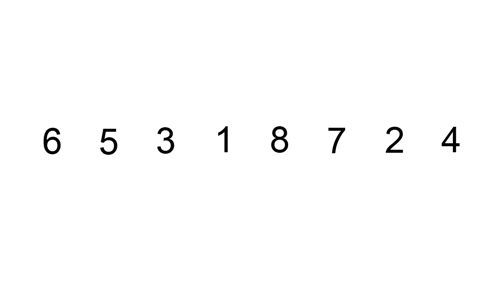
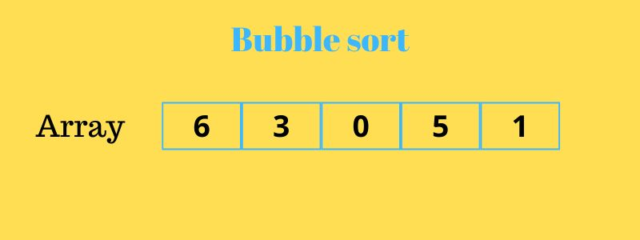

# Лекція 21: Алгоритми сортування — QuickSort, MergeSort та IntroSort

[← Лекція 20](20_lists_vector.md) | [Index](index.md) | [Далі: Лекція 22 →](22_graphs_search.md)

## Мета

Зрозуміти, як працюють класичні алгоритми сортування "під капотом". Навчитися розрізняти стабільні та нестабільні алгоритми. Дізнатися, чому `std::sort` працює не так, як ви думаєте.

## Експрес-опитування

1. Якщо у нас є 1000 елементів, скільки порівнянь зробить Bubble Sort у найгіршому випадку?
2. Чи завжди QuickSort швидший за MergeSort?
3. Що означає "стабільне сортування"?

<details markdown="1">
<summary>Інженерна відповідь</summary>

1. **~500,000 порівнянь** (N^2 / 2). Для N=1000: 1000*1000 / 2 = 500,000. Ось чому Bubble Sort мертвий у промисловості.
2. **Ні.** QuickSort у середньому швидший (менше операцій з пам'яттю), але у найгіршому випадку (відсортований масив з поганим вибором pivot) деградує до O(N^2). MergeSort завжди O(N log N).
3. Алгоритм зберігає **відносний порядок** елементів з однаковими ключами. Приклад: якщо сортуємо студентів за оцінкою, то студенти з однаковою оцінкою залишаться у тому ж порядку, що й були.

</details>

---

## Частина 1: Базис для порівняння (O(N^2) алгоритми)

Перед тим, як вивчати швидкі алгоритми, подивимося, чому повільні —

 **повільні**.

### Bubble Sort (Сортування бульбашкою)

Ідея: Проходимо масив N разів. Кожного разу "спли вливаєм" найбільший елемент вправо.

```cpp
void bubbleSort(std::vector<int>& arr) {
    int n = arr.size();
    
    // N проходів
    for (int i = 0; i < n - 1; i++) {
        // Кожного разу зменшуємо область пошуку
        for (int j = 0; j < n - i - 1; j++) {
            if (arr[j] > arr[j + 1]) {
                std::swap(arr[j], arr[j + 1]); // "Бульбашка" спливає
            }
        }
    }
}
// Складність: O(N^2)
// Стабільність: Так (не міняємо рівні елементи)
```

**Чому повільно?** Навіть якщо масив майже відсортований, алгоритм все одно робить N^2 порівнянь.

### Selection Sort (Сортування вибором)

Ідея: Шукаємо мінімальний елемент і ставимо його на початок. Повторюємо для хвоста масиву.

```cpp
void selectionSort(std::vector<int>& arr) {
    int n = arr.size();
    
    for (int i = 0; i < n - 1; i++) {
        int minIdx = i;
        
        // Шукаємо мінімум в невідсортованій частині
        for (int j = i + 1; j < n; j++) {
            if (arr[j] < arr[minIdx]) {
                minIdx = j;
            }
        }
        
        std::swap(arr[i], arr[minIdx]);
    }
}
// Складність: O(N^2)
// Стабільність: Ні (swap може порушити порядок)
```

**Step-by-Step Visualization:**

> **💡 Visual Schema from Source Material**  
> Джерело: Sorting using Lists.pdf, стор. 172-176



*Рис. 1: Insertion Sort — покрокова візуалізація*



*Рис. 2: Порівняння Bubble Sort та Merge Sort під час виконання*

**Insertion Sort Frame-By-Frame:**
```
Initial:  [5][2][4][6][1][3]
          ↑ sorted region ends here

Pass 1:   [2][5][4][6][1][3]  ← Insert 2 into sorted [5]
          ↑↑

Pass 2:   [2][4][5][6][1][3]  ← Insert 4 into sorted [2,5]
          ↑↑↑

Pass 3:   [2][4][5][6][1][3]  ← 6 already in correct position
          ↑↑↑↑

Pass 4:   [1][2][4][5][6][3]  ← Insert 1 at beginning
          ↑↑↑↑↑

Pass 5:   [1][2][3][4][5][6]  ← Insert 3 into sorted region
          ↑↑↑↑↑↑ SORTED!
```

**Bubble Sort Frame-By-Frame:**
```
Initial:  [5][2][4][6][1][3]

Pass 1:   [2][4][5][1][3][6]  ← Largest (6) bubbles to end
                          ↑ fixed

Pass 2:   [2][4][1][3][5][6]  ← Second largest (5) fixed
                       ↑↑ fixed

Pass 3:   [2][1][3][4][5][6]  ← Third largest (4) fixed
                    ↑↑↑ fixed

Pass 4:   [1][2][3][4][5][6]  ← Final swaps
              ↑↑↑↑ fixed
```

**Merge Sort Divide-and-Conquer:**
```
DIVIDE Phase:
[5][2][4][6][1][3]
     ↓ split
[5][2][4]   [6][1][3]
     ↓           ↓
[5]  [2][4]   [6]  [1][3]
       ↓            ↓
     [2] [4]      [1] [3]

CONQUER Phase (Merge):
     [2] [4]      [1] [3]
       ↓            ↓
    [2][4]        [1][3]
       ↓            ↓
     [2][4][5]   [1][3][6]
         ↓
    [1][2][3][4][5][6]  ← Final merge
```

**Key Visual Insights:**
- **Insertion**: Grows sorted region from left
- **Bubble**: Fixes largest elements from right
- **Merge**: Divide fully, then merge up

**Висновок:** O(N^2) алгоритми придатні лише для навчання або дуже малих масивів (N < 50).

---

## Частина 2: QuickSort — Divide and Conquer

Алгоритм, вигаданий Tony Hoare у 1959 році. Досі один з найшвидших на практиці.

### Ідея

1. Вибрати **pivot** (опорний елемент, наприклад, середній).
2. **Partition:** Переставити елементи так, щоб ліворуч від pivot були менші, праворуч — більші.
3. **Рекурсивно** відсортувати ліву та праву частини.

```cpp
int partition(std::vector<int>& arr, int low, int high) {
    int pivot = arr[high]; // Беремо останній елемент як pivot (проста стратегія)
    int i = low - 1;
    
    for (int j = low; j < high; j++) {
        if (arr[j] <= pivot) {
            i++;
            std::swap(arr[i], arr[j]);
        }
    }
    
    std::swap(arr[i + 1], arr[high]);
    return i + 1; // Позиція pivot
}

void quickSort(std::vector<int>& arr, int low, int high) {
    if (low < high) {
        int pi = partition(arr, low, high);
        
        // Рекурсивно сортуємо ліву та праву частини
        quickSort(arr, low, pi - 1);
        quickSort(arr, pi + 1, high);
    }
}
```

### Складність

- **Середній випадок:** O(N log N) — кожен рівень рекурсії обробляє N елементів, глибина дерева — log N.
- **Найгірший випадок:** O(N^2) — якщо pivot завжди вибирається як мінімум/максимум (відсортований масив).

### Як уникнути O(N^2)?

1. **Median-of-Three:** Вибрати pivot як медіану з `arr[low]`, `arr[mid]`, `arr[high]`.
2. **Randomized QuickSort:** Вибрати випадковий pivot. Математично доведено, що очікуваний час — O(N log N).

**Стабільність:** Ні (partition може переставляти рівні елементи).

---

## Частина 3: MergeSort — Гарантований O(N log N)

Алгоритм від John von Neumann (1945). Ідеальний, коли потрібна передбачуваність.

### Ідея

1. **Divide:** Розділити масив навпіл.
2. **Conquer:** Рекурсивно відсортувати кожну половину.
3. **Merge:** Злити дві відсортовані половини в один масив.

```cpp
void merge(std::vector<int>& arr, int left, int mid, int right) {
    int n1 = mid - left + 1;
    int n2 = right - mid;
    
    // Тимчасові масиви
    std::vector<int> L(n1), R(n2);
    
    for (int i = 0; i < n1; i++) L[i] = arr[left + i];
    for (int i = 0; i < n2; i++) R[i] = arr[mid + 1 + i];
    
    // Злиття
    int i = 0, j = 0, k = left;
    while (i < n1 && j < n2) {
        if (L[i] <= R[j]) {
            arr[k++] = L[i++];
        } else {
            arr[k++] = R[j++];
        }
    }
    
    // Копіюємо залишок
    while (i < n1) arr[k++] = L[i++];
    while (j < n2) arr[k++] = R[j++];
}

void mergeSort(std::vector<int>& arr, int left, int right) {
    if (left < right) {
        int mid = left + (right - left) / 2;
        
        mergeSort(arr, left, mid);
        mergeSort(arr, mid + 1, right);
        merge(arr, left, mid, right);
    }
}
```

### Переваги

- **Завжди O(N log N)** — незалежно від вхідних даних.
- **Стабільне** сортування (при правильній реалізації `merge`).

### Недоліки

- **Додаткова пам'ять:** Потрібен допоміжний масив розміром N (O(N) space).
- **Повільніше за QuickSort** на практиці через більше копіювань даних.

---

## Частина 4: IntroSort — Гібрид у `std::sort`

**Інженерне рішення:** Взяти QuickSort, але захиститися від O(N^2).

### Алгоритм IntroSort (Introspective Sort)

1. Починаємо з **QuickSort**.
2. Якщо глибина рекурсії перевищує `2 * log(N)` (ознака деградації), переключаємося на **HeapSort**.
3. Для малих підмасивів (N < 16) використовуємо **Insertion Sort** (він швидший за QuickSort на мікроданих).

```cpp
// Псевдокод std::sort (спрощено)
template<typename T>
void introsort(std::vector<T>& arr, int maxDepth) {
    if (arr.size() < 16) {
        insertionSort(arr); // Простий алгоритм для малих N
        return;
    }
    
    if (maxDepth == 0) {
        heapSort(arr); // Захист від O(N^2)
        return;
    }
    
    int pivot = partition(arr); // QuickSort partition
    introsort(arr_left, maxDepth - 1);
    introsort(arr_right, maxDepth - 1);
}
```

**Складність:** Гарантований O(N log N) у найгіршому випадку.
**Стабільність:** Ні. Для стабільного сортування є `std::stable_sort` (використовує MergeSort).

---

## Частина 5: Порівняльна таблиця

| Алгоритм | Середній час | Найгірший час | Пам'ять | Стабільний? | Коли використовувати |
|----------|--------------|----------------|---------|-------------|----------------------|
| **Bubble Sort** | O(N^2) | O(N^2) | O(1) | Так | Ніколи (тільки навчання) |
| **Selection Sort** | O(N^2) | O(N^2) | O(1) | Ні | Ніколи |
| **QuickSort** | O(N log N) | O(N^2) | O(log N) | Ні | Загальне призначення, великі дані |
| **MergeSort** | O(N log N) | O(N log N) | O(N) | Так | Коли потрібна стабільність або гарантований час |
| **IntroSort** | O(N log N) | O(N log N) | O(log N) | Ні | **std::sort** — дефолт для C++ |
| **std::stable_sort** | O(N log N) | O(N log N) | O(N) | Так | Коли важливий порядок рівних елементів |

---

## Практичне застосування

**Див.:** [Практикум 14: Search Engine](p14_search_engine.md) — індексація та сортування файлів за релевантністю.

---

## Контрольні питання

1. Чому QuickSort називають "нестабільним"? Наведіть приклад, коли це важливо.

<details markdown="1">
<summary>Відповідь</summary>

QuickSort може переставляти рівні елементи під час partition. Приклад: сортуємо студентів за оцінкою. Якщо два студенти мають оцінку "5", але один здав роботу раніше, QuickSort може змінити їх порядок. Для збереження хронології треба використовувати MergeSort або `std::stable_sort`.

</details>

2. У вас є масив з 1 мільйоном елементів, але він майже відсортований (лише 100 елементів не на місці). Який алгоритм буде найшвидшим?

<details markdown="1">
<summary>Відповідь</summary>

**Insertion Sort** (O(N) для майже відсортованих даних) або **TimSort** (гібрид Insertion + Merge, використовується в Python та Java). `std::sort` (IntroSort) також швидко впорається, але Insertion Sort буде оптимальнішим для цього випадку.

</details>

3. Чому MergeSort вимагає O(N) додаткової пам'яті, а QuickSort — тільки O(log N)?

<details markdown="1">
<summary>Відповідь</summary>

**MergeSort** створює тимчасові масиви для злиття — розміром N.
**QuickSort** працює in-place (на місці), але використовує стек викликів для рекурсії. Глибина стеку — log N у середньому (висота дерева рекурсії).

</details>

4. Що станеться, якщо ви викличете `std::sort` на масиві, який вже відсортований?

<details markdown="1">
<summary>Відповідь</summary>

**IntroSort** (std::sort) впорається за O(N log N). Але для вже відсортованих даних оптимальніше використати `std::is_sorted` (O(N) перевірка), щоб уникнути зайвої роботи.

</details>
