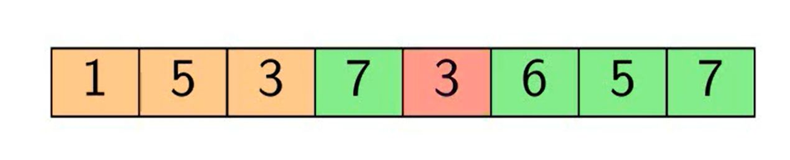

# Лекція 22: Графи та Алгоритми пошуку — BFS, DFS, Binary Search

[← Лекція 21](21_sorting_algorithms.md) | [Index](index.md) | [Далі: Лекція 23 →](23_optimization_dp.md)

## Мета

Навчитися представляти

 графи у пам'яті (Matrix vs List). Зрозуміти різницю між пошуком у ширину (BFS) та пошуком у глибину (DFS). Навчитися шукати у відсортованих масивах за O(log N).

> **📚 Матеріал лекції базується на:**  
> Using the trees.pdf (дерева та їх застосування) та s02e06. Introduction to Algorithms.pdf



*Рис. 1: Обхід графа — порівняння BFS (пошук у ширину) та DFS (пошук у глибину)*

## Експрес-опитування

1. Як представити соціальну мережу (користувачі та їх дружні зв'язки) у пам'яті?
2. Чи можна знайти елемент у невідсортованому масиві швидше, ніж за O(N)?
3. Яка різниця між BFS і DFS у контексті пошуку виходу з лабіринту?

<details markdown="1">
<summary>Інженерна відповідь</summary>

1. **Граф:** Вершини = користувачі, ребра = дружні зв'язки. Можна зберігати як **Adjacency List** (`std::unordered_map<int, std::vector<int>>`) — кожен користувач має список друзів.
2. **Ні.** Без додаткової інформації (індекс, хеш-таблиця) найкращий час — O(N) (linear search). Але якщо масив відсортований, можна використати Binary Search — O(log N).
3. **BFS** знайде **найкоротший шлях** (мінімальна кількість кроків). **DFS** просто знайде **будь-який шлях**, але може піти в глухий кут і повернутися.

</details>

---

## Частина 1: Binary Search — O(log N) для відсортованих масивів

Якщо ви шукаєте число у **відсортованому** масиві, не треба перевіряти кожен елемент.

### Ідея

1. Подивіться на **середній** елемент.
2. Якщо він менший за шукане — відкиньте ліву половину.
3. Якщо більший — відкиньте праву.
4. Повторюйте, поки не знайдете або поки масив не зникне.

```cpp
#include <vector>

// Повертає індекс елемента або -1, якщо не знайдено
int binarySearch(const std::vector<int>& arr, int target) {
    int left = 0;
    int right = arr.size() - 1;
    
    while (left <= right) {
        int mid = left + (right - left) / 2; // Уникаємо переповнення
        
        if (arr[mid] == target) {
            return mid; // Знайшли!
        }
        
        if (arr[mid] < target) {
            left = mid + 1; // Шукаємо праворуч
        } else {
            right = mid - 1; // Шукаємо ліворуч
        }
    }
    
    return -1; // Не знайдено
}
```

**Складність:** O(log N) — кожна ітерація відкидає половину масиву.

**Приклад:** У масиві з 1,000,000 елементів Binary Search потребує максимум **20 порівнянь** (log₂(1,000,000) ≈ 20).

---

## Частина 2: Графи — що це і навіщо

**Граф** — це набір вершин (Vertices) і ребер (Edges), що їх з'єднують.

### Приклади з реального світу

- **Соціальні мережі:** Люди = вершини, дружба = ребра.
- **Карти:** Міста = вершини, дороги = ребра.
- **Інтернет:** Веб-сторінки = вершини, посилання = ребра.
- **Дерева файлової системи:** Папки = вершини, вкладеність = ребра.

### Типи графів

- **Орієнтований (Directed):** Ребра мають напрямок (Twitter: підписка не симетрична).
- **Неорієнтований (Undirected):** Ребра двосторонні (Facebook: дружба симетрична).
- **Зважений (Weighted):** К��жне ребро має вагу (відстань між містами).

---

## Частина 3: Представлення графів у пам'яті

### Варіант 1: Adjacency Matrix (Матриця суміжності)

2D масив: `matrix[i][j] = 1`, якщо є ребро між вершиною `i` та `j`.

```cpp
// Граф з 4 вершин
int graph[4][4] = {
    {0, 1, 1, 0}, // Вершина 0 з'єднана з 1 та 2
    {1, 0, 0, 1}, // Вершина 1 з'єднана з 0 та 3
    {1, 0, 0, 1}, // Вершина 2 з'єднана з 0 та 3
    {0, 1, 1, 0}  // Вершина 3 з'єднана з 1 та 2
};
```

**Плюси:**
- Перевірка наявності ребра: O(1) — `matrix[i][j]`.

**Мінуси:**
- Пам'ять: O(V^2) — навіть якщо ребер мало (розріджений граф).
- Перебір сусідів: O(V) — треба пройти весь рядок.

### Варіант 2: Adjacency List (Список суміжності)

Для кожної вершини зберігаємо список сусідів.

```cpp
#include <vector>
#include <unordered_map>

// Граф як хеш-таблиця: вершина -> список сусідів
std::unordered_map<int, std::vector<int>> graph;

graph[0] = {1, 2};
graph[1] = {0, 3};
graph[2] = {0, 3};
graph[3] = {1, 2};
```

**Плюси:**
- Пам'ять: O(V + E) — зберігаємо тільки існуючі ребра.
- Перебір сусідів: O(deg(v)) — проходимо тільки реальні зв'язки.

**Мінуси:**
- Перевірка ребра: O(deg(v)) — треба шукати у списку.

**Висновок:** Для більшості задач (соціальні мережі, карти) використовують **Adjacency List**.

---

## Частина 4: BFS (Breadth-First Search) — пошук у ширину

Алгоритм досліджує граф **рівнями** (як хвилі на воді).

### Ідея

1. Почніть з початкової вершини.
2. Додайте її до черги (Queue).
3. Поки черга не порожня:
   - Витягніть вершину з черги.
   - Обробіть її (наприклад, надрукуйте).
   - Додайте всіх незайманих сусідів до черги.

```cpp
#include <queue>
#include <unordered_set>

void BFS(const std::unordered_map<int, std::vector<int>>& graph, int start) {
    std::queue<int> q;
    std::unordered_set<int> visited; // Щоб не відвідувати вершину двічі
    
    q.push(start);
    visited.insert(start);
    
    while (!q.empty()) {
        int current = q.front();
        q.pop();
        
        std::cout << current << " "; // Обробка вершини
        
        // Додаємо всіх сусідів до черги
        for (int neighbor : graph.at(current)) {
            if (visited.find(neighbor) == visited.end()) {
                visited.insert(neighbor);
                q.push(neighbor);
            }
        }
    }
}
```

**Складність:** O(V + E) — відвідуємо кожну вершину та кожне ребро один раз.

**Використання:**
- Пошук найкоротшого шляху (у незваженому графі).
- Перевірка зв'язності графа.
- Пошук у соціальних мережах (друзі на відстані N кліків).

---

## Частина 5: DFS (Depth-First Search) — пошук у глибину

Алгоритм йде **максимально глибоко**, перш ніж повернутися назад.

### Ідея

1. Почніть з початкової вершини.
2. Рекурсивно відвідайте інших сусідів, яких ще не відвідували.
3. Коли немає нових сусідів — повертайтеся назад (backtracking).

```cpp
#include <unordered_set>

void DFSRecursive(const std::unordered_map<int, std::vector<int>>& graph, 
                  int current, 
                  std::unordered_set<int>& visited) {
    
    visited.insert(current);
    std::cout << current << " ";
    
    for (int neighbor : graph.at(current)) {
        if (visited.find(neighbor) == visited.end()) {
            DFSRecursive(graph, neighbor, visited);
        }
    }
}

void DFS(const std::unordered_map<int, std::vector<int>>& graph, int start) {
    std::unordered_set<int> visited;
    DFSRecursive(graph, start, visited);
}
```

**Складність:** O(V + E).

**Використання:**
- Пошук циклів у графі.
- Топологічне сортування (порядок виконання залежностей).
- Аналіз дерева (обхід файлової системи).

---

## Частина 6: BFS vs DFS — коли що використовувати?

| Характеристика | BFS | DFS |
|----------------|-----|-----|
| **Структура даних** | Черга (Queue) | Стек (Stack) або рекурсія |
| **Порядок обходу** | Рівнями (Layer by Layer) | Глибоко вниз (Deep First) |
| **Найкоротший шлях** | Так (у незваженому графі) | Ні |
| **Пам'ять** | O(V) (черга може бути великою) | O(h) — h = висота дерева/графа |
| **Типове застосування** | Навігація, соціальні мережі | Пошук циклів, аналіз дерев |

**Приклад (лабіринт):**
- **BFS:** Знайде вихід найкоротшим шляхом.
- **DFS:** Може піти в глухий кут, але використовує менше пам'яті.

---

## Частина 7: Компоненти зв'язності (Connected Components)

**Компонента зв'язності** — максимальна підмножина вершин графа, де між будь-якими двома вершинами існує шлях.

```
Граф:
  1 — 2    4 — 5
  |        |
  3        6

Компонента 1: {1, 2, 3}
Компонента 2: {4, 5, 6}
```

Щоб знайти всі компоненти — запустіть BFS/DFS з кожної невідвіданої вершини:

```cpp
int countComponents(int n, const std::unordered_map<int, std::vector<int>>& graph) {
    std::unordered_set<int> visited;
    int components = 0;

    for (int v = 0; v < n; v++) {
        if (visited.count(v)) continue;

        components++;       // Знайшли нову компоненту
        // BFS щоб обійти всю компоненту
        std::queue<int> q;
        q.push(v);
        visited.insert(v);
        while (!q.empty()) {
            int cur = q.front(); q.pop();
            if (!graph.count(cur)) continue;
            for (int nb : graph.at(cur)) {
                if (!visited.count(nb)) {
                    visited.insert(nb);
                    q.push(nb);
                }
            }
        }
    }
    return components;
}
```

**Складність:** O(V + E).

**Застосування:** Визначення острівців у карті, перевірка зв'язності мережі, кластеризація.

---

## Частина 8: Dijkstra — найкоротший шлях у зваженому графі

BFS знаходить найкоротший шлях у **незваженому** графі. Але якщо ребра мають **вагу** (kilometri дороги, затримка мережі) — потрібен **алгоритм Дейкстри**.

**Ідея:** Жадібно вибирати вершину з мінімальною відомою відстанню і "розслабляти" її сусідів.

```
Граф (зважений):
     2       5
 A ─── B ─── D
 │     │
 4     1
 │     │
 C ─── E
     3

Shortest paths from A:
  A→A: 0
  A→B: 2
  A→C: 4
  A→E: 3  (A→B→E = 2+1)
  A→D: 7  (A→B→D = 2+5)
```

```cpp
#include <queue>
#include <vector>
#include <unordered_map>
#include <limits>

using Graph = std::unordered_map<int, std::vector<std::pair<int,int>>>; // node → {neighbor, weight}

std::unordered_map<int,int> dijkstra(const Graph& graph, int start) {
    // dist[v] = найкоротша відома відстань від start до v
    std::unordered_map<int,int> dist;
    for (auto& [v, _] : graph) dist[v] = std::numeric_limits<int>::max();
    dist[start] = 0;

    // Min-heap: {відстань, вершина}
    std::priority_queue<
        std::pair<int,int>,
        std::vector<std::pair<int,int>>,
        std::greater<>> pq;
    pq.push({0, start});

    while (!pq.empty()) {
        auto [d, u] = pq.top(); pq.pop();

        if (d > dist[u]) continue; // Застарілий запис

        for (auto [v, w] : graph.at(u)) {
            int newDist = dist[u] + w;
            if (newDist < dist[v]) {
                dist[v] = newDist;
                pq.push({newDist, v});  // Додаємо оновлену відстань
            }
        }
    }
    return dist;
}
```

**Складність:** O((V + E) log V) — завдяки priority_queue.

> **Обмеження:** Dijkstra не працює з **від'ємними вагами** ребер. Для цього використовують алгоритм Беллмана-Форда (O(V·E)).

**Порівняння алгоритмів найкоротшого шляху:**

| Алгоритм | Граф | Складність | Особливості |
|----------|------|-----------|-------------|
| **BFS** | Незважений | O(V+E) | Найпростіший |
| **Dijkstra** | Зважений (≥0) | O((V+E) log V) | Найпоширеніший |
| **Bellman-Ford** | Зважений (будь-які) | O(V·E) | Від'ємніваги |
| **Floyd-Warshall** | Всі пари | O(V³) | Всі пари вершин |

---

## **Практичне застосування:**
- [Практикум 15: Pathfinder](p15_pathfinder.md) — застосування BFS та DFS для пошуку шляху

**Поглиблене вивчення:** [Лекція 25: String Algorithms](25_string_algorithms.md) — pattern matching з KMP та Rabin-Karp для ефективного пошуку у текстах.

## Контрольні питання

1. У вас є відсортований масив з 1 мільйоном елементів. Скільки кроків потрібно Binary Search у найгіршому випадку?

<details markdown="1">
<summary>Відповідь</summary>

**~20 кроків.** log₂(1,000,000) ≈ 19.93. Кожна ітерація відкидає половину масиву.

</details>

2. Чому для соціальних мереж використовують Adjacency List, а не Adjacency Matrix?

<details markdown="1">
<summary>Відповідь</summary>

Соціальні мережі — **розріджені графи** (Sparse Graphs). У мережі з 1 мільярдом користувачів середній користувач має ~500 друзів, а не мільярд. Adjacency Matrix займала б терабайти пам'яті (1,000,000,000²), тоді як Adjacency List — лише O(V + E).

</details>

3. У чому перевага BFS перед DFS для пошуку найкоротшого шляху?

<details markdown="1">
<summary>Відповідь</summary>

BFS відвідує вершини **рівнями** (відстань 1, потім відстань 2 тощо). Коли BFS вперше досягає цільової вершини, це гарантовано найкоротший шлях. DFS може знайти шлях, але не обов'язково найкоротший.

</details>

4. Як адаптувати DFS для виявлення циклу у графі?

<details markdown="1">
<summary>Відповідь</summary>

Під час DFS, якщо ми зустрічаємо вершину, яка вже у **поточному шляху рекурсії** (не просто visited, а саме в активному стеку викликів), це означає цикл. Для цього використовують додатковий масив `inRecursionStack`.

</details>
