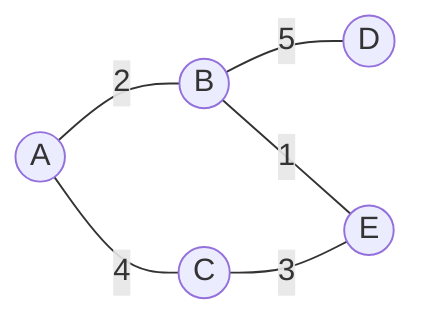

# Лекція 22: Графи та Алгоритми пошуку — BFS, DFS, Binary Search

[← Лекція 21](21_sorting_algorithms.md) | [Index](index.md) | [Далі: Лекція 23 →](23_optimization_dp.md)

## Мета

Навчитися представляти

 графи у пам'яті (Matrix vs List). Зрозуміти різницю між пошуком у ширину (BFS) та пошуком у глибину (DFS). Навчитися шукати у відсортованих масивах за O(log N).

## Експрес-опитування

1. Як представити соціальну мережу (користувачі та їх дружні зв'язки) у пам'яті?
2. Чи можна знайти елемент у невідсортованому масиві швидше, ніж за O(N)?
3. **Ситуація:** Ви пишете алгоритм пошуку виходу з лабіринту. Вам потрібно знайти **найкоротший** шлях. Чи підійде класична стратегія "завжди йди вздовж правої стіни"?

<details markdown="1">
<summary>Інженерна відповідь</summary>

1. **Граф:** Вершини = користувачі, ребра = дружні зв'язки. Можна зберігати як **Adjacency List** (`std::unordered_map<int, std::vector<int>>`) — кожен користувач має список друзів.
2. **Ні.** Без додаткової інформації (індекс, хеш-таблиця) найкращий час — O(N) (linear search). Але якщо масив відсортований, можна використати Binary Search — O(log N).
3. **Ні.** Стратегія "вздовж правої стіни" (що концептуально є пошуком у глибину) знайде вихід, але шлях може бути дуже довгим і заплутаним. Щоб знайти гарантовано **найкоротший шлях**, алгоритм має досліджувати лабіринт рівномірно в усі боки одночасно (пошук у ширину). Сьогодні ми якраз дізнаємося, як реалізувати обидва ці підходи.

</details>

---

## Частина 1: Binary Search — O(log N) для відсортованих масивів

### Інженерний місток: Від 1D-масивів до складних мереж

Минулої лекції ми розібрали складні алгоритми сортування ($O(N \log N)$). Навіщо ми витратили стільки зусиль на впорядкування даних? Заради однієї мети — **блискавичного пошуку**. 

У невідсортованому масиві вам доведеться перевіряти кожен елемент (лінійний пошук, $O(N)$). Але якщо дані відсортовані, ви можете використати **Binary Search** (бінарний пошук) і знайти відповідь за логарифмічний час ($O(\log N)$). Бінарний пошук — це абсолютний ідеал пошуку в **одновимірному, лінійному просторі**. Завдяки сортуванню, ви на кожному кроці точно знаєте напрямок: "менше — йдемо ліворуч, більше — йдемо праворуч".

**Але що робити, коли світ не є лінійним?** 
Що, якщо ваші дані — це маршрути GPS, соціальна мережа або заплутаний лабіринт? У таких системах (графах) немає глобального поняття "більше" чи "менше", є лише локальні зв'язки (ребра) між об'єктами. Класичний бінарний пошук тут безсилий. 

Саме тому, згадавши, як виглядає ідеальний пошук у найпростіших лінійних структурах, сьогодні ми зробимо крок уперед і навчимося "шукати" у складних, неструктурованих багатовимірних топологіях за допомогою алгоритмів BFS та DFS.

Якщо ви шукаєте число у **відсортованому** масиві, вам не треба перевіряти кожен елемент.

### Ідея

1. Подивіться на **середній** елемент.
2. Якщо він менший за шукане — відкиньте ліву половину.
3. Якщо більший — відкиньте праву.
4. Повторюйте, поки не знайдете або поки масив не зникне.

> [!IMPORTANT]
> **Інженерне обмеження:** Бінарний пошук вимагає можливості миттєво "стрибати" в середину колекції. Тому цей алгоритм (як і `std::sort`) ефективно працює лише з контейнерами, що підтримують **Random Access Iterators** (наприклад, `std::vector`, `std::array`, `std::deque`). Якщо ви спробуєте застосувати його до зв'язного списку (`std::list`), перехід до середини вимагатиме лінійного часу $O(N)$, що повністю знищить перевагу логарифмічної швидкості $O(\log N)$.

```cpp
#include <vector>

// Повертає індекс елемента або -1, якщо не знайдено
int binarySearch(const std::vector<int>& arr, int target) {
    int left = 0;
    int right = arr.size() - 1;
    
    while (left <= right) {
        int mid = left + (right - left) / 2; // Уникаємо переповнення
        
        if (arr[mid] == target) {
            return mid; // Знайшли!
        }
        
        if (arr[mid] < target) {
            left = mid + 1; // Шукаємо праворуч
        } else {
            right = mid - 1; // Шукаємо ліворуч
        }
    }
    
    return -1; // Не знайдено
}
```

> [!WARNING]
> **Класичний інженерний баг: Чому не `(left + right) / 2`?**
> Більшість початківців інтуїтивно шукають середину як `int mid = (left + right) / 2`. Проте, якщо ваш масив містить мільярди елементів (або індекси наближаються до `INT_MAX`, що становить ~2.14 млрд), сума `left + right` просто не поміститься у тип `int`. Відбудеться **цілочисельне переповнення** (integer overflow) — сума миттєво перетвориться на гігантське від'ємне число. При спробі звернутися до `arr[mid]` програма впаде з помилкою *Segmentation fault*.
> Формула `left + (right - left) / 2` математично абсолютно тотожна, але вона гарантовано запобігає переповненню, оскільки спочатку обчислюється відстань (`right - left`), яка точно поміщається в `int`. 
> *Цікавий факт: Цей знаменитий баг був присутній у стандартній бібліотеці Java (`Arrays.binarySearch`) цілих 9 років, перш ніж його виявили та виправили!*

**Складність:** O(log N) — кожна ітерація відкидає половину масиву.

**Приклад:** У масиві з 1,000,000 елементів Binary Search потребує максимум **20 порівнянь** (log₂(1,000,000) ≈ 20).

### Практика C++: std::lower_bound та std::upper_bound

Хоча розуміти математику бінарного пошуку критично важливо, **на практиці інженери майже ніколи не пишуть цей цикл `while` власноруч**. Ручне написання часто призводить до прикрих помилок "на одиницю" (off-by-one errors) під час маніпуляцій з індексами `+1` / `-1`.

У C++ для цього використовують перевірені та оптимізовані функції зі стандартної бібліотеки (заголовок `<algorithm>`):
- `std::binary_search` — просто повертає `true`/`false`, якщо елемент є в колекції.
- `std::lower_bound` — повертає ітератор на перший елемент, який **більший або дорівнює (≥)** шуканому.
- `std::upper_bound` — повертає ітератор на перший елемент, який суворо **більший (>)** за шуканий.

```cpp
#include <vector>
#include <algorithm>
#include <iostream>

int main() {
    std::vector<int> arr = {10, 20, 20, 20, 30, 40};
    
    // Шукаємо перше число >= 20
    auto it = std::lower_bound(arr.begin(), arr.end(), 20);
    
    if (it != arr.end() && *it == 20) {
        // std::distance рахує кількість кроків від початку до ітератора (індекс)
        std::cout << "Знайдено на індексі: " << std::distance(arr.begin(), it); // Виведе: 1
    }
}
```

Розвивайте звичку користуватися перевіреним інструментарієм STL. Це економить час, робить код чистішим і гарантує відсутність базових багів.

---

## Частина 2: Графи — що це і навіщо

**Граф** — це набір вершин (Vertices) і ребер (Edges), що їх з'єднують.

### Приклади з реального світу

- **Соціальні мережі:** Люди = вершини, дружба = ребра.
- **Карти:** Міста = вершини, дороги = ребра.
- **Інтернет:** Веб-сторінки = вершини, посилання = ребра.
- **Дерева файлової системи:** Папки = вершини, вкладеність = ребра.

### Типи графів

- **Орієнтований (Directed):** Ребра мають напрямок (Twitter: підписка не симетрична).
- **Неорієнтований (Undirected):** Ребра двосторонні (Facebook: дружба симетрична).
- **Незважений (Unweighted):** Усі ребра "коштують" однаково (зазвичай розцінюються як 1 крок). Найчастіший тип у базових задачах на пошук найкоротшого шляху.
- **Зважений (Weighted):** Кожне ребро має унікальну вагу (кілометри між містами, ціна квитка, час виконання процесу).

### Інженерний тренажер: Розпізнавання графів
Вміння розпізнати математичну природу системи за її текстовим описом — це 80% успіху інженера, оскільки саме це визначає вибір алгоритму (BFS, DFS, Dijkstra тощо). Розглянемо 6 класичних реальних кейсів:

1. **Мережа метрополітену (оцінюємо маршрут за кількістю станцій):**
<details markdown="1">
<summary>Відповідь</summary>

*Неорієнтований, Незважений.* Потяги ходять туди й назад, кожен перегін = 1 станція.
</details>

2. **Карта автомобільних доріг (наявні вулиці з одностороннім рухом і заторами):**
<details markdown="1">
<summary>Відповідь</summary>

*Орієнтований, Зважений.* Можна їхати лише за напрямком знаку, час проїзду вулиці є унікальною вагою.
</details>

3. **Грошові транзакції між банківськими рахунками:**
<details markdown="1">
<summary>Відповідь</summary>

*Орієнтований, Зважений.* Гроші переказуються від особи А до Б, вага ребра — сума переказу або банківська комісія.
</details>

4. **Турнірна таблиця шахістів (фіксація фактів "хто кого переміг"):**
<details markdown="1">
<summary>Відповідь</summary>

*Орієнтований, Незважений.* Гравець А переміг Б, ваги немає, важливий лише сам факт зв'язку та його напрямок.
</details>

5. **Мережа інтернет-кабелів між серверами (маршрутизація за Ping'ом):**
<details markdown="1">
<summary>Відповідь</summary>

*Неорієнтований, Зважений.* Оптоволокно передає дані в обидва боки, але кожен лінк має різну затримку/пропускну здатність.
</details>

6. **Класичний лабіринт на папері з порожніми клітинками:**
<details markdown="1">
<summary>Відповідь</summary>

*Неорієнтований, Незважений.* З клітинки можна вільно піти в будь-яку доступну сусідню і повернутися назад, вартість усіх кроків однакова.
</details>

---

## Частина 3: Представлення графів у пам'яті

### Варіант 1: Adjacency Matrix (Матриця суміжності)

2D масив: `matrix[i][j] = 1`, якщо є ребро між вершиною `i` та `j`.

```cpp
// Граф з 4 вершин
int graph[4][4] = {
    {0, 1, 1, 0}, // Вершина 0 з'єднана з 1 та 2
    {1, 0, 0, 1}, // Вершина 1 з'єднана з 0 та 3
    {1, 0, 0, 1}, // Вершина 2 з'єднана з 0 та 3
    {0, 1, 1, 0}  // Вершина 3 з'єднана з 1 та 2
};
```

**Плюси:**
- Перевірка наявності ребра: O(1) — `matrix[i][j]`.

**Мінуси:**
- Пам'ять: O(V^2) — навіть якщо ребер мало (розріджений граф).
- Перебір сусідів: O(V) — треба пройти весь рядок.

### Варіант 2: Adjacency List (Список суміжності)

Для кожної вершини зберігаємо список сусідів.

```cpp
#include <vector>

// Граф як масив списків: індекс = вершина, значення = список сусідів
std::vector<std::vector<int>> graph(4); // Граф на 4 вершини

graph[0] = {1, 2};
graph[1] = {0, 3};
graph[2] = {0, 3};
graph[3] = {1, 2};
```

**Плюси:**
- Пам'ять: O(V + E) — зберігаємо тільки існуючі ребра.
- Перебір сусідів: O(K), де K — кількість сусідів вершини (її ступінь, або *degree*). Проходимо тільки реальні зв'язки.

**Мінуси:**
- Перевірка наявності ребра: O(K) — треба лінійно шукати індекс у масиві сусідів.

**Висновок:** Для більшості реальних розріджених задач (соціальні мережі, карти) за замовчуванням використовують **Adjacency List**. 

> [!TIP]
> **Інженерний нюанс: Кеш-локальність (Cache Locality)**
> Це математичне правило не є абсолютним! Якщо граф дуже щільний або відносно невеликий (наприклад, $V < 1000$), використання **Adjacency Matrix** (особливо якщо вона реалізована як один суцільний одномірний `std::vector` розміру $V \times V$) працюватиме в рази швидше за масив масивів. Чому? Завдяки ідеальній роботі процесорного кешу (CPU Cache). Безперервний шмат пам'яті дозволяє процесору миттєво підвантажувати дані без хаотичних стрибків по різних ділянках RAM. Це чудово продовжує ідею оптимізації під архітектуру "заліза", про яку ми говорили на минулій лекції під час порівняння QuickSort та HeapSort.

---

## Частина 4: BFS (Breadth-First Search) — пошук у ширину

Алгоритм досліджує граф **рівнями** (як хвилі на воді).

### Ідея

1. Почніть з початкової вершини.
2. Додайте її до черги (Queue).
3. Поки черга не порожня:
   - Витягніть вершину з черги.
   - Обробіть її (наприклад, надрукуйте).
   - Додайте всіх незайманих сусідів до черги.

```cpp
#include <queue>
#include <vector>
#include <iostream>

void BFS(const std::vector<std::vector<int>>& graph, int start) {
    std::queue<int> q;
    std::vector<bool> visited(graph.size(), false); // Щоб не відвідувати вершину двічі
    
    q.push(start);
    visited[start] = true;
    
    while (!q.empty()) {
        int current = q.front();
        q.pop();
        
        std::cout << current << " "; // Обробка вершини
        
        // Додаємо всіх сусідів до черги
        for (int neighbor : graph[current]) {
            if (!visited[neighbor]) {
                visited[neighbor] = true;
                q.push(neighbor);
            }
        }
    }
}
```

**Складність:** O(V + E) — відвідуємо кожну вершину та кожне ребро один раз.

**Використання:**
- Пошук найкоротшого шляху (у незваженому графі).
- Перевірка зв'язності графа.
- Пошук у соціальних мережах (друзі на відстані N кліків).

---

## Частина 5: DFS (Depth-First Search) — пошук у глибину

Алгоритм йде **максимально глибоко**, перш ніж повернутися назад.

### Ідея

1. Почніть з початкової вершини.
2. Рекурсивно відвідайте інших сусідів, яких ще не відвідували.
3. Коли немає нових сусідів — повертайтеся назад (backtracking).

```cpp
#include <vector>
#include <iostream>

void DFSRecursive(const std::vector<std::vector<int>>& graph, 
                  int current, 
                  std::vector<bool>& visited) {
    
    visited[current] = true;
    std::cout << current << " ";
    
    for (int neighbor : graph[current]) {
        if (!visited[neighbor]) {
            DFSRecursive(graph, neighbor, visited);
        }
    }
}

void DFS(const std::vector<std::vector<int>>& graph, int start) {
    std::vector<bool> visited(graph.size(), false);
    DFSRecursive(graph, start, visited);
}
```

**Складність:** O(V + E).

**Використання:**
- Пошук циклів у графі.
- Топологічне сортування (порядок виконання залежностей).
- Аналіз дерева (обхід файлової системи).

> [!WARNING]
> **Проблема "Сліпих зон" (Ізольованих підграфів)**
> Якщо ви просто викличете `BFS(0)` або `DFS(0)`, алгоритм обійде лише ті вершини, до яких існує шлях від нульової. Якщо мережа розірвана (наприклад, два різних континенти на карті), алгоритм просто "не побачить" другий континент!
> Тому "промисловий" обхід графа завжди загортають у глобальний цикл, який гарантує відвідування всіх вершин:
> ```cpp
> for (int i = 0; i < graph.size(); i++) {
>     if (!visited[i]) {
>         DFS(graph, i); // Або BFS
>     }
> }
> ```
> Саме ця фундаментальна ідея лежить в основі пошуку **Компонент зв'язності**, про що ми поговоримо у Частині 7.

---

## Частина 6: BFS vs DFS — коли що використовувати?

| Характеристика | BFS | DFS |
|----------------|-----|-----|
| **Структура даних** | Черга (Queue) | Стек (Stack) або рекурсія |
| **Порядок обходу** | Рівнями (Layer by Layer) | Глибоко вниз (Deep First) |
| **Найкоротший шлях** | Так (у незваженому графі) | Ні |
| **Пам'ять** | O(V) (черга може бути великою) | O(h) — h = висота дерева/графа |
| **Типове застосування** | Навігація, соціальні мережі | Пошук циклів, аналіз дерев |

**Приклад (лабіринт):**
- **BFS:** Знайде вихід найкоротшим шляхом.
- **DFS:** Може піти в глухий кут, але використовує менше пам'яті.

---

## Частина 7: Компоненти зв'язності (Connected Components)

**Компонента зв'язності** — максимальна підмножина вершин графа, де між будь-якими двома вершинами існує шлях.

```
Граф:
  1 — 2    4 — 5
  |        |
  3        6

Компонента 1: {1, 2, 3}
Компонента 2: {4, 5, 6}
```

Щоб знайти всі компоненти — запустіть BFS/DFS з кожної невідвіданої вершини:

```cpp
int countComponents(int n, const std::vector<std::vector<int>>& graph) {
    std::vector<bool> visited(n, false);
    int components = 0;

    for (int v = 0; v < n; v++) {
        if (visited[v]) continue;

        components++;       // Знайшли нову компоненту
        // BFS щоб обійти всю компоненту
        std::queue<int> q;
        q.push(v);
        visited[v] = true;
        while (!q.empty()) {
            int cur = q.front(); q.pop();
            for (int nb : graph[cur]) {
                if (!visited[nb]) {
                    visited[nb] = true;
                    q.push(nb);
                }
            }
        }
    }
    return components;
}
```

**Складність:** O(V + E).

**Застосування:** Визначення острівців у карті, перевірка зв'язності мережі, кластеризація.

---

## Частина 8: Dijkstra — найкоротший шлях у зваженому графі

> **Хто такий Дейкстра?** **Едсгер В. Дейкстра** (1930–2002) — один із найвпливовіших піонерів комп'ютерних наук. Окрім створення цього алгоритму (який він, за легендою, вигадав за 20 хвилин у кафе без олівця та паперу), він заклав основи структурного програмування, винайшов семафори для багатопотоковості та знаменитий тим, що довів фундаментальну шкідливість оператора `goto`.

BFS знаходить найкоротший шлях у **незваженому** графі. Але якщо ребра мають **вагу** (кілометри дороги, час затримки мережі) — потрібен **алгоритм Дейкстри**.

**Ідея:** Алгоритм побудований на **жадібній стратегії** (Greedy approach) та процесі "розслаблення" (Relaxation):
1. **Жадібний вибір:** На кожному кроці ми завжди беремо ту вершину з черги, до якої на даний момент знайдено найкоротший шлях. Оскільки в графі немає ребер з від'ємною вагою, математично доведено: якщо ми зараз маємо найкоротший шлях до цієї вершини, ми вже ніколи не знайдемо ще коротшого обхідного шляху до неї. Ми фіксуємо цей результат.
2. **Розслаблення (Relaxation):** Стоячи на цій зафіксованій вершині, ми дивимося на всіх її сусідів і ставимо питання: *«Чи буде шлях до сусіда коротшим, якщо ми прокладемо його через нашу поточну вершину?»*. Якщо так — ми оновлюємо ("розслабляємо") відому відстань до сусіда і додаємо його в чергу на майбутню обробку.


```mermaid
graph LR
    A((A)) -- 2 --- B((B))
    A -- 4 --- C((C))
    B -- 5 --- D((D))
    B -- 1 --- E((E))
    C -- 3 --- E
```

**Найкоротші шляхи від вершини A:**
- **A → A:** 0
- **A → B:** 2
- **A → C:** 4
- **A → E:** 3 *(маршрут: A → B → E = 2 + 1)*
- **A → D:** 7 *(маршрут: A → B → D = 2 + 5)*

```cpp
#include <queue>
#include <vector>
#include <limits>

using Graph = std::vector<std::vector<std::pair<int,int>>>; // node → {neighbor, weight}

std::vector<int> dijkstra(const Graph& graph, int start) {
    // dist[v] = найкоротша відома відстань від start до v
    std::vector<int> dist(graph.size(), std::numeric_limits<int>::max());
    dist[start] = 0;

    // Min-heap: {відстань, вершина}
    std::priority_queue<
        std::pair<int,int>,
        std::vector<std::pair<int,int>>,
        std::greater<>> pq;
    pq.push({0, start});

    while (!pq.empty()) {
        auto [d, u] = pq.top(); pq.pop();

        if (d > dist[u]) continue; // Застарілий запис

        for (auto [v, w] : graph[u]) {
            int newDist = dist[u] + w;
            if (newDist < dist[v]) {
                dist[v] = newDist;
                pq.push({newDist, v});  // Додаємо оновлену відстань
            }
        }
    }
    return dist;
}
```

**Складність:** $O((V + E) \log E) \approx O((V + E) \log V)$.

> [!TIP]
> **C++ Специфіка: Lazy Deletion (Ліниве видалення)**
> Класичний (теоретичний) алгоритм Дейкстри вимагає операції `decrease-key`, щоб оновити пріоритет вершини, яка **вже лежить** у черзі. 
> 
> **Як хотілося б (Теорія):**
> ```cpp
> pq.decrease_key(v, newDist); // Знайшли вершину в черзі і змінили її вагу
> ```
> Але стандартний `std::priority_queue` у C++ **не має** такого методу (бо це порушило б інкапсуляцію купи)! Тому інженери використовують хак — "Ліниве видалення".
> 
> **Як роблять насправді (C++):**
> ```cpp
> pq.push({newDist, v}); // Просто закидаємо дублікат з кращою вагою
> ```
> Через це в черзі накопичуються застарілі "клони" однієї вершини (розмір черги стає $E$ замість $V$). Щоб алгоритм не обробляв їх вдруге, ми одразу після діставання з черги перевіряємо актуальність:
> ```cpp
> auto [d, u] = pq.top(); pq.pop();
> if (d > dist[u]) continue; // Якщо дістали старий (гірший) клон — просто ігноруємо
> ```
> Це блискучий приклад того, як теоретична математика адаптується під жорсткі обмеження реальних інструментів.

> **Обмеження:** Dijkstra не працює з **від'ємними вагами** ребер. Для цього використовують алгоритм Беллмана-Форда (O(V·E)).

**Порівняння алгоритмів найкоротшого шляху:**

| Алгоритм | Граф | Складність | Особливості |
|----------|------|-----------|-------------|
| **BFS** | Незважений | O(V+E) | Найпростіший |
| **Dijkstra** | Зважений (≥0) | O((V+E) log V) | Найпоширеніший |
| **Bellman-Ford** | Зважений (будь-які) | O(V·E) | Від'ємніваги |
| **Floyd-Warshall** | Всі пари | O(V³) | Всі пари вершин |

---

## **Практичне застосування:**
- [Практикум 15: Pathfinder](p15_pathfinder.md) — застосування BFS та DFS для пошуку шляху

**Поглиблене вивчення:** [Лекція 25: String Algorithms](25_string_algorithms.md) — pattern matching з KMP та Rabin-Karp для ефективного пошуку у текстах.

---

## Інженерний мікро-кейс: "Пробиваючи стіни"

**Ситуація:** У вас є гра-лабіринт. Рух на сусідню порожню клітинку займає **1 секунду**. Проте ваш персонаж має суперздібність — він може пробити стіну до сусідньої клітинки, але на це потрібно витратити **5 секунд**. 
Вам необхідно написати алгоритм пошуку **найшвидшого** (за часом) виходу. Який алгоритм ви оберете?

<details markdown="1">
<summary>Аналіз та рішення</summary>

Більшість новачків, почувши слово "лабіринт" і "найкоротший шлях", одразу скажуть: "Беремо класичний **BFS**!". 
Але це **хибний вибір**. 

Класичний BFS гарантує правильний результат **лише для незважених графів**, де кожен крок коштує абсолютно однаково (наприклад, 1 умовну одиницю). Якщо ви запустите стандартний BFS, він може прокласти маршрут через стіну (оскільки за кількістю клітинок цей шлях коротший), і ви витратите 15 секунд, хоча поруч був обхідний шлях по порожніх коридорах, який зайняв би лише 10 секунд.

**Правильне інженерне рішення:** 
Цей лабіринт насправді є **зваженим графом** (де існують ребра з вагою 1 та вагою 5). Тому тут необхідно використовувати **Алгоритм Дейкстри** (або специфічні оптимізації на кшталт 0-1 BFS із двосторонньою чергою `std::deque`). 
Ця задача чудово ілюструє головне правило інженерії: **алгоритми — це конструктор, а не сліпий шаблон**. Вибір інструменту диктується не декораціями задачі (лабіринт), а математичною природою обмежень (наявністю різних ваг).

</details>

## Контрольні питання

1. У вас є відсортований масив з 1 мільйоном елементів. Скільки кроків потрібно Binary Search у найгіршому випадку?

<details markdown="1">
<summary>Відповідь</summary>

**~20 кроків.** log₂(1,000,000) ≈ 19.93. Кожна ітерація відкидає половину масиву.

</details>

2. Чому для соціальних мереж використовують Adjacency List, а не Adjacency Matrix?

<details markdown="1">
<summary>Відповідь</summary>

Соціальні мережі — **розріджені графи** (Sparse Graphs). У мережі з 1 мільярдом користувачів середній користувач має ~500 друзів, а не мільярд. Adjacency Matrix займала б терабайти пам'яті (1,000,000,000²), тоді як Adjacency List — лише O(V + E).

</details>

3. У чому перевага BFS перед DFS для пошуку найкоротшого шляху?

<details markdown="1">
<summary>Відповідь</summary>

BFS відвідує вершини **рівнями** (відстань 1, потім відстань 2 тощо). Коли BFS вперше досягає цільової вершини, це гарантовано найкоротший шлях. DFS може знайти шлях, але не обов'язково найкоротший.

</details>

4. Як адаптувати DFS для виявлення циклу у графі?

<details markdown="1">
<summary>Відповідь</summary>

Алгоритм кардинально залежить від типу графа:

- **Неорієнтований граф (Undirected):** Достатньо передавати в рекурсію `parent` (батьківську вершину, з якої ми прийшли). Якщо ми бачимо вже відвідану вершину, яка **не є** нашим `parent`, — ми знайшли цикл.
- **Орієнтований граф (Directed):** Такий підхід не спрацює. Тут використовують додатковий масив `inRecursionStack` (або алгоритм "трьох кольорів": білий, сірий, чорний), щоб відрізнити справжній цикл від двох різних шляхів до однієї вершини. Якщо ми зустрічаємо вершину, яка зараз знаходиться в **активному стеку викликів** (сіра вершина), — це цикл.

</details>
