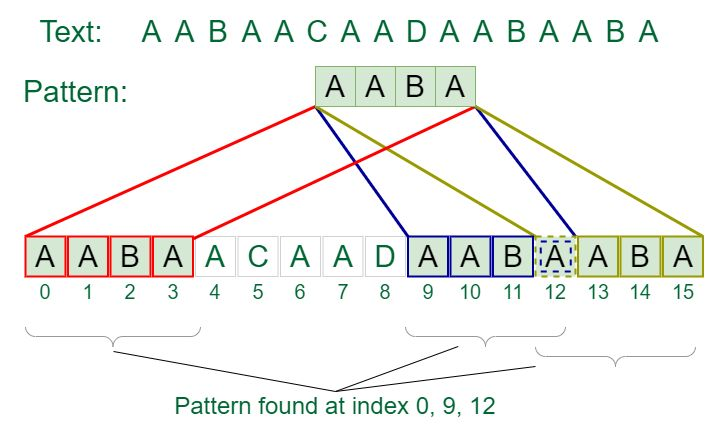

# Лекція 25: String Algorithms — Pattern Matching

[← Лекція 24](24_performance_deep_dive.md) | [Index](index.md) | [Далі: Лекція 26 →](26_tree_structures.md)

## Мета

Навчитися знаходити патерни (підрядки) у текстах ефективно. Зрозуміти три фундаментальні алгоритми: Naive, Rabin-Karp, та Knuth-Morris-Pratt (KMP). Вміти обирати правильний алгоритм для конкретної задачі.

> **📚 Матеріал лекції базується на:**  
> String Algorithms using Lists.pdf



*Рис. 1: Алгоритми пошуку рядків — від Naive до KMP*

## Експрес-опитування

1. Скільки порівнянь символів потрібно у найгіршому випадку, щоб знайти патерн довжиною m у тексті довжиною n наївним методом?
2. Чи можна знайти всі входження патерна за один прохід по тексту?
3. Що швидше для CPU: порівняння двох чисел чи порівняння двох рядків?

<details markdown="1">
<summary>Інженерна відповідь</summary>

1. **O(n * m) порівнянь.** Для кожної з n позицій у тексті ми можемо порівнювати до m символів патерна. Для n=1,000,000 і m=1000 це мільярд порівнянь!
2. **Так!** KMP алгоритм робить це за O(n + m) — один прохід по тексту плюс препроцесинг патерна.
3. **Порівняння чисел.** Одна CPU інструкція проти циклу порівняння кожного символа. Ось чому Rabin-Karp використовує хеші (числа) замість прямого порівняння рядків.

</details>

---

## Частина 1: Проблема пошуку патерна

### Формулювання

**Дано:** 
- Текст `T` довжиною `n`
- Патерн `P` довжиною `m` (де m ≤ n)

**Знайти:** Всі позиції `i`, де `T[i...i+m-1] == P[0...m-1]`

### Приклади з реального світу

1. **Ctrl+F** у браузері — знайти всі входження слова на сторінці
2. **DNA секвенування** — знайти генетичний маркер у геномі
3. **Plagiarism detection** — знайти скопійовані фрагменти тексту
4. **Log analysis** — знайти всі помилки у файлі логів
5. **Antivirus** — знайти сигнатуру вірусу у файлі

**Чому важливо:** Текст може бути гігантським (геном людини — 3 млрд символів), тому O(n²) неприйнятно.

---

## Частина 2: Naive Algorithm — грубою силою

### Ідея

Перевіряй кожну позицію тексту: чи починається там патерн?

```
Text:    A B C A B D A B C
Pattern: A B C

Position 0: A B C == A B C ✓ (match!)
Position 1: B C A ≠ A B C
Position 2: C A B ≠ A B C
...
Position 6: A B C == A B C ✓ (match!)
```

### Код

```cpp
#include <vector>
#include <string>

std::vector<int> naive_search(const std::string& text, const std::string& pattern) {
    std::vector<int> matches;
    int n = text.length();
    int m = pattern.length();
    
    // Перевіряємо кожну позицію
    for (int i = 0; i <= n - m; i++) {
        // Порівнюємо патерн з підрядком тексту
        bool found = true;
        for (int j = 0; j < m; j++) {
            if (text[i + j] != pattern[j]) {
                found = false;
                break;
            }
        }
        
        if (found) {
            matches.push_back(i);
        }
    }
    
    return matches;
}
```

### Складність

- **Найкращий випадок:** O(n) — перший символ завжди не збігається
- **Найгірший випадок:** O(n * m) — патерн майже збігається кожного разу

**Приклад найгіршого випадку:**
```
Text:    AAAAAAAAAB
Pattern: AAAAB
```
Для кожної позиції порівняємо 4 символи перед невдачею.

---

## Частина 3: Rabin-Karp — Rolling Hash

### Ідея

Замість порівняння рядків, порівнюємо їх **хеші** (числа). Якщо хеші збігаються — перевіряємо рядок для упевненості (collision check).

**Ключова оптимізація:** Rolling Hash — обчислюємо хеш наступного вікна за O(1), не перераховуючи все з нуля.

### Hash Function

Інтерпретуємо рядок як число у p-чній системі числення:

```
hash("ABC") = A*p^0 + B*p^1 + C*p^2  (mod M)
```

де `p` — просте число (наприклад, 31), `M` — великий модуль (наприклад, 10^9 + 9).

### Rolling Hash механізм

```
Text: [A B C] D E
       ↓
Text:  A [B C D] E

Старий хеш: A*p^0 + B*p^1 + C*p^2
Новий хеш: B*p^0 + C*p^1 + D*p^2

Формула: new_hash = (old_hash - A*p^0) / p + D*p^(m-1)
```

### Код

```cpp
#include <vector>
#include <string>

const long long P = 31;
const long long M = 1e9 + 9;

long long compute_hash(const std::string& s) {
    long long hash_value = 0;
    long long p_pow = 1;
    
    for (char c : s) {
        hash_value = (hash_value + (c - 'a' + 1) * p_pow) % M;
        p_pow = (p_pow * P) % M;
    }
    
    return hash_value;
}

std::vector<int> rabin_karp(const std::string& text, const std::string& pattern) {
    std::vector<int> matches;
    int n = text.length();
    int m = pattern.length();
    
    if (m > n) return matches;
    
    // Обчислюємо хеш патерна
    long long pattern_hash = compute_hash(pattern);
    
    // Обчислюємо хеш першого вікна тексту
    long long text_hash = compute_hash(text.substr(0, m));
    
    // Обчислюємо p^m для rolling hash
    long long p_pow_m = 1;
    for (int i = 0; i < m; i++) {
        p_pow_m = (p_pow_m * P) % M;
    }
    
    // Перевіряємо всі вікна
    for (int i = 0; i <= n - m; i++) {
        if (text_hash == pattern_hash) {
            // Хеші збіглися — перевіряємо рядок (на випадок колізії)
            if (text.substr(i, m) == pattern) {
                matches.push_back(i);
            }
        }
        
        // Rolling hash для наступного вікна
        if (i < n - m) {
            text_hash = (text_hash - (text[i] - 'a' + 1)) % M;
            text_hash = (text_hash / P) % M;
            text_hash = (text_hash + (text[i + m] - 'a' + 1) * p_pow_m) % M;
            
            // Коригування для від'ємних значень
            if (text_hash < 0) text_hash += M;
        }
    }
    
    return matches;
}
```

### Складність

- **Preprocessing:** O(m) — обчислення хешу патерна
- **Searching:** O(n + m) в середньому, O(n * m) у найгіршому (багато колізій)
- **Space:** O(1)

---

## Частина 4: Knuth-Morris-Pratt (KMP) — розумний пошук

### Проблема Naive підходу

```
Text:    A B C A B D
Pattern: A B C A B E

Position 0:
A B C A B D
A B C A B E
        ✗ (mismatch at position 5)

Naive: починаємо з позиції 1
KMP:   "Стоп! Ми вже знаємо, що є AB після невдачі, починаємо з позиції 4"
```

**Ідея KMP:** Не починати з нуля після невдачі. Використати інформацію з вже перевірених символів.

### Prefix Function (Failure Function)

Для патерна обчислюємо `pi[i]` — довжина найдовшого proper prefix, який також є suffix.

**Приклад для патерна "ABABC":**

| i | 0 | 1 | 2 | 3 | 4 |
|---|---|---|---|---|---|
| pattern[i] | A | B | A | B | C |
| pi[i] | 0 | 0 | 1 | 2 | 0 |

**Пояснення:**
- `pi[0] = 0` (порожній prefix)
- `pi[1] = 0` ("AB" немає proper prefix == suffix)
- `pi[2] = 1` ("ABA": prefix "A" == suffix "A")
- `pi[3] = 2` ("ABAB": prefix "AB" == suffix "AB")
- `pi[4] = 0` ("ABABC": немає збігів)

### Побудова Prefix Function

```cpp
#include <vector>
#include <string>

std::vector<int> compute_prefix_function(const std::string& pattern) {
    int m = pattern.length();
    std::vector<int> pi(m, 0);
    
    for (int i = 1; i < m; i++) {
        int j = pi[i - 1];
        
        // Знаходимо найдовший prefix
        while (j > 0 && pattern[i] != pattern[j]) {
            j = pi[j - 1];
        }
        
        if (pattern[i] == pattern[j]) {
            j++;
        }
        
        pi[i] = j;
    }
    
    return pi;
}
```

### KMP Search

```cpp
std::vector<int> kmp_search(const std::string& text, const std::string& pattern) {
    std::vector<int> matches;
    int n = text.length();
    int m = pattern.length();
    
    // Обчислюємо prefix function
    std::vector<int> pi = compute_prefix_function(pattern);
    
    int j = 0;  // Поточна позиція у патерні
    
    for (int i = 0; i < n; i++) {
        // Якщо не збігається, зсуваємось назад використовуючи pi
        while (j > 0 && text[i] != pattern[j]) {
            j = pi[j - 1];
        }
        
        if (text[i] == pattern[j]) {
            j++;
        }
        
        // Знайшли повне входження
        if (j == m) {
            matches.push_back(i - m + 1);
            j = pi[j - 1];  // Продовжуємо пошук
        }
    }
    
    return matches;
}
```

### Складність

- **Preprocessing:** O(m) — побудова prefix function
- **Searching:** O(n) — **один прохід по тексту!**
- **Total:** O(n + m) — **оптимально для pattern matching**
- **Space:** O(m) для prefix table

**Чому O(n)?** Змінна `j` ніколи не зменшується більше, ніж збільшувалася, тому загальна кількість операцій лінійна.

---

## Частина 5: Порівняльна таблиця

| Алгоритм | Preprocessing | Search | Total | Space | Коли використовувати |
|----------|---------------|--------|-------|-------|---------------------|
| **Naive** | O(1) | O(n*m) | O(n*m) | O(1) | Дуже короткі патерни (m < 5) |
| **Rabin-Karp** | O(m) | O(n+m) avg | O(n+m) avg | O(1) | Багато патернів одночасно |
| **KMP** | O(m) | O(n) | O(n+m) | O(m) | **Гарантований лінійний час** |

### Коли що обирати?

1. **KMP** — коли потрібна **гарантована** продуктивність O(n+m)
2. **Rabin-Karp** — коли шукаємо **багато різних патернів** у тому ж тексті
3. **Naive** — коли патерн **дуже короткий** (2-3 символи) і код має бути простим

**У std::string::find()** зазвичай використовується оптимізований Naive або Boyer-Moore.

---

## Практичне застосування

**Див.:** [Практикум 18: Pattern Matching](p18_pattern_matching.md) — реалізація всіх трьох алгоритмів і порівняння продуктивності.

---

## Контрольні питання

1. Чому Rabin-Karp використовує rolling hash замість перерахунку хешу з нуля для кожного вікна?

<details markdown="1">
<summary>Відповідь</summary>

Rolling hash дозволяє оновити хеш за O(1) замість O(m):
- Видаляємо внесок першого символа старого вікна
- Зсуваємо всі позиції на один степінь вниз (ділимо на p)
- Додаємо внесок нового символа

Без rolling hash: O(m) для кожного вікна → O(n*m) загалом.
З rolling hash: O(1) для кожного вікна → O(n) загалом.

</details>

2. У чому різниця між "proper prefix" та "prefix"?

<details markdown="1">
<summary>Відповідь</summary>

- **Prefix**: Будь-який початок рядка, включаючи сам рядок. Для "ABC": "", "A", "AB", "ABC"
- **Proper prefix**: Prefix, що не дорівнює всьому рядку. Для "ABC": "", "A", "AB"

У KMP ми шукаємо proper prefix, бо якщо prefix == весь рядок, це не допомагає пропустити символи.

</details>

3. Чому KMP має складність O(n), хоча там є цикл while всередині циклу for?

<details markdown="1">
<summary>Відповідь</summary>

**Amortized analysis**: Змінна `j` може тільки збільшуватись при `text[i] == pattern[j]` (максимум n разів) і зменшуватись у while (максимум стільки ж разів, скільки збільшувалась).

Загальна кількість збільшень + зменшень = O(n). Отже, загальна складність O(n), а не O(n²).

</details>

4. Коли Rabin-Karp може деградувати до O(n*m)?

<details markdown="1">
<summary>Відповідь</summary>

Коли багато **hash collisions** (різні рядки з однаковим хешем). Тоді для кожного вікна доведеться робити повне порівняння рядків O(m).

Це може статися якщо:
- Погано обраний p або M
- Зловмисник спеціально створив текст з колізіями

Рішення: використати кілька хеш-функцій або перейти на KMP.

</details>
