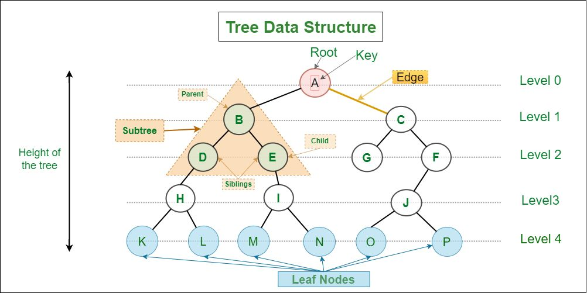
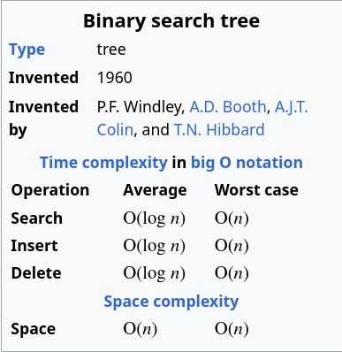
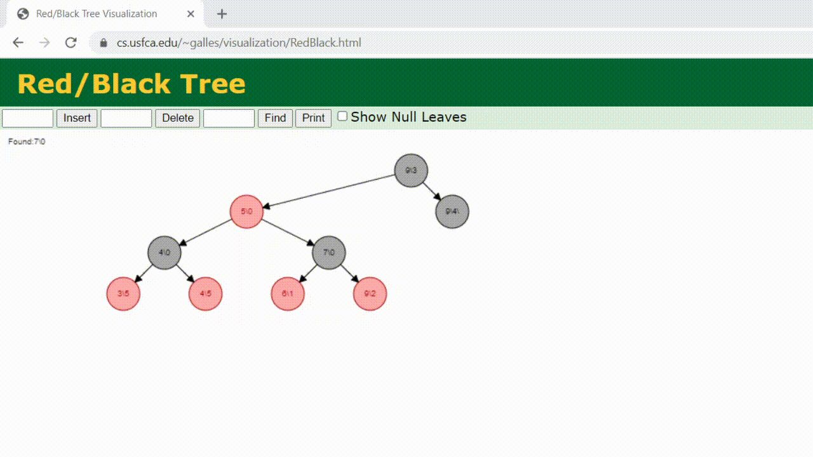

# Лекція 26: Tree Data Structures — BST та Red-Black Trees

[← Лекція 25](25_string_algorithms.md) | [Index](index.md)

## Мета

Зрозуміти, як працюють дерева пошуку "під капотом". Навчитися виконувати операції з BST (вставка, видалення, пошук). Розібрати механізм балансування Red-Black дерев та зрозуміти, чому `std::map` використовує саме їх.

## Експрес-опитування

1. Яка складність пошуку елемента у Binary Search Tree у найгіршому випадку?
2. Чи може незбалансоване BST деградувати до лінійного списку?
3. Що таке "rotation" у деревах і навіщо це потрібно?

<details markdown="1">
<summary>Інженерна відповідь</summary>

1. **O(h)**, де h — висота дерева. Для збалансованого дерева h = O(log n), але для незбалансованого може бути h = O(n).
2. **Так!** Якщо вставляти послідовність 1,2,3,4,5 у незбалансоване BST, отримаємо лінійний ланцюжок (кожен вузол має тільки праву дитину).
3. **Rotation** — це операція, яка змінює структуру дерева, зберігаючи BST властивість, але змінюючи висоту. Використовується для балансування.

</details>

---

## Частина 1: Binary Search Tree (BST) — Основи

### Властивість BST

Для кожного вузла `node`:
- **Всі вузли у лівому піддереві** < `node->key`
- **Всі вузли у правому піддереві** > `node->key`

### Приклад

```
        8
       / \
      3   10
     / \    \
    1   6    14
       / \   /
      4   7 13
```

**Перевірка:** Для вузла `8`: ліве піддерево {1,3,4,6,7} < 8, праве {10,13,14} > 8. ✓

### Структура вузла

```cpp
struct Node {
    int key;
    Node* left;
    Node* right;
    Node* parent;  // Для зручності навігації
    
    Node(int k) : key(k), left(nullptr), right(nullptr), parent(nullptr) {}
};
```

### Пошук (Search)

```cpp
Node* search(Node* root, int key) {
    if (root == nullptr || root->key == key) {
        return root;
    }
    
    if (key < root->key) {
        return search(root->left, key);
    } else {
        return search(root->right, key);
    }
}
```

**Складність:** O(h), де h — висота дерева.

### Вставка (Insert)

```cpp
Node* insert(Node* root, int key) {
    if (root == nullptr) {
        return new Node(key);
    }
    
    if (key < root->key) {
        root->left = insert(root->left, key);
        root->left->parent = root;
    } else if (key > root->key) {
        root->right = insert(root->right, key);
        root->right->parent = root;
    }
    // Якщо key == root->key, не вставляємо дублікат
    
    return root;
}
```

### Мінімум та Максимум

```cpp
Node* find_min(Node* root) {
    while (root && root->left != nullptr) {
        root = root->left;
    }
    return root;
}

Node* find_max(Node* root) {
    while (root && root->right != nullptr) {
        root = root->right;
    }
    return root;
}
```

### Видалення (Delete) — найскладніша операція

**Три випадки:**

1. **Вузол без дітей** (лист) — просто видаляємо
2. **Вузол з одною дитиною** — замінюємо вузол його дитиною
3. **Вузол з двома дітьми** — знаходимо наступника (successor), замінюємо значення, видаляємо наступника

```cpp
Node* delete_node(Node* root, int key) {
    if (root == nullptr) return root;
    
    if (key < root->key) {
        root->left = delete_node(root->left, key);
    } else if (key > root->key) {
        root->right = delete_node(root->right, key);
    } else {
        // Знайшли вузол для видалення
        
        // Випадок 1: Лист або один нащадок
        if (root->left == nullptr) {
            Node* temp = root->right;
            delete root;
            return temp;
        } else if (root->right == nullptr) {
            Node* temp = root->left;
            delete root;
            return temp;
        }
        
        // Випадок 2: Два нащадки
        // Знаходимо наступника (мінімум у правому піддереві)
        Node* successor = find_min(root->right);
        
        // Копіюємо значення наступника
        root->key = successor->key;
        
        // Видаляємо наступника
        root->right = delete_node(root->right, successor->key);
    }
    
    return root;
}
```

### Знищення всього дерева (Recursive Destructors & Stack Overflow)

Деструктори можуть викликати інші деструктори. Це зручно для ієрархічних структур (як дерева), але має **небезпеку stack overflow**.

**Приклад: Знищення вузла**

```cpp
struct Node {
    int key;
    Node* left;
    Node* right;
    
    // Рекурсивний деструктор
    ~Node() {
        delete left;   // Викликає ~Node() для лівого піддерева
        delete right;  // Викликає ~Node() для правого піддерева
    }
};
```

**Як це працює:**

```
Дерево:
        10
       /  \
      5   15
     / \
    3   7

Порядок знищення (post-order):
1. ~Node(3)
2. ~Node(7)
3. ~Node(5)   ← викликає delete left; delete right;
4. ~Node(15)
5. ~Node(10)
```

**⚠️ ПРОБЛЕМА: Stack Overflow для глибоких дерев**

Кожен виклик деструктора займає місце на стеку (stack frame). Для збалансованого дерева з 1,000,000 вузлів глибина ~20 — це ОК. Але для **незбалансованого** дерева (лінійний ланцюжок) глибина = 1,000,000 → **stack overflow!**

```cpp
// Створюємо лінійний ланцюжок (worst case)
Node* root = new Node(1);
Node* current = root;

for (int i = 2; i <= 100'000; i++) {
    current->right = new Node(i);
    current = current->right;
}

delete root;  // ❌ Stack overflow! Глибина рекурсії = 100,000
```

**Рішення 1: Iterative Destruction (ручний стек)**

```cpp
~Node() {
    std::stack<Node*> toDelete;
    toDelete.push(this->left);
    toDelete.push(this->right);
    
    this->left = this->right = nullptr;  // Запобігти подвійному видаленню
    
    while (!toDelete.empty()) {
        Node* node = toDelete.top();
        toDelete.pop();
        
        if (node) {
            toDelete.push(node->left);
            toDelete.push(node->right);
            node->left = node->right = nullptr;
            delete node;
        }
    }
}
```

**Рішення 2: Балансування дерева (AVL, Red-Black)**

Гарантує, що глибина завжди O(log N), тому рекурсивний деструктор безпечний.

**Коли рекурсивний деструктор безпечний:**
- Збалансовані дерева (глибина ≤ 20-30)
- Невеликі структури (< 1000 елементів)
- Гарантована обмежена глибина

**Коли небезпечний:**
- Незбалансовані дерева (linked list disguised as tree)
- User-generated data (ви не контролюєте глибину)
- Великі графи (cycles потребують окремої логіки)

### Binary Tree to Array Mapping

> **💡 Visual Schema from Source Material**  
> Джерело: Trees.pdf



*Рис. 1: Повне (Full) бінарне дерево vs Неповне — базова класифікація*

Бінарне дерево можна зберігати у **лінійному масиві** без вказівників, використовуючи математичні формули для навігації.

**Приклад: Complete Binary Tree**

```
Tree Representation:
        A (0)
       /     \
     B (1)   C (2)
    /  \     /
  D(3) E(4) F(5)

Array Representation:
Index:  [0] [1] [2] [3] [4] [5]
Value:  [A] [B] [C] [D] [E] [F]
```

**Navigation Formulas:**

Для вузла на індексі `i`:
- **Left child** = `2*i + 1`
- **Right child** = `2*i + 2`
- **Parent** = `(i - 1) / 2` (integer division)

**Приклад:**
- Батько E (індекс 4): `(4-1)/2 = 1` → B ✓
- Ліва дитина B (індекс 1): `2*1+1 = 3` → D ✓
- Права дитина A (індекс 0): `2*0+2 = 2` → C ✓

**Візуалізація "пропусків" для non-complete trees:**

```
Non-complete tree:
        A
       / \
      B   C
         /
        D

Проблема: C має тільки ліву дитину (D), але права немає.

Array (з пропусками):
Index:  [0] [1] [2] [3] [4] [5] [6]
Value:  [A] [B] [C] [X] [X] [D] [X]
                     ↑       ↑   ↑
              Right of B  Left of C  Right of C

Gap calculation:
- D is left child of C (index 2): 2*2+1 = 5 ✓
- Unused slots: [3], [4], [6]
```

**Memory Efficiency Comparison:**

| Tree Property | Waste (Empty Slots) |
|---------------|---------------------|
| **Complete Binary Tree** | 0% (all slots used) |
| **Balanced BST** | ~50% (some gaps) |
| **Skewed Tree** (linear) | ~75% (many gaps!) |

**Використання:**
- **Heap** (complete binary tree) — ідеально для масиву!
- **Segment Tree** — зберігається в масиві розміру 4*N
- **Fenwick Tree** (BIT) — 1-indexed array

**Код приклад (Heap):**

```cpp
class MinHeap {
    std::vector<int> arr;
    
    int parent(int i) { return (i - 1) / 2; }
    int left(int i) { return 2 * i + 1; }
    int right(int i) { return 2 * i + 2; }
    
public:
    void insert(int key) {
        arr.push_back(key);
        int i = arr.size() - 1;
        
        // Bubble up
        while (i != 0 && arr[parent(i)] > arr[i]) {
            std::swap(arr[i], arr[parent(i)]);
            i = parent(i);
        }
    }
};
```

**Переваги array-based trees:**
- ✓ No pointers (економія пам'яті для complete trees)
- ✓ Cache-friendly (continuous memory)
- ✓ Швидша навігація (arithmetic vs pointer dereferencing)

**Недоліки:**
- ✗ Waste  space для non-complete trees
- ✗ Фіксований розмір (або динамічне розширення)

---

## Частина 2: Проблема — Незбалансовані дерева

### Найгірший випадок

Вставка послідовності `1, 2, 3, 4, 5`:

```
1
 \
  2
   \
    3
     \
      4
       \
        5
```

**Висота:** h = n → **O(n) для всіх операцій!** Це деградація до списку.

### Рішення: Балансування

Ми хочемо гарантувати, що висота завжди O(log n). Для цього використовуються **самобалансуючі дерева**:
- AVL Trees (строге балансування, |h_left - h_right| ≤ 1)
- **Red-Black Trees** (послаблені умови, швидші вставки)

---

## Частина 3: Ротації — Базова операція

Ротація змінює структуру дерева, **зберігаючи BST властивість**.

### Ліва ротація (Left Rotation)

**До:**
```
    x
   / \
  A   y
     / \
    B   C
```

**Після:**
```
    y
   / \
  x   C
 / \
A   B
```

**Код:**
```cpp
Node* rotate_left(Node* x) {
    Node* y = x->right;
    Node* B = y->left;
    
    // Виконуємо ротацію
    y->left = x;
    x->right = B;
    
    // Оновлюємо parent вказівники
    y->parent = x->parent;
    x->parent = y;
    if (B) B->parent = x;
    
    return y;  // Новий корінь
}
```

### Права ротація (Right Rotation)

**До:**
```
      y
     / \
    x   C
   / \
  A   B
```

**Після:**
```
    x
   / \
  A   y
     / \
    B   C
```

**Код:**
```cpp
Node* rotate_right(Node* y) {
    Node* x = y->left;
    Node* B = x->right;
    
    // Виконуємо ротацію
    x->right = y;
    y->left = B;
    
    // Оновлюємо parent
    x->parent = y->parent;
    y->parent = x;
    if (B) B->parent = y;
    
    return x;  // Новий корінь
}
```

**Важливо:** Ротації **завжди зберігають BST властивість**. Можна довести індукцією.

---

## Частина 4: Red-Black Tree — Властивості

### Визначення

Red-Black дерево — це BST з додатковою інформацією (колір вузла: RED або BLACK) та 5 властивостями:

1. **Кожен вузол або червоний, або чорний**
2. **Корінь чорний**
3. **Всі листя (NIL) чорні**
4. **Червоний вузол не може мати червоних дітей** (no two reds in a row)
5. **Всі шляхи від кореня до листя мають однакову кількість чорних вузлів** (black-height)

### Приклад

> **💡 Visual Diagram from Source Material**  
> Джерело: Binary and Red-Black trees.pdf



*Рис. 2: Приклад BST структури до балансування*



*Рис. 3: Red-Black Tree — операції вставки з ротаціями та перефарбуванням*

**Notation:** `●` = Black node, `○` = Red node

```
       [10●]  ← Black root (property 2)
       /    \
    [5○]    [15●]  ← Red left, Black right
    /  \       \
 [3●] [7●]   [20○]  ← All children of Red node are Black (property 4)
  |    |      |
 NIL  NIL    NIL   ← All leaves (NIL) are Black (property 3)
```

**Перевірка властивостей:**
- ✓ Property 2: Корінь 10 чорний
- ✓ Property 4: Немає двох червоних підряд (5○ має чорних дітей 3● та 7●)
- ✓ Property 5: Black-height від кореня до кожного листа = 2

**Black-height calculation (from root to leaves):**
```
Path 1:  10● → 5○ → 3● → NIL  |  Black count: 3 (10, 3, NIL)
Path 2:  10● → 5○ → 7● → NIL  |  Black count: 3 (10, 7, NIL)
Path 3:  10● → 15● → 20○ → NIL |  Black count: 3 (10, 15, NIL)
                              All paths have 3 black nodes ✓
```

**Visual Legend:**
- ● (Black) = Filled circle = contributes to black-height
- ○ (Red) = Empty circle = does NOT contribute to black-height
- NIL = Implicit black leaf nodes

### Чому це гарантує O(log n)?

**Теорема:** Дерево з n вузлами має висоту h ≤ 2 * log₂(n + 1).

**Доказ (ідея):** Завдяки властивості 5, black-height ≥ h/2. А кількість вузлів з black-height bh ≥ 2^bh - 1. Отже, n ≥ 2^(h/2) - 1 → h ≤ 2 * log₂(n + 1).

---

## Частина 5: Red-Black Вставка — Покрокова інструкція

### Алгоритм

1. **Вставляємо новий вузол як у звичайному BST**
2. **Фарбуємо його в RED**
3. **Відновлюємо властивості RB-дерева**

### Випадки порушення (після вставки RED вузла)

**Проблема:** Батько також RED (порушення властивості 4).

**Випадок 1:** Дядько (uncle) теж RED
- **Дія:** Перефарбувати батька, дядька, діда
```
        [GB]                [GR]
       /    \              /    \
   [PR]    [UR]   →    [PB]    [UB]
    /                    /
 [NR]                [NR]
```

**Випадок 2:** Дядько BLACK, новий вузол — правий нащадок
- **Дія:** Ліва ротація на батькові, потім випадок 3

**Випадок 3:** Дядько BLACK, новий вузол — лівий нащадок
- **Дія:** Права ротація на дідові + перефарбування
```
        [GB]                [PB]
       /                   /    \
   [PR]         →       [NR]   [GR]
    /
 [NR]
```

### Псевдокод вставки

```cpp
void insert_fixup(Node* z) {
    while (z->parent && z->parent->color == RED) {
        if (z->parent == z->parent->parent->left) {
            Node* uncle = z->parent->parent->right;
            
            if (uncle && uncle->color == RED) {
                // Case 1: Uncle is RED
                z->parent->color = BLACK;
                uncle->color = BLACK;
                z->parent->parent->color = RED;
                z = z->parent->parent;
            } else {
                if (z == z->parent->right) {
                    // Case 2: Node is right child
                    z = z->parent;
                    rotate_left(z);
                }
                // Case 3: Node is left child
                z->parent->color = BLACK;
                z->parent->parent->color = RED;
                rotate_right(z->parent->parent);
            }
        } else {
            // Symmetric cases (mirror image)
            // ...
        }
    }
    root->color = BLACK;  // Ensure root is black
}
```

---

## Частина 6: Чому std::map використовує RB-Trees?

### Порівняння з AVL Trees

| Характеристика | AVL Tree | Red-Black Tree |
|----------------|----------|----------------|
| **Балансування** | Строге (|h_L - h_R| ≤ 1) | Послаблене (h ≤ 2*log n) |
| **Висота** | ~1.44 * log n | ~2 * log n |
| **Вставка/Видалення** | Повільніше (більше ротацій) | **Швидше** |
| **Пошук** | Трохи швидше | Трохи повільніше |
| **Використання** | Коли багато пошуків | **std::map, std::set** |

**Висновок:** RB-Trees — хороший баланс між швидкістю вставки та пошуку.

### Гарантії std::map

- `insert()`: O(log n) guaranteed
- `find()`: O(log n) guaranteed
- `erase()`: O(log n) guaranteed

Без балансування це були б O(n) у найгіршому випадку!

---

## Практичне застосування

**Див.:** [Практикум 19: BST Implementation](p19_bst_implementation.md) — реалізація BST з ротаціями та візуалізацією.

---

## Контрольні питання

1. Чому ротація зберігає BST властивість?

<details markdown="1">
<summary>Відповідь</summary>

Розглянемо ліву ротацію на вузлі `x`:
- До: `A < x < B < y < C`
- Після: `A < x < B < y < C` (порядок не змінився!)

Ротація лише **переміщує вузли**, але не змінює їх відносний порядок. Усі, що були менші за x, залишаються меншими. Усі, що були більшими за y, залишаються більшими.

</details>

2. Чи може RB-дерево мати два червоні вузли поспіль?

<details markdown="1">
<summary>Відповідь</summary>

**Ні!** Це порушення властивості 4. Якщо після вставки з'являються два червоні підряд, ми негайно виправляємо це через перефарбування або ротації.

</details>

3. Яка black-height дерева з 1000 вузлів?

<details markdown="1">
<summary>Відповідь</summary>

Black-height bh ≥ h/2, а h ≤ 2*log₂(1001) ≈ 20.

Отже, bh ≥ 10. Фактично, для RB-дерева з 1000 вузлів black-height близька до 9-11.

</details>

4. Чому вставка у RB-дерево може вимагати O(log n) ротацій, але амортизована складність O(1) ротацій?

<details markdown="1">
<summary>Відповідь</summary>

**Насправді, вставка вимагає максимум 2 ротації!**

Випадок 1 (дядько RED) — 0 ротацій, але можемо рухатися вгору по дереву.
Випадок 2+3 (дядько BLACK) — максимум 2 ротації (одна у випадку 2, одна у випадку 3), і алгоритм зупиняється.

Отже, вставка = O(log n) перефарбувань + O(1) ротацій.

</details>
