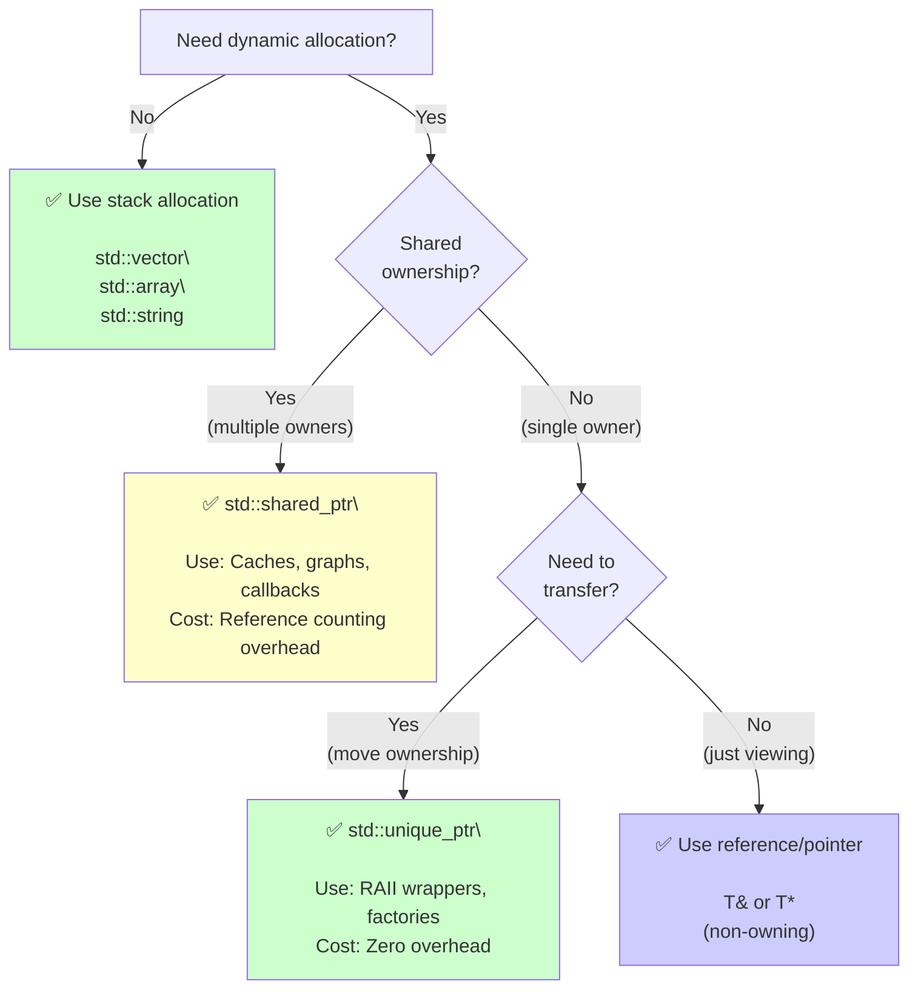

# Modern C++ Quick Reference Cheatsheet

[← Back to Self-Study Guide](../modern_cpp_guide.md)

## Smart Pointers Decision Tree



---

## Container Selection Guide

### The Decision Matrix

| Need | Container | Time Complexity | When to Use |
|------|-----------|-----------------|-------------|
| **Fixed size, compile-time** | `std::array<T, N>` | Random: $O(1)$ | Size known at compile, stack speed |
| **Dynamic size, fast access** | `std::vector<T>` | Random: $O(1)$<br/>Push back: $O(1)^*$ | **DEFAULT CHOICE** |
| **Fast insert/delete anywhere** | `std::deque<T>` | Random: $O(1)$<br/>Insert: $O(1)$ (ends) | Double-ended queue |
| **Fast insert/delete middle** | `std::list<T>` | Insert: $O(1)$<br/>Random: $O(n)$ | Rarely needed (cache-hostile) |
| **Lookup by key** | `std::unordered_map<K,V>` | Lookup: $O(1)$ avg | Hash table, unsorted |
| **Sorted keys** | `std::map<K,V>` | Lookup: $O(\log n)$ | Red-black tree, ordered |
| **Unique sorted values** | `std::set<T>` | Insert/Search: $O(\log n)$ | No duplicates, ordered |
| **View without ownership** | `std::span<T>` | N/A | C++20, zero-copy view |

$^*$ Amortized constant time

### Performance Cheat Sheet

```cpp
// ✓ FAST: Contiguous memory (cache-friendly)
std::vector, std::array, std::string

// ⚠️ SLOW: Scattered memory (cache misses)
std::list, std::forward_list

// When to use std::list? Almost never. Exceptions:
// - Frequent inserts/deletes in middle AND random access not needed
// - Iterator stability required (pointers don't invalidate)
```

---

## Rule of Zero vs Rule of Five

### Rule of Zero (✅ ALWAYS TRY THIS FIRST)

```cpp
class GoodExample {
    std::vector<int> data;      // Self-managing
    std::string name;            // Self-managing
    std::unique_ptr<File> file;  // Self-managing
    
    // ✅ Compiler generates CORRECT:
    // - Destructor
    // - Copy constructor
    // - Copy assignment
    // - Move constructor
    // - Move assignment
};

// No custom code needed!
```

**When it applies:** Always, unless managing raw resources (rare).

### Rule of Five (⚠️ ONLY for raw resources)

```cpp
class ResourceOwner {
    int* raw_ptr;  // Raw resource
    
public:
    // 1. Destructor
    ~ResourceOwner() {
        delete raw_ptr;
    }
    
    // 2. Copy constructor
    ResourceOwner(const ResourceOwner& other) {
        raw_ptr = new int(*other.raw_ptr);  // Deep copy
    }
    
    // 3. Copy assignment
    ResourceOwner& operator=(const ResourceOwner& other) {
        if (this != &other) {
            delete raw_ptr;
            raw_ptr = new int(*other.raw_ptr);
        }
        return *this;
    }
    
    // 4. Move constructor
    ResourceOwner(ResourceOwner&& other) noexcept {
        raw_ptr = other.raw_ptr;
        other.raw_ptr = nullptr;  // Nullify source
    }
    
    // 5. Move assignment
    ResourceOwner& operator=(ResourceOwner&& other) noexcept {
        if (this != &other) {
            delete raw_ptr;
            raw_ptr = other.raw_ptr;
            other.raw_ptr = nullptr;
        }
        return *this;
    }
};
```

**When it applies:** Only when directly managing raw pointers, file handles, or OS resources.

**Better:** Wrap raw resource in smart pointer → use Rule of Zero!

---

## C++20 Concepts Quick Reference

### Standard Concepts

```cpp
#include <concepts>

// ━━━━━━━━━━━━━━━━━━━━━━━━━━━━━━━━━━━
// NUMERIC TYPES
// ━━━━━━━━━━━━━━━━━━━━━━━━━━━━━━━━━━━
std::integral<T>              // int, long, short, char, bool
std::signed_integral<T>       // signed int types
std::unsigned_integral<T>     // unsigned int types
std::floating_point<T>        // float, double, long double

// ━━━━━━━━━━━━━━━━━━━━━━━━━━━━━━━━━━━
// TYPE RELATIONSHIPS
// ━━━━━━━━━━━━━━━━━━━━━━━━━━━━━━━━━━━
std::same_as<T, U>            // Exact type match
std::convertible_to<From, To> // Implicit conversion exists
std::derived_from<D, B>       // Inheritance check

// ━━━━━━━━━━━━━━━━━━━━━━━━━━━━━━━━━━━
// OPERATIONS
// ━━━━━━━━━━━━━━━━━━━━━━━━━━━━━━━━━━━
std::copyable<T>              // Can be copied
std::movable<T>               // Can be moved
std::equality_comparable<T>   // Has operator==
std::totally_ordered<T>       // Has < > <= >= == !=
```

### Custom Concept Examples

```cpp
// Example 1: Type must have specific methods
template <typename T>
concept Drawable = requires(T obj) {
    { obj.draw() } -> std::same_as<void>;
    { obj.getColor() } -> std::convertible_to<int>;
};

template <Drawable T>
void render(T shape) {
    shape.draw();  // Guaranteed to exist
}

// Example 2: Numeric operations
template <typename T>
concept Numeric = std::integral<T> || std::floating_point<T>;

template <Numeric T>
T add(T a, T b) {
    return a + b;  // Works for int, float, double, etc.
}

// Example 3: Container concept
template <typename T>
concept Container = requires(T container) {
    { container.size() } -> std::convertible_to<std::size_t>;
    { container.begin() };
    { container.end() };
};
```

---

## Performance Optimization Checklist

### ✅ Always Do

```cpp
// 1. Use const references for function parameters (avoid copies)
void process(const std::vector<int>& data);  // ✓ No copy
// NOT: void process(std::vector<int> data);  // ✗ Copies entire vector

// 2. Use const auto& in range loops
for (const auto& item : container) { ... }   // ✓ Reference
// NOT: for (auto item : container) { ... }   // ✗ Copies each item

// 3. Reserve vector capacity if size known
std::vector<int> v;
v.reserve(1000);  // ✓ Prevents reallocations
for (int i = 0; i < 1000; i++) {
    v.push_back(i);
}

// 4. Use '\n' instead of std::endl
std::cout << "Hello\n";      // ✓ Buffered
// NOT: std::cout << "Hello" << std::endl;  // ✗ Flushes (slow)

// 5. Use emplace over push (construct in-place)
vec.emplace_back(arg1, arg2);  // ✓ Direct construction
// NOT: vec.push_back(T(arg1, arg2));  // ✗ Temp object + move
```

### ⚠️ Avoid

```cpp
// 1. Unnecessary string concatenation in loops
for (auto& str : strings) {
    result = result + str;  // ✗ O(n²) — reallocates every time
}
// FIX: result.append(str);  // ✓ O(n)

// 2. Returning large objects by value (without move)
std::vector<int> process() {
    std::vector<int> data(1'000'000);
    // ...
    return data;  // ✓ Move semantics (C++11+), not a copy!
}

// 3. Using std::endl in loops
for (int i = 0; i < 1000; i++) {
    file << i << std::endl;  // ✗ Flushes 1000 times!
}
// FIX: file << i << '\n';   // ✓ Buffer flushes automatically

// 4. Calling .size() in loop condition
for (size_t i = 0; i < vec.size(); i++) { ... }  // ⚠️ OK for vector
for (size_t i = 0; i < list.size(); i++) { ... } // ✗ O(n) per iteration! (for std::list)
```

---

## Common Pitfalls & Fixes

### Pitfall 1: Object Slicing

```cpp
// ❌ BAD: Slicing
void process(Base obj) {  // Pass by value
    obj.virtualMethod();  // Calls Base version (sliced!)
}

Derived d;
process(d);  // Derived part sliced off!

// ✅ FIX: Pass by reference
void process(const Base& obj) {  // Reference
    obj.virtualMethod();  // Calls Derived version via polymorphism
}
```

### Pitfall 2: Forgetting const in Methods

```cpp
class Data {
    int value;
public:
    int getValue() { return value; }  // ❌ Not const!
};

const Data d;
d.getValue();  // ✗ ERROR: cannot call non-const method on const object

// FIX:
int getValue() const { return value; }  // ✓ const method
```

### Pitfall 3: Dangling References

```cpp
// ❌ DANGER: Returning reference to local
const std::string& getBadString() {
    std::string local = "temp";
    return local;  // ✗ Returns reference to destroyed object!
}

auto& str = getBadString();  // Dangling reference!

// ✅ FIX: Return by value (move semantics)
std::string getGoodString() {
    std::string local = "temp";
    return local;  // ✓ Moved, not copied
}
```

### Pitfall 4: Iterator Invalidation

```cpp
std::vector<int> vec = {1, 2, 3};
for (auto it = vec.begin(); it != vec.end(); ++it) {
    vec.push_back(*it);  // ✗ Invalidates iterators!
}

// FIX: Cache original size
size_t original_size = vec.size();
for (size_t i = 0; i < original_size; i++) {
    vec.push_back(vec[i]);
}
```

---

## Compilation Flags Quick Reference

### Development (Debug)
```bash
g++ -std=c++20 -g -Wall -Wextra -Werror -fsanitize=address,undefined main.cpp -o app
```

**Flags explained:**
- `-std=c++20` — Use C++20 standard
- `-g` — Debug symbols
- `-Wall -Wextra` — All warnings
- `-Werror` — Treat warnings as errors
- `-fsanitize=address` — Detect memory leaks, buffer overflows
- `-fsanitize=undefined` — Detect undefined behavior

### Production (Release)
```bash
g++ -std=c++20 -O3 -DNDEBUG -march=native main.cpp -o app
```

**Flags explained:**
- `-O3` — Maximum optimization
- `-DNDEBUG` — Disable assert()
- `-march=native` — Optimize for current CPU

---

## Summary: Decision Flowcharts

### "What container should I use?"
```
Start → Need dynamic size? 
  ├─ No → std::array<T, N>
  └─ Yes → Need lookup by key?
      ├─ Yes → Need sorted? 
      │   ├─ Yes → std::map<K,V>
      │   └─ No  → std::unordered_map<K,V>
      └─ No → Need fast insert in middle?
          ├─ Yes → std::deque<T>
          └─ No  → std::vector<T>  ← DEFAULT
```

### "Do I need a smart pointer?"
```
Start → Managing resource?
  ├─ No → Use std::vector or std::string
  └─ Yes → Shared ownership?
      ├─ Yes → std::shared_ptr<T>
      └─ No  → std::unique_ptr<T>
```

---

[← Back to Self-Study Guide](../modern_cpp_guide.md)
