# Visual Diagrams: Memory & Execution Flow

[← Back to Self-Study Guide](../modern_cpp_guide.md)

## Purpose

These Mermaid diagrams visualize **invisible** runtime concepts that are hard to grasp from code alone:
- Memory layout
- Object lifecycles
- Execution flow
- Performance costs

---

## Diagram 1: The 3-Compartment Box Model

**Context:** [Lecture 13 - OOPP Philosophy](../../13_oop_philosophy.md#3-compartment-box)

### The Mental Model

```mermaid
classDiagram
    class BankAccount {
        <<class>>
        -string owner
        -double balance
        -static int totalAccounts
        +BankAccount(string, double)
        +deposit(double amount) void
        +withdraw(double amount) void
        +static getTotalAccounts() int
    }
    
    note for BankAccount "Memory Layout:\n━━━━━━━━━━━━━━━━━━\n📦 Instance Members (per object):\n  • owner (on heap if > 16 bytes)\n  • balance (8 bytes)\n\n📚 Static Members (one copy, shared):\n  • totalAccounts (4bytes)\n\n📄 Methods (in Text Segment):\n  • Not stored in objects!\n  • All BankAccount objects share same code"
```



### Key Insights

**What's IN each object:**
```
Object 1:                Object 2:
┌─────────────────┐     ┌─────────────────┐
│ owner: "Alice"  │     │ owner: "Bob"    │
│ balance: 100.0  │     │ balance: 200.0  │
└─────────────────┘     └─────────────────┘
```

**What's SHARED (static):**
```
Global Data Segment:
┌──────────────────────┐
│ totalAccounts: 2     │  ← One copy for ALL objects
└──────────────────────┘
```

**Where methods live:**
```
Text Segment (Code):
┌──────────────────────────┐
│ BankAccount::deposit()   │ ← Same code for all objects
│ BankAccount::withdraw()  │
└──────────────────────────┘
```

**Memory sizes:**
- Each `BankAccount` object: ~32 bytes (owner + balance)
- Static `totalAccounts`: 4 bytes (shared, not per-object)
- Methods: 0 bytes per object (code shared)

---

## Diagram 2: Shallow vs Deep Copy (Double Free Danger!)

**Context:** [Lecture 15 - Copy Control](../../15_copy_control.md)

### The Danger of Shallow Copy

```mermaid
graph TB
    subgraph "❌ SHALLOW COPY - DANGEROUS!"
        direction TB
        Obj1["Object 1<br/>━━━━━━━━<br/>int* data<br/>size: 5"]
        Obj2["Object 2<br/>━━━━━━━━<br/>int* data<br/>size: 5"]
        HeapMem1["Heap Memory<br/>━━━━━━━━━━━<br/>[10, 20, 30, 40, 50]<br/>Address: 0x1000"]
        
        Obj1 -->|"points to"| HeapMem1
        Obj2 -->|"points to SAME!"| HeapMem1
        
        Crash["💥 CRASH SCENARIO:<br/>━━━━━━━━━━━━━<br/>1. ~Obj1() calls delete[] → frees 0x1000<br/>2. ~Obj2() calls delete[] → tries to free ALREADY FREED memory<br/>3. DOUBLE FREE → Undefined Behavior (crash!)"]
        
        HeapMem1 -.->|"causes"| Crash
    end
    
    subgraph "✅ DEEP COPY - SAFE!"
        direction TB
        ObjA["Object A<br/>━━━━━━━━<br/>int* data<br/>size: 5"]
        ObjB["Object B<br/>━━━━━━━━<br/>int* data<br/>size: 5"]
        HeapA["Heap A<br/>━━━━━━━━━━━<br/>[10, 20, 30, 40, 50]<br/>Address: 0x1000"]
        HeapB["Heap B<br/>━━━━━━━━━━━<br/>[10, 20, 30, 40, 50]<br/>Address: 0x2000"]
        
        ObjA -->|"points to"| HeapA
        ObjB -->|"points to"| HeapB
        
        Safe["✓ SAFE:<br/>━━━━━━━━━━━━━<br/>~ObjA() frees 0x1000<br/>~ObjB() frees 0x2000<br/>No conflict!"]
        
        HeapA -.->|"independent"| Safe
        HeapB -.->|"independent"| Safe
    end
    
    style Crash fill:#ffcccc,stroke:#cc0000,stroke-width:2px
    style Safe fill:#ccffcc,stroke:#00cc00,stroke-width:2px
```



### The Fix: Deep Copy Implementation

```cpp
class Buffer {
    int* data;
    int size;
public:
    // Deep copy constructor
    Buffer(const Buffer& other) : size(other.size) {
        data = new int[size];  // Allocate NEW memory
        for (int i = 0; i < size; i++) {
            data[i] = other.data[i];  // Copy values
        }
    }
    
    // Or better: Use std::vector and get deep copy for free!
    std::vector<int> data;  // Rule of Zero!
};
```

---

## Diagram 3: V-Table Dynamic Dispatch

**Context:** [Lecture 16 - Polymorphism](../../16_inheritance_polymorphism.md#v-table)

### Execution Flow for Virtual Function Call

```mermaid
flowchart TD
    Start["Code: unit_ptr->move()"]
    
    Start --> Step1["① Dereference pointer<br/>Access object memory"]
    Step1 --> Step2["② Read vptr<br/>(hidden pointer at offset 0)<br/>Cost: ~4 cycles"]
    Step2 --> Step3["③ Access V-Table<br/>Look up method slot 'move'<br/>Cost: ~4 cycles"]
    Step3 --> Step4["④ Read function address<br/>V-Table[move] = 0x2000"]
    Step4 --> Step5["⑤ Indirect jump<br/>Jump to address 0x2000<br/>Cost: 1 cycle + pipeline stall"]
    Step5 --> Step6["⑥ Execute Soldier::move()<br/>Actual work happens here"]
    
    Step3 -.->|"Memory access"| VTable[("━━━━━━━━━━━━━━━━<br/>V-Table for Soldier<br/>━━━━━━━━━━━━━━━━<br/>move   → 0x2000<br/>shoot  → 0x2100<br/>~Soldier → 0x2200")]
    
    Step5 -.->|"Branch prediction miss<br/>+15 cycles"| Pipeline["Pipeline<br/>Stall"]
    
    Compare["━━━━━━━━━━━━━━━━━━━━━━━<br/>PERFORMANCE COMPARISON<br/>━━━━━━━━━━━━━━━━━━━━━━━<br/>Direct call:<br/>call 0x2000<br/>Cost: ~1 cycle<br/><br/>Virtual call:<br/>Steps ②+③+④+⑤<br/>Cost: ~24 cycles<br/>(24x slower!)"]
    
    Step6 -.-> Compare
    
    style Step2 fill:#ffffcc,stroke:#333,stroke-width:2px
    style Step3 fill:#ffccaa,stroke:#333,stroke-width:2px
    style Step5 fill:#ffaacc,stroke:#333,stroke-width:2px
    style VTable fill:#ccccff
    style Pipeline fill:#ffcccc
    style Compare fill:#e6ffe6
```



### When Does This Matter?

**Tight loop with millions of calls:**
```cpp
// Hot path: called 10 million times per second
for (Unit* unit : units) {  // 10,000 units
    unit->update();  // Virtual call
}
```

**Cost calculation:**
- **Direct call:** 10M × 1 cycle = 10M cycles = 3ms @ 3GHz
- **Virtual call:** 10M × 24 cycles = 240M cycles = 80ms @ 3GHz

**Difference:** 77ms per frame → drops from 60 FPS to 12 FPS!

**Solution:** Only use `virtual` when polymix is actually needed.

---

## Diagram 4: Vector Reallocation (Why push_back Can Be Slow)

**Context:** [Lecture 20 - Vectors and Lists](../../20_lists_vector.md#vector-reallocation)

### The Reallocation Dance

```mermaid
sequenceDiagram
    participant User
    participant Vector
    participant Old as Old Memory<br/>(capacity=4)
    participant New as New Memory<br/>(capacity=8)
    
    User->>Vector: push_back(5)
    Vector->>Vector: Check: size < capacity?
    
    alt Capacity Available
        Vector->>Old: Insert at end
        Note over Vector: ✓ Fast: O(1)
    else No Space (Reallocation Needed)
        Note over Vector: ⚠️ Expensive!
        Vector->>New: Allocate new block (2× size)
        Note over New: malloc(8 * sizeof(int))
        
        Vector->>New: Copy element [0]
        Vector->>New: Copy element [1]
        Vector->>New: Copy element [2]
        Vector->>New: Copy element [3]
        Note over Vector: O(n) copies!
        
        Vector->>New: Insert new element [4]
        
        Vector->>Old: delete[] old memory
        Note over Old: Deallocated
        
        Vector->>Vector: Update internal pointer
    end
    
    Vector-->>User: Done
```



### Performance Analysis

**Without `reserve()`:**
```cpp
std::vector<int> v;
for (int i = 0; i < 1000; i++) {
    v.push_back(i);  // Reallocates at: 1, 2, 4, 8, 16, 32, 64, 128, 256, 512
}
// Total reallocations: 10
// Total copies: 1 + 2 + 4 + 8 + ... + 512 = 1023 copies!
```

**With `reserve()`:**
```cpp
std::vector<int> v;
v.reserve(1000);  // Pre-allocate space
for (int i = 0; i < 1000; i++) {
    v.push_back(i);  // Never reallocates
}
// Total reallocations: 0
// Total copies: 0
```

**Rule:** Always `reserve()` if you know the final size!

---

## Diagram 5: Inheritance Memory Layout

**Context:** [Lecture 16 - Inheritance](../../16_inheritance_polymorphism.md#memory-layout)

### Object Slicing Visualization

```mermaid
graph LR
    subgraph "Full Derived Object"
        D1["Derived Object<br/>━━━━━━━━━━━<br/>vptr → Derived V-Table<br/>base_member: 10<br/>derived_member: 20"]
    end
    
    subgraph "After Slicing (Pass by Value)"
        B1["Base Object<br/>━━━━━━━━━━━<br/>vptr → Base V-Table<br/>base_member: 10<br/><s>derived_member: ❌</s>"]
    end
    
    D1 -->|"void func(Base b)"| B1
    
    style D1 fill:#ccffcc
    style B1 fill:#ffcccc
    
    Warning["⚠️ SLICED OFF:<br/>• derived_member lost<br/>• V-Table points to Base<br/>• Polymorphism broken!"]
    
    B1 -.-> Warning
```



**The Fix:**
```cpp
// ❌ BAD: Slicing
void func(Base b) { b.virtual_method(); }  // Calls Base version!

// ✓ GOOD: Reference
void func(const Base& b) { b.virtual_method(); }  // Calls Derived version!
```

---

## Summary: What These Diagrams Teach

| Diagram | Invisible Concept | Key Takeaway |
|---------|-------------------|--------------|
| **3-Compartment Box** | Memory layout | Methods aren't duplicated per object |
| **Shallow vs Deep** | Pointer aliasing | Always deep copy or use smart pointers |
| **V-Table Dispatch** | Virtual call cost | 24× slower than direct calls |
| **Vector Reallocation** | Hidden copies | Always `reserve()` if size known |
| **Object Slicing** | Inheritance pitfalls | Pass by reference, not value |

---

## Next Steps

- [Coding Challenges](../exercises/coding_challenges.md) — Test your understanding
- [Quick Reference](../quick_reference/cheatsheet.md) — Decision trees for when to use what

[← Back to Self-Study Guide](../modern_cpp_guide.md)
